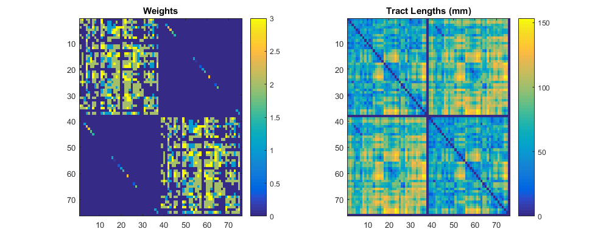
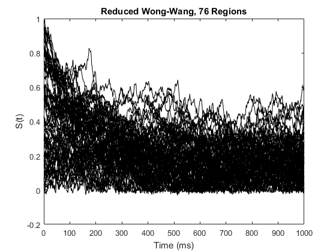

.. _tvb_demo_simple:

============================
Simple TVB Usage from Matlab
============================

--------------------
Ensure TVB is set up
--------------------
::

    tvb_setup

|  [tvb_setup] using Python 2.7 C:\\Users\\mw\\Downloads\\TVB_Distribution\\tvb_data\\python.exe
|  h5py modules unsupported.
|  [TVB]    INFO  log level set to INFO

---------------
Build simulator
---------------
::

    model = py.tvb.simulator.models.ReducedWongWang();
    coupling = py.tvb.simulator.coupling.Linear;
    conn = py.tvb.datatypes.connectivity.Connectivity(...
        pyargs('load_default', py.True));
    noise = py.tvb.simulator.noise.Additive(pyargs('nsig', 1e-4));

    sim = py.tvb.simulator.simulator.Simulator(pyargs(...
        'integrator', py.tvb.simulator.integrators.HeunStochastic(...
            pyargs('dt', 0.1, 'noise', noise)),...
        'model', model, ...
        'coupling', coupling, ...
        'connectivity', conn, ...
        'simulation_length', 1000));

    configure(sim);

|  [TVB] WARNING  File 'hemispheres' not found in ZIP.
|  [TVB]    INFO  Region simulation with 76 ROI nodes
|  [TVB]    INFO  Memory requirement estimate: simulation will need about 0.7 MB
|  [TVB]    INFO  White noise configured with dt=0.1
|  [TVB]    INFO  Preparing initial history of shape (513, 1, 76L, 1) using model.initial()
|  [TVB]    INFO  Final initial history shape is (513L, 1L, 76L, 1L)
|  [TVB]    INFO  history has n_time=513 n_cvar=1 n_node=76 n_nmode=1, requires 0.32 MB
|  [TVB]    INFO  sparse history has n_nnzw=1560, i.e. 27.01 % sparse
|  [TVB]    INFO  Memory requirement census: simulation will need about 0.8 MB

----------------------------------------------
Examine connectivity weights and tract lengths
----------------------------------------------
::

    figure('Position', [500 500 1000 400])
    subplot 121, imagesc(np2m(conn.weights)), colorbar, title('Weights')
    subplot 122, imagesc(np2m(conn.tract_lengths)), colorbar
    title('Tract Lengths (mm)')

--------------
Run simulation
--------------
::

    data = run(sim);

|  [TVB]    INFO  Simulation runtime should be about 4.993 seconds
|  [TVB]    INFO  Calculating storage requirement for ...
|  [TVB]    INFO  Calculated storage requirement for simulation: 700416
|  [TVB]    INFO  2.400 s elapsed, 2.400x real time

-----------------------------
Convert data to MATLAB format
-----------------------------
::

    t = np2m(data{1}{1});
    y = np2m(data{1}{2});

------------
Plot results
------------

NB Dimensions will be [mode, node, state var, time]::

    figure()
    plot(t, squeeze(y(1, :, 1, :)), 'k')
    ylabel('S(t)')
    xlabel('Time (ms)')
    title(sprintf('Reduced Wong-Wang, %d Regions', conn.weights.shape{1}*1))

