GUI Demos
=========

The links in this section showcase TVB's web interface.

Simulation
----------

.. Sphinx limitations
      A :target: option on figure allows for links. But not for sphinx refs.
      So clicking the images does not follow the link.
      The images cannot be arranged in a flowing grid.
      To work around the grid issue we have added a css class and a rule for it in default.css
      To work around the target issue we have added direct html links. These are not robust and
      will be weird if this document will be rendered to pdf.

.. figure:: /manuals/UserGuide/screenshots/simulator_phase_plane_interactive.jpg
      :width: 200px
      :figclass: demo-figure
      :target: ../manuals/UserGuide/UserGuide-UI_Simulator.html#phase-plane

      :ref:`Exploring a Model phase space. <phase_plane>`

.. figure:: /manuals/UserGuide/screenshots/simulator.jpg
      :width: 200px
      :figclass: demo-figure
      :target: ../manuals/UserGuide/UserGuide-UI_Simulator.html#simulator-ui

      :ref:`Launch a simulation. <simulator_ui>`

Data Management
---------------

.. figure:: /manuals/UserGuide/screenshots/data.jpg
      :width: 200px
      :figclass: demo-figure
      :target: ../manuals/UserGuide/UserGuide-UI_Project.html#tree-view-ui

      :ref:`View the data types in a project <tree_view_ui>`

.. figure:: /manuals/UserGuide/screenshots/default_operations.jpg
      :width: 200px
      :figclass: demo-figure
      :target: ../manuals/UserGuide/UserGuide-UI_Project.html#operations-ui

      :ref:`Operations executed in the project <operations_ui>`

Visualizers
-----------

.. figure:: /manuals/UserGuide/screenshots/visualizer_timeseries_svgd3.jpg
      :width: 200px
      :figclass: demo-figure
      :target: ../manuals/UserGuide/UserGuide-UI_Simulator-Visualizers.html#ts-svg-ui

      :ref:`Time series view <ts_svg_ui>`

.. figure:: /manuals/UserGuide/screenshots/visualizer_brain.jpg
      :width: 200px
      :figclass: demo-figure
      :target: ../manuals/UserGuide/UserGuide-UI_Simulator-Visualizers.html#brain-activity-view

      :ref:`3D brain activity view <brain_activity_view>`

.. figure:: /manuals/UserGuide/screenshots/visualizer_dual_head_eeg.jpg
      :width: 200px
      :figclass: demo-figure
      :target: ../manuals/UserGuide/UserGuide-UI_Simulator-Visualizers.html#brain-activity-view

      :ref:`brain_dual_view`

.. figure:: /manuals/UserGuide/screenshots/visualizer_tsv.jpg
      :width: 200px
      :figclass: demo-figure
      :target: ../manuals/UserGuide/UserGuide-UI_Simulator-Visualizers.html#brain-volumetric

      :ref:`brain_volumetric`

.. figure:: /manuals/UserGuide/screenshots/connectivity_editor.jpg
      :width: 200px
      :figclass: demo-figure
      :target: ../manuals/UserGuide/UserGuide-UI_Connectivity.html#connectivity-matrix-ui

      :ref:`connectivity_matrix_ui`

.. _scripting_demos:

Python Demos
============

These tutorials are written as IPython Notebooks and they use the scripting interface of TVB.
They can be run interactively if you have TVB’s scientific library and ipython installed.

The first set of "basic" tutorials are listed roughly in the order they should be read,
and cover the basic functionality of TVB's simulator package using very simple
examples.

.. _Analyze Region Corrcoef: http://nbviewer.ipython.org/url/docs.thevirtualbrain.org/demos/analyze_region_corrcoef.ipynb
.. _Compare Connectivity Normalization: http://nbviewer.ipython.org/url/docs.thevirtualbrain.org/demos/compare_connectivity_normalization.ipynb
.. _Compare Integrators: http://nbviewer.ipython.org/url/docs.thevirtualbrain.org/demos/compare_integrators.ipynb
.. _Display Source Sensor Geometry: http://nbviewer.ipython.org/url/docs.thevirtualbrain.org/demos/display_source_sensor_geometry.ipynb
.. _Display Surface Local Connectivity: http://nbviewer.ipython.org/url/docs.thevirtualbrain.org/demos/display_surface_local_connectivity.ipynb
.. _Exploring Longer Time Series: http://nbviewer.ipython.org/url/docs.thevirtualbrain.org/demos/exploring_longer_time_series.ipynb
.. _Exploring The Bold Monitor: http://nbviewer.ipython.org/url/docs.thevirtualbrain.org/demos/exploring_the_bold_monitor.ipynb
.. _Exporing A Surface Mesh: http://nbviewer.ipython.org/url/docs.thevirtualbrain.org/demos/exporing_a_surface_mesh.ipynb
.. _Generate Surrogate Connectivity: http://nbviewer.ipython.org/url/docs.thevirtualbrain.org/demos/generate_surrogate_connectivity.ipynb
.. _Interacting With The Framework: http://nbviewer.ipython.org/url/docs.thevirtualbrain.org/demos/interacting_with_the_framework.ipynb
.. _Simulate Bold Continuation: http://nbviewer.ipython.org/url/docs.thevirtualbrain.org/demos/simulate_bold_continuation.ipynb
.. _Simulate Reduced Wong Wang: http://nbviewer.ipython.org/url/docs.thevirtualbrain.org/demos/simulate_reduced_wong_wang.ipynb
.. _Simulate Region Bold Stimulus: http://nbviewer.ipython.org/url/docs.thevirtualbrain.org/demos/simulate_region_bold_stimulus.ipynb
.. _Simulate Region Jansen Rit: http://nbviewer.ipython.org/url/docs.thevirtualbrain.org/demos/simulate_region_jansen_rit.ipynb
.. _Simulate Region Stimulus: http://nbviewer.ipython.org/url/docs.thevirtualbrain.org/demos/simulate_region_stimulus.ipynb
.. _Simulate Surface Seeg Eeg Meg: http://nbviewer.ipython.org/url/docs.thevirtualbrain.org/demos/simulate_surface_seeg_eeg_meg.ipynb
.. _Using Your Own Connectivity: http://nbviewer.ipython.org/url/docs.thevirtualbrain.org/demos/using_your_own_connectivity.ipynb

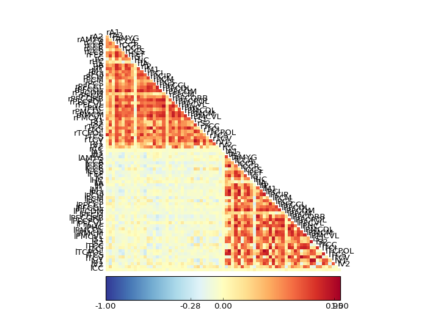

      `Analyze Region Corrcoef`_

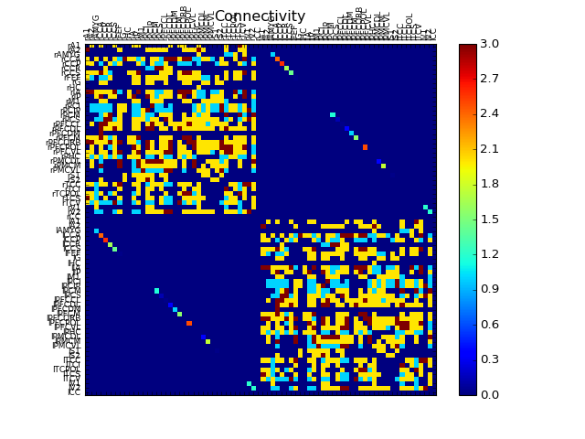

      `Compare Connectivity Normalization`_

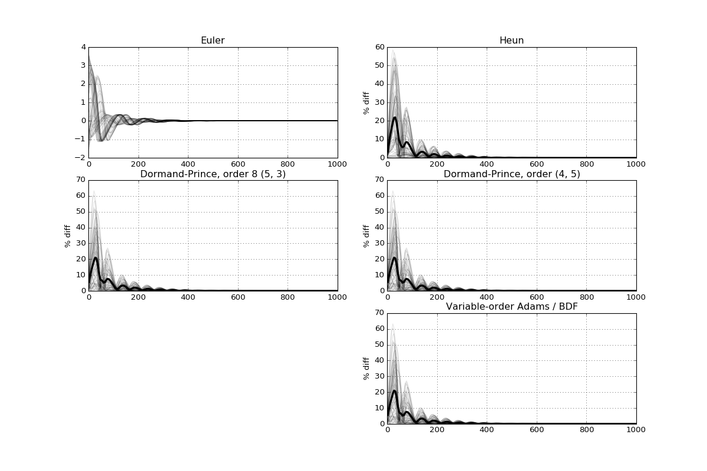

      `Compare Integrators`_

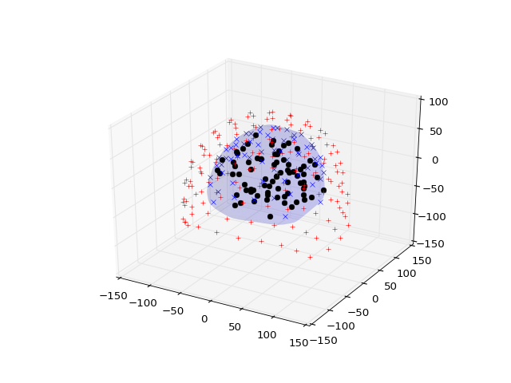

      `Display Source Sensor Geometry`_

.. figure:: figures/display_surface_local_connectivity.png
      :width: 200px
      :figclass: demo-figure
      :target: `Display Surface Local Connectivity`_

      `Display Surface Local Connectivity`_

.. figure:: figures/exploring_longer_time_series.png
      :width: 200px
      :figclass: demo-figure
      :target: `Exploring Longer Time Series`_

      `Exploring Longer Time Series`_

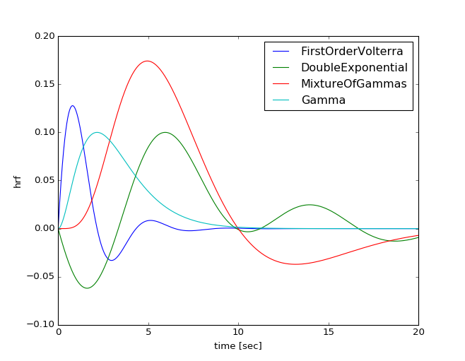

      `Exploring The Bold Monitor`_

.. figure:: figures/exporing_a_surface_mesh.png
      :width: 200px
      :figclass: demo-figure
      :target: `Exporing A Surface Mesh`_

      `Exporing A Surface Mesh`_

.. figure:: figures/generate_surrogate_connectivity.png
      :width: 200px
      :figclass: demo-figure
      :target: `Generate Surrogate Connectivity`_

      `Generate Surrogate Connectivity`_

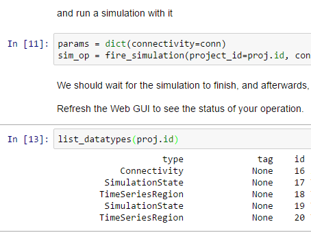

      `Interacting With The Framework`_

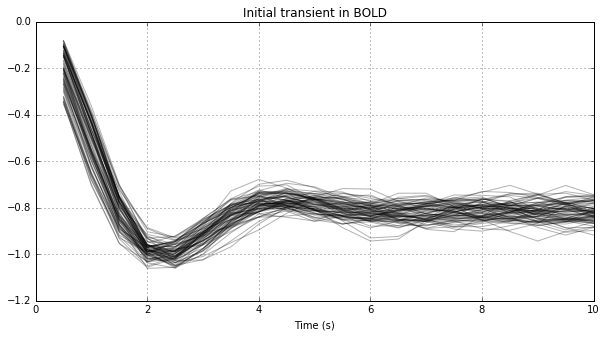

      `Simulate Bold Continuation`_

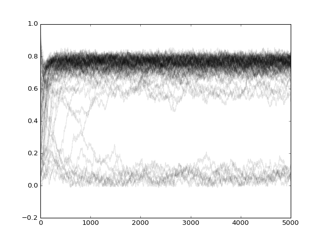

      `Simulate Reduced Wong Wang`_

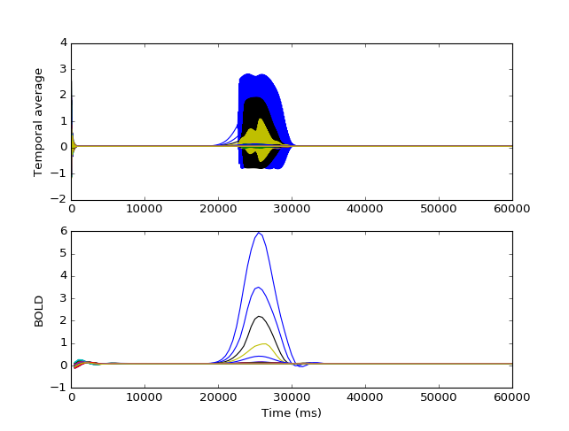

      `Simulate Region Bold Stimulus`_

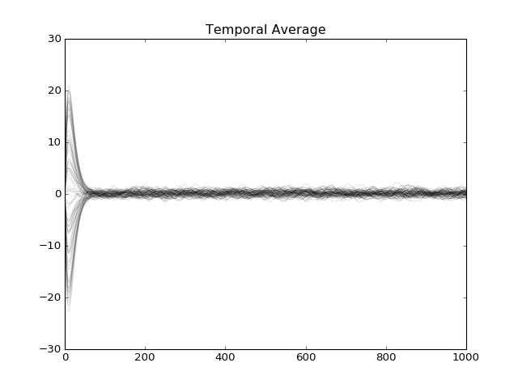

      `Simulate Region Jansen Rit`_

.. figure:: figures/simulate_region_stimulus.png
      :width: 200px
      :figclass: demo-figure
      :target: `Simulate Region Stimulus`_

      `Simulate Region Stimulus`_

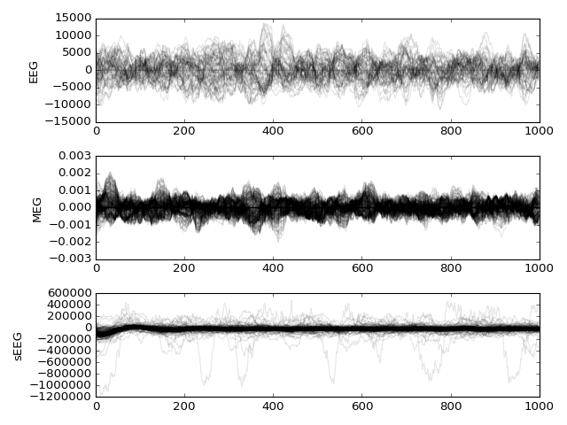

      `Simulate Surface Seeg Eeg Meg`_

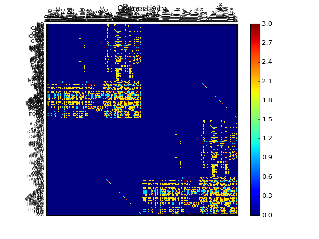

      `Using Your Own Connectivity`_

.. toctree::
      :hidden:

      Demos_Matlab

.. _matlab_demos:

MATLAB Demos
============

These are the first demos of the experimental use of TVB from the MATLAB environment, and they will
be expanded in the future.

.. figure:: ../../matlab/html/tvb_demo_region_rww_01.png
      :width: 200px
      :figclass: demo-figure
      :target: :ref:`tvb_demo_region_rww`

      :ref:`tvb_demo_region_rww`

.. figure:: ../../matlab/html/tvb_demo_two_epi_01.png
      :width: 200px
      :figclass: demo-figure
      :target: :ref:`tvb_demo_two_epi`

      :ref:`tvb_demo_two_epi`