GUI Demos
=========

The links in this section showcase TVB's web interface.

Simulation
----------

.. Sphinx limitations
      A :target: option on figure allows for links. But not for sphinx refs.
      So clicking the images does not follow the link.
      The images cannot be arranged in a flowing grid.
      To work around the grid issue we have added a css class and a rule for it in default.css
      To work around the target issue we have added direct html links. These are not robust and
      will be weird if this document will be rendered to pdf.

.. figure:: /manuals/UserGuide/screenshots/simulator_phase_plane_interactive.jpg
      :width: 200px
      :figclass: demo-figure
      :target: ../manuals/UserGuide/UserGuide-UI_Simulator.html#phase-plane

      :ref:`Exploring a Model phase space. <phase_plane>`

.. figure:: /manuals/UserGuide/screenshots/simulator.jpg
      :width: 200px
      :figclass: demo-figure
      :target: ../manuals/UserGuide/UserGuide-UI_Simulator.html#simulator-ui

      :ref:`Launch a simulation. <simulator_ui>`

Data Management
---------------

.. figure:: /manuals/UserGuide/screenshots/data.jpg
      :width: 200px
      :figclass: demo-figure
      :target: ../manuals/UserGuide/UserGuide-UI_Project.html#tree-view-ui

      :ref:`View the data types in a project <tree_view_ui>`

.. figure:: /manuals/UserGuide/screenshots/default_operations.jpg
      :width: 200px
      :figclass: demo-figure
      :target: ../manuals/UserGuide/UserGuide-UI_Project.html#operations-ui

      :ref:`Operations executed in the project <operations_ui>`

Visualizers
-----------

.. figure:: /manuals/UserGuide/screenshots/visualizer_timeseries_svgd3.jpg
      :width: 200px
      :figclass: demo-figure
      :target: ../manuals/UserGuide/UserGuide-UI_Simulator-Visualizers.html#ts-svg-ui

      :ref:`Time series view <ts_svg_ui>`

.. figure:: /manuals/UserGuide/screenshots/visualizer_brain.jpg
      :width: 200px
      :figclass: demo-figure
      :target: ../manuals/UserGuide/UserGuide-UI_Simulator-Visualizers.html#brain-activity-view

      :ref:`3D brain activity view <brain_activity_view>`

.. figure:: /manuals/UserGuide/screenshots/visualizer_dual_head_eeg.jpg
      :width: 200px
      :figclass: demo-figure
      :target: ../manuals/UserGuide/UserGuide-UI_Simulator-Visualizers.html#brain-activity-view

      :ref:`brain_dual_view`

.. figure:: /manuals/UserGuide/screenshots/visualizer_tsv.jpg
      :width: 200px
      :figclass: demo-figure
      :target: ../manuals/UserGuide/UserGuide-UI_Simulator-Visualizers.html#brain-volumetric

      :ref:`brain_volumetric`

.. figure:: /manuals/UserGuide/screenshots/connectivity_editor.jpg
      :width: 200px
      :figclass: demo-figure
      :target: ../manuals/UserGuide/UserGuide-UI_Connectivity.html#connectivity-matrix-ui

      :ref:`connectivity_matrix_ui`

.. _scripting_demos:

Scripting Demos 
===============

These tutorials are written as IPython Notebooks and they use the scripting interface of TVB.
They can be run interactively if you have TVB’s scientific library and ipython installed.

The first set of "basic" tutorials are listed roughly in the order they should be read,
and cover the basic functionality of TVB's simulator package using very simple
examples.

.. _Anatomy Of A Region Simulation: http://nbviewer.ipython.org/url/docs.thevirtualbrain.org/demos/anatomy_of_a_region_simulation.ipynb
.. _Anatomy Of A Surface Simulation: http://nbviewer.ipython.org/url/docs.thevirtualbrain.org/demos/anatomy_of_a_surface_simulation.ipynb
.. _Exploring A Model: http://nbviewer.ipython.org/url/docs.thevirtualbrain.org/demos/exploring_a_model.ipynb
.. _Exploring A Model Reduced Wong Wang: http://nbviewer.ipython.org/url/docs.thevirtualbrain.org/demos/exploring_a_model_reducedWongWang.ipynb
.. _Exploring The Bold Monitor: http://nbviewer.ipython.org/url/docs.thevirtualbrain.org/demos/exploring_the_bold_monitor.ipynb
.. _Looking At Longer TimeSeries: http://nbviewer.ipython.org/url/docs.thevirtualbrain.org/demos/looking_at_longer_time_series.ipynb
.. _Region Stimuli: http://nbviewer.ipython.org/url/docs.thevirtualbrain.org/demos/region_stimuli.ipynb
.. _Surface Stimuli: http://nbviewer.ipython.org/url/docs.thevirtualbrain.org/demos/surface_stimuli.ipynb
.. _Smooth Parameter Variations: http://nbviewer.ipython.org/url/docs.thevirtualbrain.org/demos/smooth_parameter_variation.ipynb
.. _Stochastic Simulations: http://nbviewer.ipython.org/url/docs.thevirtualbrain.org/demos/stochastic_simulation.ipynb
.. _Getting To Know Your Mesh Surface: http://nbviewer.ipython.org/url/docs.thevirtualbrain.org/demos/getting_to_know_your_mesh_surface.ipynb
.. _Using Your Own Connectivity: http://nbviewer.ipython.org/url/docs.thevirtualbrain.org/demos/using_your_own_connectivity.ipynb
.. _Monitoring With Transformations: http://nbviewer.ipython.org/url/docs.thevirtualbrain.org/demos/monitoring_with_transformations.ipynb
.. _Connectivity Normalisation Modes: http://nbviewer.ipython.org/url/docs.thevirtualbrain.org/demos/connectivity_normalisation_modes.ipynb
.. _Generate Surrogate Connectivity: http://nbviewer.ipython.org/url/docs.thevirtualbrain.org/demos/generate_surrogate_connectivity.ipynb
.. _SEEG Region Deterministic: http://nbviewer.ipython.org/url/docs.thevirtualbrain.org/demos/seeg_region_deterministic.ipynb
.. _SEEG Surface Deterministic: http://nbviewer.ipython.org/url/docs.thevirtualbrain.org/demos/seeg_surface_deterministic.ipynb
.. _Region Stochastic ReducedWongWang: http://nbviewer.ipython.org/url/docs.thevirtualbrain.org/demos/region_stochastic_reducedwongwang.ipynb
.. _Region Stochastic Jansen: http://nbviewer.ipython.org/url/docs.thevirtualbrain.org/demos/region_stochastic_jansen.ipynb
.. _Surface Deterministic Custom Local Connectivity: http://nbviewer.ipython.org/url/docs.thevirtualbrain.org/demos/surface_deterministic_custom_local_connectivity.ipynb

.. _Correlation_coefficient Analyzer: http://nbviewer.ipython.org/url/docs.thevirtualbrain.org/demos/corrcoeff_analyse_view_region.ipynb
.. _PCA Analysis: http://nbviewer.ipython.org/url/docs.thevirtualbrain.org/demos/pca_analyse_view_region.ipynb

.. _Display Sensors Location: http://nbviewer.ipython.org/url/docs.thevirtualbrain.org/demos/display_sensors_locations.ipynb
.. _Display Subject Dataset: http://nbviewer.ipython.org/url/docs.thevirtualbrain.org/demos/display_subject_dataset.ipynb
.. _Display Surface Local Connectivity: http://nbviewer.ipython.org/url/docs.thevirtualbrain.org/demos/display_surface_local_connectivity.ipynb
.. _Display Surface Parcellation: http://nbviewer.ipython.org/url/docs.thevirtualbrain.org/demos/display_surface_parcellation.ipynb

Simulation
----------

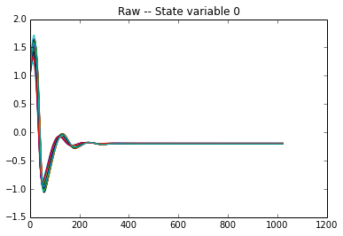

      `Anatomy Of A Region Simulation`_

.. figure:: figures/anatomy_of_a_surface_simulation.png
      :width: 200px
      :figclass: demo-figure
      :target: `Anatomy Of A Surface Simulation`_

      `Anatomy Of A Surface Simulation`_

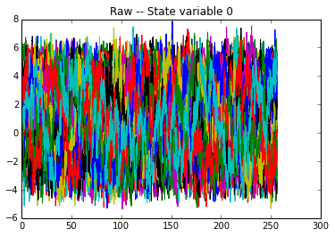

      `Exploring A Model`_

.. figure:: /manuals/UserGuide/screenshots/demo_wong_wang.png
      :width: 200px
      :figclass: demo-figure
      :target: `Exploring A Model Reduced Wong Wang`_

      `Exploring A Model Reduced Wong Wang`_

.. figure:: /manuals/UserGuide/screenshots/demo_bold.png
      :width: 200px
      :figclass: demo-figure
      :target: `Exploring The Bold Monitor`_

      `Exploring The Bold Monitor`_

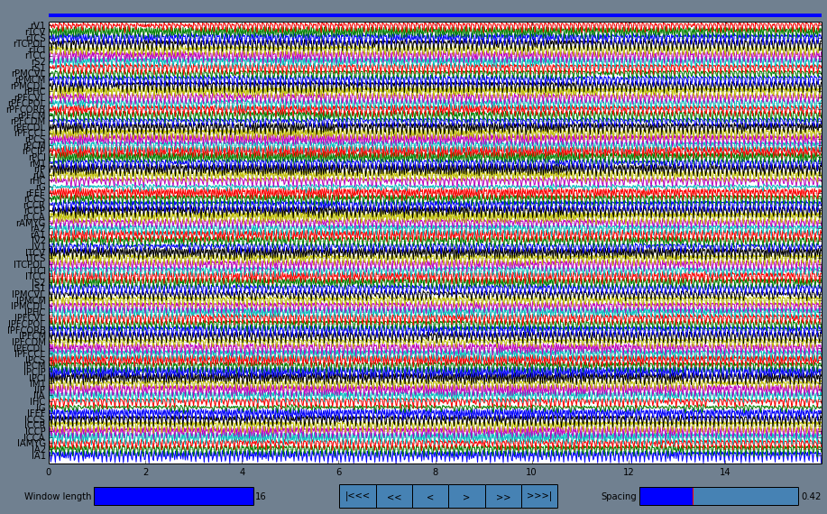

      `Looking At Longer TimeSeries`_

.. figure:: /manuals/UserGuide/screenshots/demo_stimuli.png
      :width: 200px
      :figclass: demo-figure
      :target: `Region Stimuli`_

      `Region Stimuli`_

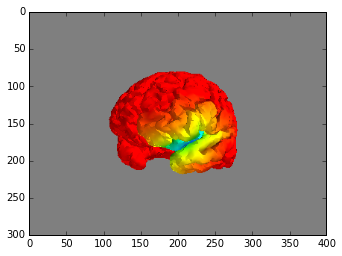

      `Surface Stimuli`_

.. figure:: /manuals/UserGuide/screenshots/demo_smooth_param.png
      :width: 200px
      :figclass: demo-figure
      :target: `Smooth Parameter Variations`_

      `Smooth Parameter Variations`_

.. figure:: /manuals/UserGuide/screenshots/demo_stoch.png
      :width: 200px
      :figclass: demo-figure
      :target: `Stochastic Simulations`_

      `Stochastic Simulations`_

.. figure:: /manuals/UserGuide/screenshots/demo_mesh_stats.png
      :width: 200px
      :figclass: demo-figure
      :target: `Getting To Know Your Mesh Surface`_

      `Getting To Know Your Mesh Surface`_

.. figure:: /manuals/UserGuide/screenshots/demo_conn.png
      :width: 200px
      :figclass: demo-figure
      :target: `Using Your Own Connectivity`_

      `Using Your Own Connectivity`_

.. figure:: figures/monitoring_with_transformations.png
      :width: 200px
      :figclass: demo-figure
      :target: `Monitoring With Transformations`_

      `Monitoring With Transformations`_

.. figure:: figures/connectivity_normalisation_modes.png
      :width: 200px
      :figclass: demo-figure
      :target: `Connectivity Normalisation Modes`_

      `Connectivity Normalisation Modes`_

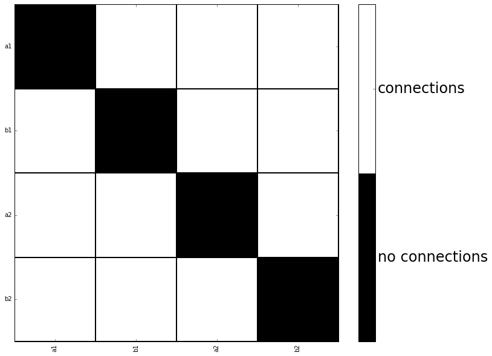

      `Generate Surrogate Connectivity`_

.. figure:: figures/seeg_region_deterministic.png
      :width: 200px
      :figclass: demo-figure
      :target: `SEEG Region Deterministic`_

      `SEEG Region Deterministic`_

.. figure:: figures/seeg_surface_deterministic.png
      :width: 200px
      :figclass: demo-figure
      :target: `SEEG Surface Deterministic`_

      `SEEG Surface Deterministic`_

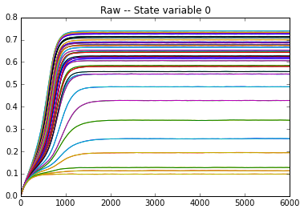

      `Region Stochastic ReducedWongWang`_

.. figure:: figures/region_stochastic_jansen.png
      :width: 200px
      :figclass: demo-figure
      :target: `Region Stochastic Jansen`_

      `Region Stochastic Jansen`_

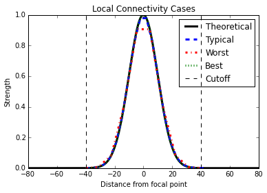

      `Surface Deterministic Custom Local Connectivity`_

Analyzers
---------

.. figure:: figures/corrcoeff_analyse_view_region.png
      :width: 200px
      :figclass: demo-figure
      :target: `Correlation_coefficient Analyzer`_

      `Correlation_coefficient Analyzer`_

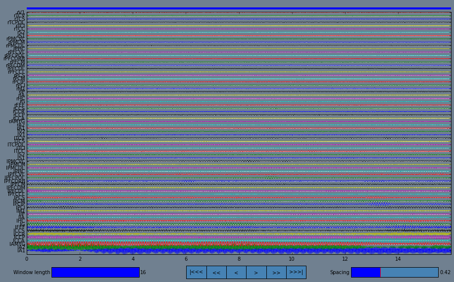

      `PCA Analysis`_

Visualizers
-----------

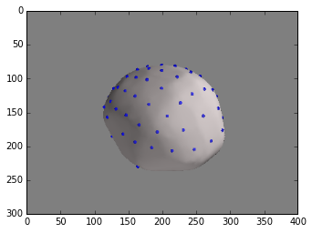

      `Display Sensors Location`_

.. figure:: figures/display_subject_dataset.png
      :width: 200px
      :figclass: demo-figure
      :target: `Display Subject Dataset`_

      `Display Subject Dataset`_

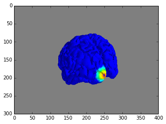

      `Display Surface Local Connectivity`_

.. figure:: figures/display_surface_parcellation.png
      :width: 200px
      :figclass: demo-figure
      :target: `Display Surface Parcellation`_

      `Display Surface Parcellation`_

.. toctree::
      :hidden:

      Demos_Matlab

Matlab Demos
============

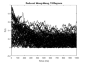

      :ref:`tvb_demo_simple`