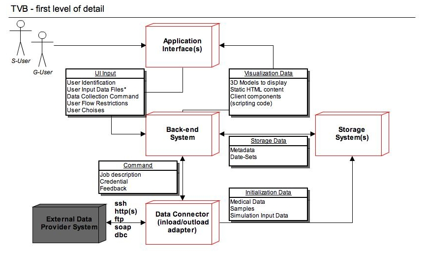
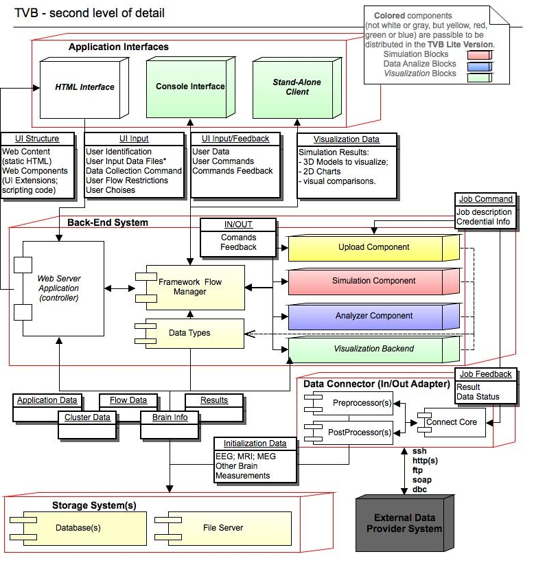
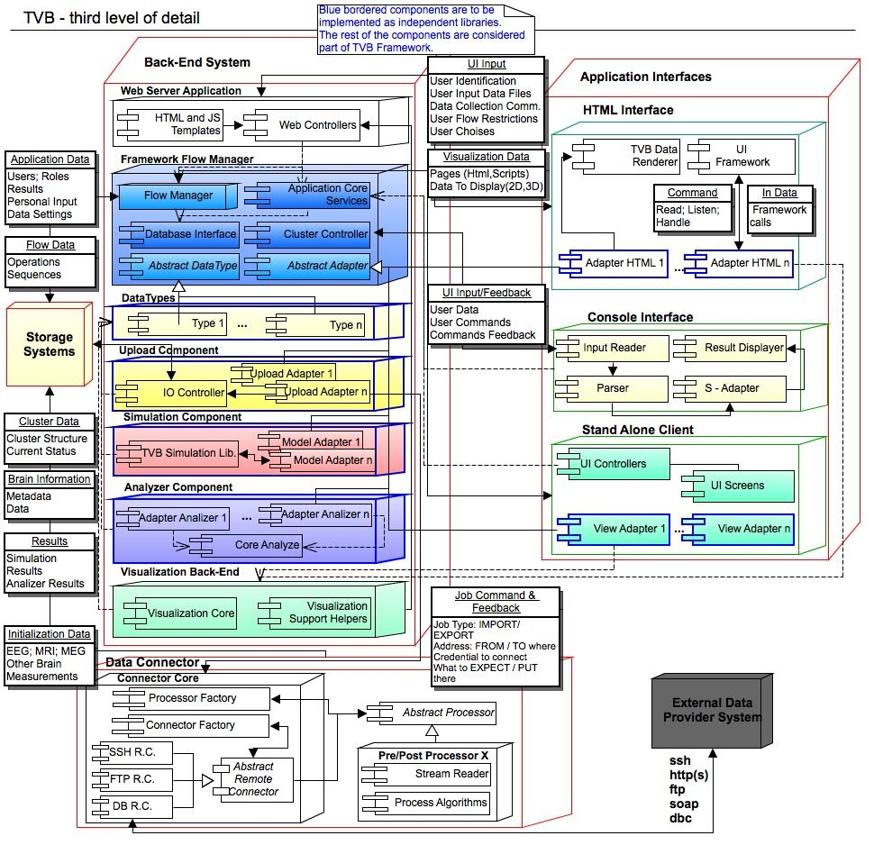
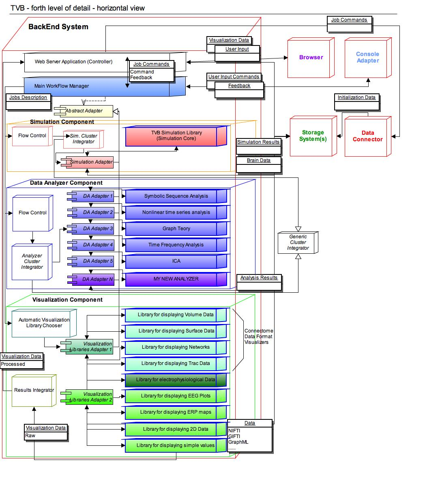
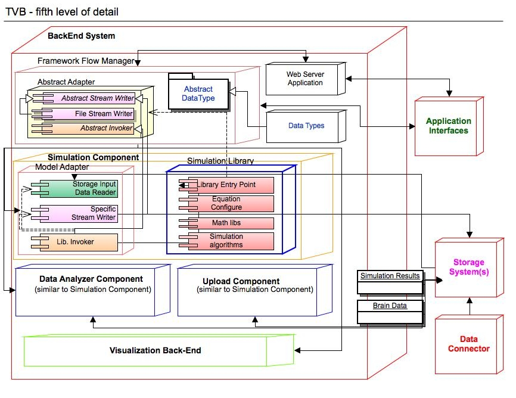

.. this is obsolete and not included in any toc trees.

:orphan:

.. |TITLE| replace:: Developers's Reference Manual
.. |DESCRIPTION| replace:: Describes the function and architecture of |TVB|
.. |VERSION| replace:: 1.0
.. |REVISION| replace:: 0.2


.. class:: legendtext

Legend

+---------------------+-----------------------------------------------------------------------------+
| **Term**            |  **Description**                                                            |
+=====================+=============================================================================+
|  TVB                | The Virtual Brain Project, including hardware and software components,      |
|                     | an open-source tool for the neuroscience community.                         |
+---------------------+-----------------------------------------------------------------------------+
| TVB Framework       | TVB Software skeleton (architecture and concrete artifacts), where          |
|                     | different independent libraries can be plugged-in.                          |
+---------------------+-----------------------------------------------------------------------------+
| TVB Full Version    | TVB software distribution package, with all the components included,        |
|                     | intended to be deployed on a cluster hardware. It will have a web interface.|
+---------------------+-----------------------------------------------------------------------------+
| TVB Light Version   | TVB software distribution package, stripped of several "heavy" components,  |
|                     | for the purpose of being distributed on a researcher's laptop/PC/node.      |
|                     | This version is to be decided if it will have the same web interface, or    |
|                     | will have a stand-alone graphical or console interface.                     |
+---------------------+-----------------------------------------------------------------------------+
| TVB Team            | Randy McIntosh, Viktor Jirsa, Laurent Pezard, Yann Manhoun, Jean-Luc Blanc, | 
|                     | Stuart Knock, Noelia Montejo, Marmaduke Woodman, Paula Sanz Leon            |
|                     | Jochen Mersmann, Calin Pavel, Bogdan Neacsa, Ionel Ortelecan, Lia Domide    |
+---------------------+-----------------------------------------------------------------------------+


.. contents::
    :depth: 3

.. raw:: pdf

   PageBreak oneColumn


Introduction
============
The Virtual Brain project (TVB project) has the purpose of offering some modern tools to the Neurosciences community, for computing, simulating and analyzing functional and structural data of human brains. It will try to bring customized engineering tools into the hands of basic and clinical Neuroscience researchers. TVB will be a modeling and analysis platform, which will allow the simulation of functional brain data specific to individual brain structures and connectivity. Experimental functional and structural data will be read into TVB and the same degree of analyses will be applicable to both simulated and experimental data.

The final goal of TVB is to create a new revolutionary tool for clinical interventions. As an example case, a clinical researcher will be able to upload brain imaging data from their patients unique neural architecture after a stroke, for example, into the synthetic healthy brain model to see how it responds to the disruption of normal network patterns and attempts to re-stabilize. This will assist the clinician in determining the treatment interventions that will likely have the best outcomes for their patient.

The project is not the first simulation tool in the computational neuroscience community, though it is the first for large-scale brain modeling, and arguably the most ambitious one.  TVB will be open to learn from and to take advantage of new existing tools. TVB is intended to be an open-source software-product, available for usage in an on-line installation, but also available for download and install by any interested person or institution.

TVB project has the goal to manipulate multiple brain models, at a middle-grain to large-scale level. It doesn't intend to build brain models at the grain of neurons, but will use information from microscopic models to improve the performance of the neural population models acting as the building blocks of the Virtual Brain network.

TVB is not a project of artificial intelligence, but it rather simulates the physical characteristics of the human brain. TVB has also the purpose of building a high-performance cluster, accessible over web from anywhere. It will avoid the necessity of multiplying big and powerful computers in several laboratories.

Input data for TVB can be retrieved from multiple sources: functional neuroimaging like EEG, MEG, sEEG, fMRI and structural imaging such as MRI, DTI, DSI, but also data from the literature etc.

This paper is intended to give a brief starting point on the Virtual Brain project, from the technical point of view. It will refer to architectural and few implementation details. It is meant to bring together important architectural decisions, some already made and others in course of being accepted.

This white-paper should provide the technical fundaments for future implementations of components and changes required for the pieces of software already existent. Several partners will work in parallel on multiple project parts, so this document will serve as a guiding line in offering an overall image of the entire Virtual Brain project to the involved programming teams.

The Virtual Brain project cannot exist without other previous open-source projects in the area of Neuroscience, some of which are listed in the references part of the document. Nevertheless, from the technical point of view, the Virtual Brain is unique in its modern and new access to the domain.

.. raw:: pdf

   PageBreak


Requirements
============

Functional Requirements
-----------------------

* **Scientific Usage**

These three are the main functional requirements for TVB, from the science point of view:

     - possibility to configure, execute and monitor large scale brain **simulations**;

     - configure and execute **data analysis** algorithms and methods;

     - **visualize** brain input data and analysis results.

When using TVB, a researcher needs to have the freedom to configure simulations and data analysis. A researcher needs to both interfere with existing simulation or libraries for analysis, by **configuring the equations** of the brain network used by the tools, and also to be able to build his/her own libraries and to **plug** them into the TVB Framework. The extensions of functionality of TVB should be as easy as possible, which means as little coding as possible.

A common use of TVB will be the scanning of parameter spaces of the brain network. Hence TVB will offer the functionality of operating in batch mode, in which a given simulation can be performed multiple times as a parameter is changed. The results will be captured in parametric maps of convenient measures and appropriately visualized.

Each user can firstly view, but also download or export his/her own **results** obtained with TVB, in multiple formats. The final results will be captured in a set of images of *high quality*, sufficient to be used fort publications in scientific *articles*.

Several **brain models** will be used that are composed of the connectivity matrix and a network node model. Generic default brain models will exist in the system, but also each user will be able to upload individualized models (for instance of a patient), in a predefined format. Brain models are based on previous brain-measurements. Users can choose what brain model they want to use for each particular simulation or data analysis they initiate.

* **Connect to External Storages**

In the neuroscience community, several open data storages already exist, containing useful input data for brain modeling and patient analyses. It is one of the important requirements for TVB to connect to such storages to *import* and *export* data from/to them. Different protocols will be used when communicating with such **External Storages**. 

* **Use in clinics**

TVB is not intended in the first place to become a diagnostic tool of the clinician. However, the clinical researcher will benefit from the use of TVB to design new treatment strategies, test out hypotheses and explore alternative avenues of brain repair. In the long run, TVB may become a precursor of a future diagnostic tool. 

* **Application Interface**

The entire system should be accessible through a **Web-Interface**. The web-interface should be built on W3C-Standards; HTML-5 will provide the basic support for visualization. A 3D representation is expected for the brain models, in a browser environment, along with graphs and charts for several 2D results.

Virtual Reality has grown a lot in the last few years, and fast, light, browser-based applications had appeared, impressing the world of computer science. We should learn from projects like: OnLive_ and Otoy to bring the power of graphics to the clients through a light web interface. However it might be necessary to allow for the usage of additional, browserenabled software (like Java-Applets or Flash), dependent of other open-source Projects from the domain we want to embrace.

Another level of usability to be achieved is a **script interface** for advanced users. The *script interface* will provide rapidity and straight access to the system.

The third level of usability is through a desktop, **Stand-Alone Interface**. This interface is not yet fully acknowledged as a requirement, but it an option nice to have. This interface could be the client-end for both TVB-Full version and Light version. This type of interface could give the user the feeling of a "really installed" application, especially for the Light Version of TVB, and would nicely mimic behavior of other existing tools in this field.  

* **Multi-user application**

You need to have an account to access the  VB system, at least for TVB Full Version distribution. A log-in page will appear, and each user will have its own data to manipulate and view, separated from the other users. Some information might be public, for all users to share (like brain structural data). For TVB Light Version, multi-user environment will not be included. 

Single users will be able to make their projects or parts of their results available either to all users (public) or designated other single users. In the latter case, the ensemble of single users with shared access rights to a common project forms a **user group**.

**Multi-tenancy** will be a good add-on here, too, as we work here with clinical data, which should live under the highest data-privacy standards. So if a patient gave consent, that a group of Doctors may look at his data, that should not apply to all Users of the System! 

* **Customizable dashboard**

A VB user will have its own personal page, something like a dashboard, where he/she can compose his/her own view over Virtual Brain. This page needs to be easily configurable, and already predefined for a new user with basic functionality (maybe dependent on the user's role, type or group).

Different VB elements like: simulation-status, 3D-models, Graph-models, Data-sets, working-queues, transformation-steps etc. shall all have different interfaces, dependent on the current user's role. Thus, a researcher will see more details than a clinician, and a developer will have a more technical view of all this elements.

The roles that are currently known for the VB view are: researcher, clinician and maybe developer, but others might be mentioned as the discussions evolve.

.. raw:: pdf

   PageBreak

Nonfunctional Requirements
--------------------------
* **Cluster infrastructure**

Performance is a common requirement in any decent application, especially when user interaction exists. Regardless that, in the Virtual Brain project, some simulations might take days or weeks to be executed on regular stations, and multiple users are expected to want their data processed in the same time.

Besides the obvious performance requirement, a cluster or a grid can offer a clear separation in executing tasks. In a multi-node environment different nodes could execute different types of tasks. For example we could have nodes for different users, or nodes for brain-simulations and nodes for graphical operations. TVB is so far not intended to make use of parallel programming across nodes for the brain network model. The here mentioned task distribution across nodes is intended for tasks within TVB, but not the numerical simulation of the brain network equations. Having tasks executed over a cluster or a grid is a requirement for the Virtual Brain's Full Version deployment.

* **Open software**

TVB is to be distributed as an open-source software, thus only Open Source *tools* and *standards* are to be used when developing it. 

However that still means, that we have to take a decision on the license, which we want to use for The Virtual Brain system and we need to pay attention, to only use Software, which has a compatible license.

* **Shrink-Wrap the software**

Some users, researchers or developers in the project, might want to use the product on their local machines. Virtual Brain will offer the possibility to download and locally install, with a customizable set of parameters, the product. The software shall shrink to the needs of each person that downloads it. This TVB Light version, might come with a different Graphical User Interface, than the web interface for TVB Full.

An installer shall be made available for the operating systems of Windows, Macintosh and Linux, taking as an input multiple parameters, for correctly configuring the product. The downloadable package will be a reduced version of the product, striped of multi-user or data import/export capability.

.. raw:: pdf

   PageBreak


I. Main System Components
=========================
In the following chapters, we intend to describe the architectural details of TVB, starting from a top level view, and going deeper in detail, as the document proceeds.



1. APPLICATION INTERFACES
-------------------------
The process of interacting with TVB Project needs to be smooth and easy, even for the complex user stories aimed to be solved by this project. Thus, a set of multiple *interaction interfaces* is to be provided, to accommodate the best support for each specific user typologies and deployment alternatives.

Based on the interaction method we can identify the following categories of users:

- **Graphical User** (G-User in the above figure) - As the name suggests, the Graphical User will access the application through a complex graphical interface. The interface is expected to fulfill usability standards and to have an intuitive and familiar outfit.

- **Script User** (S-User in figure) - This type of user will access the application through a fast, scripting interface. This interaction type is recommended for advanced users only, for which the concepts proposed by TVB are known and understood.

Based on the deployment method, we can identify the following categories of clients:

- **Light Cluster Client** - This type of client, will come with a minimum set of installed components on the client side, and it will intensively use the cluster infrastructure for all operations, including data storage.

- **Stand Alone Client** - On the opposite side of the *Light Cluster Client* is the *Stand Alone Client*. A stand alone installation, needs to be self-sufficient, to execute all TVB related operation on the client device, without communicating with the original TVB site (except maybe for regular software updates). This installation will no benefit from the cluster hardware computing power, but it will be able to work even in the absence of a network connection, and it will accomplish the most strict privacy standards.

- **Stand Alone with Cluster Fallback** - This third type of client, combines the advantages from the previous two ones. On the client side we have a set of capabilities installed, and for the operations which are extremely resource consuming, this client is able to communicate with the cluster. The light operations are expected to be executed on the client-side, but the longest ones will be passed to the cluster. The cluster receives abstract sets of input data, without nominal information, or even references, and only the client will be able to interpret results, thus providing a high privacy level. In the absence of a network connection, or with a low band-with, the stand alone client is still capable to execute local operations.

TVB is expected to have a dynamic interface; depending on the user's role, group, process in role, etc. The above mentioned user categories and deployment procedures are to be closely considered when designing desired interfaces for TVB application.  

2. BACK-END SYSTEM
------------------
TVB application summarizes all the logic, which enables data-sets to be:

- feed into the system; 

- processed according to a configurable parameter-set; 

- visualized. 

An important requirement for TVB project, to be taken into account, is performance. Due to the nature of the given problem, a single simulation-step can not be easily distributed over multiple processing threads, but each simulation-step can be fully computed in a different thread, potentially on a distinct node (with special requirements on the node - mainly in terms of available Memory). However as we will have multiple simulations (with different parameter-sets) from one user on one data-set and additionally have a multi-user environment, where multiple users work on the system in parallel, the usage of a cluster would give a great advantage, by being capable to execute multiple tasks in parallel. 

TVB also has to be multi-user and multi-tenant capable. The back-end component will need to fulfill this capabilities.

Strictly from a *functional point of view*, the Back-End is expected to transparently handle different interfaces, and fulfill mainly the same functionality, regardless the chose interface. Anyway, there are few capabilities deployment specific, like dealing with multiple data-feeds, and managing computation on a cluster.

From the *implementation point of view*, the Back-End system will have dynamic components packed, dependent on the chosen interface and deployment procedure. An automatic packaging tool will make sure the correct components are packed. For example, with the web interface, a web server is expected to be provide as main part of the Back-End, and on the cluster deployment, the full set of capabilities and clients are expected to be supported.

As for the stand-alone distribution, the problem gets a bit more complex, because we would definitely want to avoid duplicating modules, but reuse same components as in the cluster distribution. One straight-forward solution would be to include in the client-distribution a small web-server instance. Starting the application on the client will start the web-server, accessible from any browser, as long as all the paths in the application are relative. Another solution is to design from the start a stand-alone interface, with a non-web graphical interface, and re-use the back-end services only.

3. STORAGE SYSTEM(S)
--------------------
TVB-Application will work on structured meta-data, which should be searchable and on big data-sets (which are also structured, but do not benefit from decomposing and feeding into a standard database). Thus we would need some persistence, which is structured and searchable (most probably a relational database, but it could also be an XML-File for a "local" deployment) and a shared storage for the high-volume data-sets, which needs to be accessible from every involved node (in the cluster deployment). 

Where it is obvious, that design decisions around *access control* has to go into the DB design, to secure the data we process; it still has to be discussed, if the same applies for the File Storage, or if we secure access to files via other means (network restricted access, firewalls, etc.).

4. DATA CONNECTOR
-----------------
Big data-sets of medical information already exist in multiple external data storages (used for other purposes, too). At some point in the usage of the Virtual Brain system, some of that data can be imported.

Similar in terms, but with different data-flow, is valid that data also has to leave TVB-system towards some External Data Storages. Thus the Output Data requires to be processed and exported from an internal form into an accepted external format.

Initiating a Data-Connect command will come from the Browser interface or the Console Interface, and will pass the Back-End Component, but the real executor of that job, will be the Data Connector component of the Virtual Brain. 

The Data Connector is expected to receive a Job Descriptor, witch includes information about the External Data Source, credentials to access the system and operation target (what to do with the data). The meaning of the data to be imported/exported can come from the External Data Source itself, in an accepted format (metadata), or from the Back-End System. 

The interface with the External Data Sources is to be established, and will be highly dependent on the target systems. 

Specific transformations of the collected data can be executed on the imported data-sets, and it is part of this component's description to do them (based on the information in the given Job Descriptor). Depending on the effective data, and taking in consideration the accepted formats for TVB internal simulation algorithms, the transformations required can be quite complex. 

An alternative to this component is to have all the input data "uploaded" from the user interface, but this is a highly not desirable method, because of the size such data can have, and the frequency of the operation. Nevertheless an upload from the browser interface might be necessary, when no other external system exists and data is provided "as-it-is".

This component is expected to be part of TVB Cluster Version, and unavailable in the Light distribution for single nodes. This is still an issue to be discussed and decided, but this proposal (of excluding this component from the light version) comes from the fact that the requirements for this component to work might make the "light version", much too "heavy".

.. raw:: pdf

   PageBreak


II. Second Level of Detail
==========================
In this second drawing, you can find the same main components as in the previous level of detail, each of them only gaining several sub-components inside.



Important at this level of detail is the **coloring scheme**: it tries to identify which of the components are to be distributed in the *Light TVB Version* and which are to remain only for *TVB Full Version*. The colored blocks are expected to be distributed in the Light version, but the white components will not be distributed at all (e.g. Data Connector), or will suffer great changes (like the Web Server part). 

An exception from the coloring scheme is the gray block representing the *External Data Storages*, which is not part of TVB at all, is only used for communication with.

To identify the visualization blocks, we used the green color (for components to be distributed in the Light TVB Version) and Italic font, for other visualization blocks, available only in TVB Full Version. 

1. APPLICATION INTERFACES
-------------------------
A. HTML Interface
``````````````````
One of the most important requirements for the Virtual Brain project is to have a web interface. Thus a browser will be involved, and it will be the entry point in accessing the Virtual Brain Full functionality, and also in rendering this interface. The HTML Interface will be a *modern and extremely usable* interface to TVB.

The exact supported browser types for the application will be decided at a later point in the development flow, but it is expected to have none, or as few as possible, third-party elements installed in browser. Nevertheless, it is expected to have Java Script enabled and HTML 5 supported (including WebGL). This will split the work for visualization between the client and the back-end server, thus minimizing the network speed dependency. We do not intend to have an extremely *thin client* nor a *fat back-end*, but rather split the work between the two components, to have a mediative solution for bandwidth dependency and rendering speed.

Most user's interaction comes from a browser interface, and also most of the processing results will be presented to the end-user in browser. Other forms of output, like "downloadable" results, are obviously necessary.

B. Console Interface
``````````````````````
It is expected, for The Virtual Brain project, to have a special type of users, working on a very low level of abstraction, and for that, they will need and use a console interface. These users, will probably be researchers, with a previous neuroscience knowledge. They will benefit of full control over the internal parameters, flow and algorithms. Obviously, the Console Interface is harder to use, by a non-initiated user, but manuals will be provided, along with examples of extensions, and workflows.

From the two categories of users expected for TVB: "G-user" (Graphical User) and "S-User" (Script User), defined in Chapter I of this document, the Console Interface will serve S-Users. S-Users, are initiated users, who need a lot of *freedom and speed* in the actions they are to do with TVB, and the Console Interface intends to support that. 

C. Stand-Alone Client
```````````````````````
A third type of interface, the Stand-Alone one, comes from a specific distribution scheme: stand-alone distribution, not in cluster, but installed on a personal/local computer/laptop.

The Stand-Alone Client needs to re-use all the back-end business logic that is used by the other *Application Interfaces*, and only re-write the *View Component* (from Model-View-Controller Design Pattern).

This Interface comes with a specific requirement support: *extending* TVB functionality with *custom algorithms* or plug-ins. It is highly risky to allow contributors to append custom components directly in the cluster public distribution, thus, the Stand-Alone Client comes as a safe solution. Also for *network connections* with very *low speed*, the stand-alone client will provide an elegant solution, by avoiding long waiting times for server responses.*

2. BACK-END SYSTEM
------------------
A. Web Server Application
`````````````````````````
The Web Server Application is the **controlling** element at the back-end level, for the HTML Interface. It should be the one receiving data from the *HTML Interface* and making sure the correct response is feed back, after corresponding operations were executed.

It needs to take into account the need of having the UI decomposed into several parts (for easy maintenance and development) and possibly also the requirement to have a light version of the software deployable on a single personal computer (with a wrapped web-server on the client).

Also at this level, visualization parameters and input data will be prepared, for usage at the HTML Interface level, and for passing it to the back-end components, respectively.

B. Framework & Flow Manager
```````````````````````````
As the Web Server, will be used for the HTML Interface only, and possibly only for the Full TVB Distribution, *the Framework Flow Manager* is the intersection point between different Application Interfaces and the actual business logic in the Back-End. Thus this component needs to be abstract and have no connection with the interaction method (script, html or stand-alone interface). This component need to act as a framework controller for TVB business logic and also have some flow management.

The next four components in Back-End (Uploading Adapter, Simulator, Data Analyzer and Visualizer), are all part of TVB specific workflow, implementing TVB specific functional requirements, but the *Framework Manager* will be an abstract package, managing different types of operations (not only TVB specific ones).

We expect this block to be the common point in interacting with TVB libraries (the four mentioned above) or other custom libraries (sharing the same interfaces), from the Web Interface and Stand-Alone Client (by the G-User) and from the Console Interface (by the S-User).

From the development point if view, the *Flow and Framework Manager* will have a triple role:

- recording user's action and their results, for logging purposes or playback;

- playing a sequence of operations, from a previously recorded set of actions or deduced/parsed from current user's input;

- and offer code support for the Application Interfaces and the Independent Plug-able Libraries.

C. Upload Component
```````````````````
This component will be the one controlling the interaction jobs into the Data Connector component, as it will trigger and configure such IO operations, and will receive feedback about them.

Along with retrieving or exporting data in the background, from or into *External Data Storages*, we will want to have also data uploaded directly from the *Application Interfaces*. This will be data obtained from patient scans and needs to respect a well defined format. The *Upload Component* will take care that the correct format is followed and data is stored in the correct places.

The *Uploading* block is directly controlled by the *Flow Manager*, but it further controls the *Data Connector* block.

D. Simulation Component
```````````````````````
The Simulation Component is probably the most representative component in The Virtual Brain solution, as it is the component responsible for all the scientific computation related to brain models and data. 
 
The Simulation Component will receive controlling messages (a set of parameters) from the *Flow Manager*, and will know how to retrieve required Brain- Input data from the Storage System (set of input data to work on), based on that input.

The *Simulation Component*, along with the *Data Analyzer Component*, will benefit of the power of a cluster, to have their operations asynchronously executed there, as fast as possible. The problem structure of the Virtual Brain project, as we know it for now, seems to be hard to paralyze (the sequential flow of steps for data preparation and simulation is highly interconnected). Thus, when splitting work over multiple stations, the main nodes in our structure will be used to execute unitary and mostly independent processing steps.

E. Data Analyzer Component
``````````````````````````
For brain related data, several Analyzer algorithms are currently available to "process" the results.

It is known that most data analysis approaches are still "work in progress", thus TVB should allow for the greatest possible flexibility on the side of the S-User when it comes to any kind of data analysis algorithm. This being the case, TVB should allow for the user to adapt his/her own analysis tools.

The above mention issue is another common element between the Simulation and the Analysis Components. The S-User will be able to create and/or configure his/hers own processing algorithms to be executed. The S-User will be provided with hook-points for creating custom block to fit into TVB framework; in the same time, configuring the equations is also expected. The G-User is limited to the available algorithms inside TVB, but configuring them should be possible, too.

As S-User enhancements are visible only in the local environment (TVB Light Version), malicious code is avoided in the public distribution. Integrating contributor's work into the public TVB distribution will be manually handled, by authorized personnel. In a next generation of TVB we could provide the capability to upload code directly into the cluster distribution. In such case, we will make the new code "invisible" for most of the users, but available only to the owner, until some authorized person checks the new functionality.

F. Visualization  Back-End
```````````````````````````
The visualization tools are critical for TVB -they are difficult to home-brew and can really provide a quantum jump in understanding the neuroscience "secrets".

TVB should provide the capability to visualize, possibly as a movie, and where aplicable rendered in 3D, the following generic data types:

- scalp based data (EEG, MEG);

- cortical surface data (MODEL, SEEG);

- volume based data (fMRI, lesion site): visualization as a movie of selected sources with the brain as a background.

Several data types are expected to be supported for visualization. Acknowledging the fact that data types are extremely different, in form and meaning, a different visualization library is expected to be needed for each such data type. For sure, common part are expected, also.

From the *specific* visualization requirements that TVB has, based on neuroscience formats and protocols, we spot:

- visualization of connectivity matrices (structural and functional connectivity);

- visualization for the Connectome proposed data formats (NIFTI, GIFTI, GraphML, TrackVis);

- display of multiple time series with possibility to let it shift through (as known from EEG) for arbitrary sources, nodes, electrodes.

- display of wave let time series with possibility to let it shift through (as known from EEG) for arbitrary sources, nodes, electrodes.

- power spectrum for time series of arbitrary sources, nodes, electrodes;

- frequency-time plot of arbitrary sources, nodes, electrodes;

- coherence matrix of arbitrary sources, nodes, electrodes.

The Visualization components are highly dependent on the exact *Application Interface* chosen, thus an important part of the visualization is located in the *Interface* blocks, but we are expected to have a common Back-End, for using transparently any interface, dependent on the user chosen distribution.

G. Data Types
`````````````
The *Upload*, *Simulator*, *Analyzation* and *Visualization* Components will need to have a common "language" in order to work with the same data. In TVB architecture, that "common language" is represented by *Data Types*. 

A specific Data Type X will be generated after and *upload* operation from the interface, Type X is accepted by a Simulation Model as input, and it generated Type Y of Data. Type Y is accepted by an Analysis algorithm, and both Type X and Y have Visualization mechanisms. This is an abstract example of how Data Type can be used, for linking structures between different components in the Back-End block.

3. STORAGE SYSTEMS
------------------
Sub-components for the Storage are: **Database(s)** and **File System(s)**. One of these two elements could be used exclusively, but a complementary solution is considered better. Different distributions (Cluster or Stand-Alone) might have differences in the way data is stored.

Few distinct data collections are to be stored and later on manipulated in TVB project. Some of them will support mixing, but for others might come more natural and safer to be stored separately (distinct structures and different physical locations).

On one hand we will need to store **application data**: users, roles, groups, simulations progress state, personal input data and associations, settings, results mappings, work progress. This is the data coming from the Web Server Application and Framework Flow Manager, and it will be used by them when composing the final content for the UI-pages. This data is expected to be stored in a relational database system, as it would make use of the organization and the search engine of such a system.

All the **cluster-related data** needs to be stored someplace (probably database, but also xml files might work). It will refer to cluster nodes configurations, status, role, updates, etc. This data will come from the Cluster Manager component and will be used by the Cluster Job Scheduler when distributing tasks over the Simulation nodes.

On the other hand, there is plenty of **brain-related data**: brain models, 3D structures, EEG measurements, MRI, etc. This data will enter the system through the Data Connector and Uploading Adapter components, but needs to be available for access to the end-user (when controlling the simulation flows), and will be highly accessed by the Simulation, Analysis and Visualization Components, as input data. It is to be decided at the development time, for each data set in particular, which sets are suitable for relational database storage and which for file systems storage. Currently, DB indexed references, combined with a file storage for the actual neuro-data is the chosen solution or implementation.

Also the simulation and analysis **results** will require storage. This output data is similar with the uploaded data, so it will have the same storage mechanism as mentioned above.

To summarize the storage needs for TVB, we will store: 

- raw uploaded data;

- processed data (end operation or intermediate results);

- references of operations that have been executed or are planed for execution (not the actual script, but an algorithm link), so the flow of operations can be reconstructed from those.

*OPEN QUESTION:* We mentioned the cluster-distributed form of the back-end components (Simulation and Data Analysis). How can we design the Storage, so that the cluster won't have a bottleneck in executing parallel tasks while accessing the Data Storage?  All operations will need to, firstly, read data from the Storages (Brain Models, Measurements files, etc.); in the same time, we will have the streams of results from several nodes to be written in files, maybe on a common disk. Is it enough to leave this parallel writing job to the hardware and the parallel reading to the DB management system?

The hardware should do the job (when writing different files in parallel - big files with results), the DB access time for committing results references should be small enough not to create problems, and the DB system should be fine with parallel reading, but we also need to provide mechanisms for *job scheduling* and *resources locking*, to avoid problems. 
   
A. Database(s)
``````````````
We refer here both to regular Relational Database installations, but also Relational Database clusters are acceptable, depending on the physical resources and the performance or highly-availability requirements of the project. 

Some tables in DB will be generic for the Framework structure that we provide, and other are highly dependent on TVB specific operations. We are to separate these two, only at the business level, and have the Framework structure independent from TVB Data, but we will use the same storage database for all.

In the relational DB we store: informations about users, projects, references to algorithms (that can be executed), operations (with their status, input parameters and results-references) and data-links.

B. File System(s)
`````````````````
A File System is a suitable solution for when we want to avoid several problem that Blobs in most of the Relational DataBase Systems have. 

In the File Storage we store actual neuro-data (uploaded files and operation results). The file storage is a Tree of folders and files. The files in the storage are of two types:

 * data-files (actual neuro-data) or

 * metadata-xml files (files generated and used by TVB application, invisible to the end-user in the interface). These files can be of use for us, in generating multiple forms of storage for the end-user (e.g. do not display it as a Tree, but make a flat list or a graph from it). 

Also in the xml-files we will have support for the following tags: 

 * Functional Data type (e.g. EEG. Connectivity Matrix, MRI Data, etc);

 * Subject of Group Identifier (and maybe a second field isGroup = True/False);

 * Source of data (simulated or real);

 * Processing step (normalized, preprocessed, etc.);

 * File Type (txt, binary);

 * Experiment Date/Interval.

4. DATA CONNECTOR
-----------------
A. Connector Core
`````````````````
The *Data Connector* component will be the link of Virtual Brain with other External Data Provider Systems, and the *Connector Core* is the coordinative part of it. 

The *Connector Core* will receive the External Source *address* and *credentials* from the *Uploading Adapter*, along with an optional *data description* and will execute all required jobs to retrieve data from the External System and feed it into TVB system, or export it from TVB into External Storages. 

Several protocols are expected to be supported, for connecting with the External Storages: SOAP, FTP, SSH, HTTP, or maybe simple DB connector. Depending on the External Source descriptor, one of the supported protocols will be chosen for communication.

B. Pre/Post Processors
``````````````````````
After importing data sets from an external data store, and before actually using that data into the system, several  data-format transformations might be required (pre-processing). Also, before exporting data from TVB towards some external storage, some data post-processing steps might be required. 

We know the structure for the data to be imported/exported, from the external data source metadata, or from the web-application's initial job description; a set of user configuration are possible, to interfere into the processing flow. The pre and post processor elements will consider all the above and choose the correct algorithms to be executed. The jobs in these processing flows are similar to a single simulation-run, thus can run on an arbitrary Cluster-node.

The logical difference between the pre-processor component an the post-processing block, is that while the first component prepares data before using it into TVB system, the second one prepares data after internal TVB processing and before exporting it into External storages.


III. Third Level of Detail
==========================


At this level of detail, we can distinct what **TVB Framework** means. As mentioned in the Legend area of the document, TVB framework is the architectural structure, along with the implementation artifacts that allow plugging-in independent libraries into this framework. Looking carefully at the above drawing, TVB Framework represents all the blocks present there, except for the blue bordered ones (which are the *independent* libraries, plugged into the framework).

In the above drawing, the components were primary classified based on functionality (User Interface vs. Back-en Services, Simulation vs. Visualization). The separation into TVB Framework and Independent Components, on the other hand, is based on development procedure, because we want to have a Framework generic, and plugged components possible to be developed by different teams. 

An **Independent Library** is a *simulation or analysis algorithm* or even a specific *visualization tool*. In current context, a Simulation Independent Algorithm means: the minimal set of programs to run the virtual brain model in scripted fashion (not even bothering with an interface), on your favorite Laptop. The Framework can further be used, to link from Simulations to Visualizations or Data Analysis.

1. APPLICATION INTERFACES
-------------------------
A. HTML Interface
``````````````````
A browser itself is not intended to be implemented in The Virtual Brain project, but several TVB sub-components are expected to work directly with and reside inside an existent browser instance. These sub-components will *live* inside the browser, and mostly will be *JS and HTML based*.

A1. HTML Adapters (Extensions)
*******************************
As TVB interface is expected to be a non-trivial issue, it is a good idea to decompose it into several smaller components. In this direction, the UI-Extensions are a possible solution.

The *UI-Extension*, proposed term, is close to the Portlet concept, but for now we do not want to fix architectural decisions, but to cut out functional blocks. Portlets (or similar concepts) are used for big web-applications, because they bring extensibility and flexibility in the UI and core functionality of a big and configurable application.

As a multi-user application, each user will have his/hers personal needs of composing a personal useful view over the system. The smaller the UI components are, the easier a configuration will be. Also, regarding different situations, each UI-Extension can have a different view, considering current logged user, current data to display and its role, settings, or status. These will be HTML generic extensions, part of TVB Framework.

Another type of extensions, are the HTML Adapters to TVB specific visualization needs, for displaying specific TVB Data Types in the HTML Interface. These adapters are not part of TVB Framework, but are treated as *Independent Libraries*, because they have a specific form (for easy management from TVB Framework), but are specific to TVB functionality (not part of the framework).

Every HTML Adapter, which plugs-in new functionality, has to use the UI TVB Framework to interact with the back-end. Also a need can be foreseen, to synchronize actions between adapters (e.g. one could think of a general Inspector-Component, which needs to adapt to chosen elements).

Each adapter should provide  complete and sound functionality. One adapter can depend on the TVB UI Framework, but it is not desirable to depend on other Adapters.

Extension's content displayed to a user in browser, is a result of deployed back-end blocks (e.g. **HTML Visualization Adapters**), and the architectural rules for describing the extension's code will reside on the back-end system (Web Server). Having the user interface supporting multiple extensions will bring a higher complexity degree to the overall system, but it should be a price worth paying for. 

HTML Adapters will provide the actual content, but for rendering that content, some already defined tools will be used (browser, renderers).

A2. TVB Data Renderer
*********************
Plenty of visual effects and high level user interaction are expected to be part of TVB's footprint. In this architectural level, the tools capable of composing such a complex user graphical interface, are called generically: **TVB Data Renderer(s)**.

Some of the renderers will be *fat*, like the ones including Java Script code, to be executed on the client side, while others will be *extremely simple*, like displaying a simple image. All the browser's capabilities are to be exploited here (as long a they match TVB license): HTML5, JS, WebGL, and even Flash or Applet, in case we are to include already existent solution.

A3. UI Framework
****************
UI Framework will act like a generic component, were multiple UI Extensions are plugged. UI Framework will contain common handles (e.g. handler for mouse or keyboard interaction; generic Zoom functionality on Canvas), to be used in multiple HTML View Adapters. The UI Framework component should provide support for application extensibility. By having well established interfaces and abstract communication/control functions, it should be able to adjust to any extension needed in the future.

The UI Framework is the master for all the background processes on the client side. For sure the user is the  initiator of any action, but the Framework component is the one acting asynchronously or synchronously, behind the scene, to trigger some UI data receiver. and coordinate different HTML Adapters. 

B. Console Interface
````````````````````
Implementing a raw Console is not what we had in mind for this component, we only intend to provide a command-line front-end for TVB.

This component, along with all the S-User capabilities, are expected to be available only in TVB Light distribution version, at least for the first version of the product. In a future version, the S-User might be included as part of the TVB public cluster distribution, also.

B1. Input Reader
****************
The S-User will start the *Console Interface* by executing a TVB file in a classical console on his/hers preferred operating system. This action will place the user in a command/text interaction with the system. The *Input Reader* block will be used for getting the user's commands, and transmitting them to the next component in the data-flow: *Parser*.

B2. Parser
**********
A trivial parser will be needed, to understand several hard-coded commands, accepted by TVB console interface. The exact supported commands are to be established when the simulation and data analysis libraries are ready.

A possible implementation for the *Console Interface* will be with the Python programming language. In this case, the *Input Reader* and the *Parser* are nothing more than a set of methods and functions in Python that are available for call. A precondition will be to have Python installed, and the supported Operating Systems are the ones supporting Python.

B3. S-Adapter
*************
When having the command parsed and thus understood, one must translate it into TVB compatible language (internal existing method names to be called). The role of Script-Adapter, is to establish the correspondence between parsed items from the user's input and internal TVB language. 

The S-Adapter will directly communicate with the TVB *Flow Manager* and have a command ready in a format accepted by the later. In TVB language this will mean, the S-Adapter is sending a sequence of steps to be **played** by the *Simulator* or *Data Analyzer*. The S-Adapter will sent towards the Flow Manager a sequence of steps in the format that you will find exemplified in a future level of details, under the Flow component.

B4. Result Displayer
********************
The *Result Displayer* component will take care of two types of feedback, to be displayed to the user:

- When long time operations are in course, a visual feedback is needed to be sent to the user, constantly.

- When operations are finished, the user needs to be notified. In case results are Console-compatible (e.g. single numeric values), they will be immediately displayed. In case other types of results are present, the user needs to be pointed to the location where the files with results are placed.

C. Stand Alone Client
`````````````````````
The structure inside *Stand Alone Client* is standard for a user interaction package, it contains *Controllers*, *Screens* and *View Adapters*. 

**UI Controllers** and **UI Screens** are the *Control* and respectively *View*, parts from the MVC Design Pattern. The *Model* block, is the same as the one used in the rest of the user-interfaces, and it is located in the *Back-End* component, in TVB Framework.

**View Adapters** are specific TVB visualization components. They will inherit, like the rest of Adapters, from the *Abstract Adapter*, and being Adapters for Visualization purpose, will also have a common logic (common for all Application Interfaces) in the *Visualization  Back-End* component.

2. BACK-END SYSTEM
------------------
A. Web Server Application
`````````````````````````
As mentioned before, a Web Application is to be deployed in a Web Server Container and it will be the logical leading element, from back-end, for the HTML Interface.

It is expected from this Web Application to provide the **HTML pages** (as templates with place-holders for business entities) and the corresponding **Controlling** components for them. From MVC Design Pattern, the Model will be re-used, common for all the three interfaces, and taken from the *Core Services*.

B. Framework & Flow Manager
```````````````````````````
This component has as major roles:

- to manage the flow of operations in TVB;

- to offer a skeleton of code, for contributors to re-use easily and implement custom but intractable algorithms based on that skeleton.

B1. Flow Manager
****************
The *Flow Management* layer has a complex set of  roles for himself: 

- to *configure* a TVB workflow with parameters and input data;

- to *play* a sequence of internal operations;

- and to *record* sequences of executed actions with their results. 

For each of the main operations enumerated above, a sub-component will appear at the next level of details. 

B2. Framework Core
******************
The rest of the components inside *Framework & Flow Manager*, except the *Flow Manager*, all represent the *Framework Core*.

The **Database Interface** component is self-explanatory, by name. It will not be used directly from outside this block, but used indirectly, through the Core Services.

**Application Core Services** contains several algorithms and procedures, commonly used by the Web Application and the rest of the Application Interfaces. Here we will find actual "service" classes, along with the application database interaction control.

The **Cluster Controller** block should:

- *distribute* tasks over the nodes in cluster;

- *schedule* TVB specific jobs;

- and make sure the *results* and input data are retrieved in the correct order and from the correct place for each job.

We have other two block here: the **Abstract Adapter** and the **Abstract Data Type**.

One of the most important requirement for TVB is to have the *Simulation, Data Analysis* and *Visualization* libraries independent, in the sense of being possible to use then as stand-alone component, from a Python Console, for example, or imported in another project. But when included in TVB, we will want to design the interaction with such independent libraries in a generic way. 

A generic *Abstract Adapter* and an *Abstract Data Type* can be imagined to be used between TVB core and such independent libraries, with exact implementations of this abstract components, dependent on the exact library. In TVB components, we will use dependencies on this Abstract classes, but at run-time, instances of the concrete implementations will be created and used.

The *Abstract Adapter* is the interface for integrating the actual algorithm (from simulator, analyzer or visualizer) and the *Abstract Data Type* is the interface for the entities that will be passed between such Independent Libraries.

C. Upload Component
```````````````````
The **IO Controller** will coordinate the Input/Output operations into TVB. It will control the Import or Export with the *Data Connector*, or the local imports by uploading into the interface.

The **Upload Adapters** are concrete implementations for the *Abstract Adapter*. They have the purpose to accommodate, each of them the integration into the system for one specific *Data Type*. Not all Data Types will need to have an *Upload Adapter*, because some Data Types are introduced into the system as results of specific operations, like running a Simulation.

D. Simulation Component
```````````````````````
D1. TVB Simulation Library
**************************
This component should model the sequential computational steps for a *single simulation run*, with a *single parameters set* on a *single data set*. 

This library is also called a **Simulation Core**, because it is a package, which most bare-bones all you need to make a TVB-simulation on your laptop. This component is expected to be independent, thus capable to be used from a Python Command line, without any other TVB interference.

*TVB Simulation Core* will certainly be part of the *TVB Light Version*, and although a simulation could be executed with only this package, in case we want a fancy command-line interface, a job scheduling executor, to configure the input parameters, even in the single-node installation, we will need functional elements which are found in the rest of TVB Framework. 

D2. Model Adapters
******************
These adapters will link the *Simulation Library* with TVB Framework. They are concrete implementation of the *Abstract Adapter*, specific for communicating with TVB Simulation Library. By having multiple Model Adapters, we can accommodate into the simulation library several Modeling algorithm for the brain, with different set of parameters accepted as input.

E. Data Analyzer Component
``````````````````````````
Similar to the Simulation Component, the Data Analyzer contains concrete implementations of the *Abstract Adapter*. Common algorithms or tools between different such Analyzers are expected to be hold in a package named *Core Analyze*.

The **Analyzer Adapters**, should be built as independent components, probably implemented by different persons. The libraries will need to be aware of the purpose of being used with TVB framework, but they will not depend, when built, on other TVB components.

F. Visualization  Back-End
```````````````````````````
The Visualization Back-End holds the common visualization tools, used by different Application Interfaces. This package shall store at least an abstract extension of the *Abstract Adapter*, named *Abstract Displayer*, with common part for all Visualization Extensions.

G. Data Types
`````````````
Data Types represent the common entities used by *Uploaders*, *Simulators*, *Analyzers* and *Visualizers*, they offer a well defined structure for the data to interchange. All Data Types will inherit from *Abstract Data Type* in *Framework Flow Manager*.

Each Data Type defined, can produce a table in the default Storage System. This table is recommended to be used for storing short amount of data, and use the File Storage for huge amount of data.

3. STORAGE SYSTEMS
------------------
This component remains unchanged from the upper level.

4. DATA CONNECTOR
-----------------

A. Connector Core
`````````````````
We propose a division of this component by using a double Factory Design Pattern. 

A1. Connector Factory
*********************
This Factory is the entry point into the *Data Connector* component. It will receive the Job Command (What type of job it is; which is the address of the External Storage to connect to; What are the credentials; What data to expect or put there), and it will make sure, based on that, to choose the correct *Connector* instance for being created. 

A2. Processor Factory
*********************
This component will have a double role:

- firstly will be the instance creator and initiator for the Pre/Post Processor effective implementations;

- secondly and equally important, will make possible Processors initialization and/or chaining (in case a previous configuration exists.

From an implementation point of view, this Factory will, most probably, not return a single object Abstract Processor, but a list of such instances, representing the processing steps to be executed on data before exporting it from, or after importing it into TVB.

A3. Abstract Remote Connector
*****************************
A common and generic structure for all connector will be contained in this component.

This abstract connector, along with all its implementation connectors will depend on *Abstract Processors*, to be called before or after exporting or importing data. 

A4. Concrete Remote Connector(R.C.)
***********************************
Depending on the exact protocol to be used when communicating with the *External Storage*, different concrete connectors are expected to be written.

Examples of connectors expected to be needed are: **SSH Connector**, **FTP Connector**, **SOAP Connector** for web service enabled storages, Relational **Database Connector** for simple DB storages.

B. Abstract Processor
`````````````````````
A common structure for a Pre or Post Processor is defined through this component. This *abstract* block will be the one used when defining dependencies from other components to Processors, but at runtime, concrete implementation of processors will be used.

C. Pre/Post Processors
``````````````````````
**Pre** or **Port Processor** components are implementations of the *Abstract Processor* block described above. Different concrete implementations of processors are expected, because the data in *External Storages* will take different formats. Depending on the Storage internal formats, a specific processor might be needed to be implemented.

These data processing components will have two main sub-components internally: firstly a **Stream Reader**, and secondly the exact **Algorithm** to be executed. 

Both the Pre and Post processors will have a similar structure, only different algorithms and step in the work-flow when to be used.


IV. Forth Level of Detail
=========================

.. image:: schemas/VB_level4.jpg
   :width: 100%
   :align: center

Current Forth Level of Detail intends to underline the main, sometimes different, flows through the application: **Data Flow** and **Control Flow**. The two different flows are drawn with two different types of lines (dotted or continuum). Several other types of links between components are spotted in this drawing, with the accepted UML specification (*aggregation, inheritance, dependency*).

Some of the components that did not gained new details, and remained unchanged from previous level, are drawn as white boxes.

Colors in the names of the modules, were used only to spot similarity (e.g Data Connector and Data Connector Controller, both have the same color because they fit together, from the functional point of view, and they directly communicate).

The previous drawings does not include IO elements, to make the entire picture readable, but in the drawing below, some blocks got fewer sub-components, and the IO elements were included. Both drawings (previous one and next one) are at the same level of detail, they should complete each other.



1. APPLICATION INTERFACES
-------------------------
This component is mostly unchanged from the upper level, except for a few new sub-components, described bellow.
 
A. HTML Interface
`````````````````
A1.1 Data Reader
****************
**Data Reader** is a sub-component residing inside some of the **HTML Adapters**. UI data streams will come from the Back-End system and it is the Data-Reader's role to feed that data for visualization to the Adapters. 

The Data-Reader mainly is needed for queuing, but also client transformation modules can be plugged in here, in case any will be needed and we decide that we want to translate some of the work from the Back-End towards the client side.

This component can receive triggers from the Command Adapter, will react to data streams received, and the right data-listener in the UI can easily be parametrized to take over the correct visualization data. 
  
A2.1 WebGL Renderer
*******************
A WebGL renderer is needed for the 3D objects to be displayed and manipulated by the client, on his local machine. 

WebGL is a generic interface, with specific implementations provided by each particular browser. Not all browsers provide WebGL support, and not all graphic cards support WebGL. Each client must have an OpenGL 2.0 compatible graphics card and a browser installation with WebGL enabled, in order to take benefit of the full TVB visualization capability. It is not planned, to have any local render-alternative (e.g. some Flash or Java Renderer) if the client does not meet the WebGL-requirements.

The exact data to be rendered by this component, comes from the UI components of TVB site (HTML Adapter), but not all such components are expected to have WebGL code.

A WebGL rendering component can have its input data updated asynchronously, by some software component behind the scene (call server to compute new objects coordinates), but it can also auto-sustain some visual updates to be computed locally (user rotating an object, changing the light sources, adding shadows in a 3D world of objects, etc).

Especially this component moves some work from the back-end to the client. WebGL is Java Script code, executed in the client's browser and connected directly to the local graphical card.

A2.2 Graph Renderer
*******************
As *WebGL Renderer* component described above is expected to be used with 3D objects, the *Graph Renderer* block will handle 2D plots to be correctly displayed. Currently we can see two alternatives for this: one is to use JS based libraries for 2D plots, and the second one is to have a back-end for Matplotlib in HTML. Both alternatives have advantages and disadvantages, thus we might end-up using both, for different graphs.

A2.3 X Renderer
***************
Depending on the exact *Visualization Data*, these two Renderers presented above, might need to be backed-up with other similar components, for distinct data-types. In the abode architectural drawing, such a component was called *X Renderer*.

We could consider also the possibility that not all users have WebGL capability, or they might want to disable client work, when lacking of local computational resources. In such cases, the back-end could provide a specific Visualizer, that will render on the server side several images to be feed to the client, and displayed in a simple Rendering component (different than the WebGL Renderer; in previous drawing present also under the name **X Renderer**). In this case, the network connectivity will be highly used, and most probably the quality of the visualizer will not be the same (e.g. no possibility to rotate the image in real-time).

Besides the 3D or 2D images and movie renderers, one other special renderer needs to be present for allowing users to interact with the Workflow Manager (drawing states, linking them, configuring, etc); this type of renderer is also hidden under the *X Renderer* abstract umbrella.

A3.1 Command Adapter
********************
The Command Adapter is used to transport user interaction from the UI components down to the back-end Web Server. Its main target is to control the UI Extension components with commands coming from the Back-End, but it can also be used, to transport feedback to the Virtual Brain Back-End.

2. BACK-END SYSTEM
------------------
A. Web Server Application
`````````````````````````
At this level of details, the Web Application got a roughly package structure. The packages presented here were identified on functional criteria, and for sure, at the implementation level, each will split into two of three implementation sub-packages, but from the architectural point of view, these should be enough.

An important package present here, is the **Web Visual Adapter**. Along with the **Results Integrator** component from the *Visualization Component*, this package should be responsible for feeding the Visualization Data Streams, produced by the Visualization libraries, into the Browser component, that will render them to the user.  

B. Framework & Flow Manager
```````````````````````````
This component remains the same as in the previous layer, only the Flow Manager block got few sub-components.

B1. Flow Manager
****************

A **Flow Editor** is required, to allow greater flexibility in the sequence of operations to be executed, by configuring steps. A **Player** will come next in role, to read the *flow* and transform it into exact operations to be executed by the correct execution block. 

The **Recorder** is the component responsible for logging into an internal format all the action a given user does, along with the action results. When recording user's actions and results we need to make sure several previous established rules are met, especially related to occupied space. In this way, the Recorder will provide a mechanism for *caching*. The Player needs to have a special care when playing actions, to check if previous results are not already computed, and to avoid re-computing results that are already in place, but rather return previous recorded data, to enhance performance.

The same format that a *Player* accepts, for identifying actions to be executed, will be known by the *Recorder* (to record actions in that format), and by the *Console Component* or *Web Application* (to encode users input into this internal format).

A proposed form for encoding the sequence of action, is::

    <sequence name="Custom Name">
        <step name="Step1" component="SIMULATOR">
            <param type="INPUT_DATA">
                <reference value="ID_BRAIN_DATA"/>
            </param>
            <param type="INPUT_PARAM">
                <equation value="Custom Value"/>
            </param>
            <result type="FILE" path="C://data"/>
        </step>
        <step name="Step2" component="ANALYSER">
             ...
        </step>
         ...
        <step name="StepX" component="VISUALIZER">
            ...
        </step>
    </sequence>

Several variables could be added in this format:

- Language element to symbolize repetition (e.g. *for, while*) will be useful in case we want to describe an operation that needs to be repeated on a list of similar data sets.

- Parameters, to be computed at runtime: current date, current user, etc.

C. Simulator Component
``````````````````````
C1. TVB Simulation Library
**************************
The Simulation library will have, along with the obvious **Mathematical** component, and Processing **Algorithms** for simulations, also a **Pre-processing** component, to optionally prepare data before simulations.

C2. Simulation Component
************************
The **Simulation Cluster Integrator** component will deal with highlighting how the jobs to be spread over the cluster. In case current version of the software is not distributed in cluster, this block will be skipped from the data-controll-flow, as all jobs will be executed on a single node. This is the reason why this component appears as a white box (inactive or not present in the Light TVB Version).

A generic **Flow Controller** could also be present here. Simulations are complex operations as they are, but also multiple users will want to operate on multiple input data sets, thus complicating things even more. A Controller, using some Jobs Queue and scheduling, aims to solve this complex issue. 

D. Analyzer Component
`````````````````````
Looking at the *horizontal* view of this component, in the image immediately above, we will notice a *hook-point* in the system, allowing researchers to easily contribute to the project, or to customize the system to match their needs, without needing to break into the code and change already existent code (that is also possible, but not desirable).

In order for a contributing-researcher to extend the system with a new independent Analysis Library, he/she will add a new DA Adapter, extending the *Abstract Adapter*, where the new Library will be called. In the next level of detail, you might see slices of pseudo-code in this direction. 

The newly created Adapter will be easily integrated and presented to the *Flow Control* component (which will act as a Factory for such Adapters), through a settings file, specified by name.

D1. Analysis Library
********************
Each Analyzation Library will, most probably have a specific and different structure, but a generic structure is spotted in current TVB level of detail: **Pre-processor**, **Mathematical Library**, and **Analysis Algorithm**.

D2. Analyzer Controller
***********************
The analysis processes are expected to be executed in cluster, along with the Simulation operations. This is why, a similar controlling structure, as the one for the Simulations, is found also in the Analyzer Controller. Preparing jobs to be executed in cluster will be similar for both simulation and data analysis jobs, this is the reason why an abstract **Generic Cluster Integrator** component is present, inherited inside both the *Simulator* and the *Analyzer*.

From the **Cluster Integrator's** inside job, we've spotted the main call idea in the pseudo-code below::

    for d in data_array
        for p in parameters_sets
            write_in_file("simulation.py", "execute_simulation(p,d)")
            execute_command("qsub -1 other=simulation simulation.py")
 
**Flow Control** component is expected to choose the correct Analyze Library to be invoked, based on what user's selected in the configurable Work-Flow, on Input Data or on some other constraints.

E. Visualization Component
``````````````````````````
We have multiple data types to visualize. As these types are also extremely different in content, a proposed implementation schema is presented in the previous drawing (horizontal view). In most of the siuations is not a good idea to do things independently, but as the visualization data formats are extremly different, the proposed architecture seems the correct one.

E1. Visualization Library
*************************
The **Pre-Processing** component will operate on simulation/data analysis results, to make data ready to be visualized. Depending on the exact input data available, several operations will be applied:

- Split the brain surface into smaller pieces, to make the arrays compatible with a given technology;

- Change sampling rate for better performance or to get more details;

- Filter Data (e.g. by frequency);

- Re-referencing data (by changing the reference point), etc.
 
On the other hand, the **Port-Processor** will operate on the visual result, to make performance adjustments, based on exact system needs. For example:

- A post-processing step is to have the data zipped, before set to the client;

- Security issues might be applied here, also. 

E2. Visualization Controller
****************************
The **Library Chooser** component will take care to automatically determine the correct Visualization Library to be used, depending on the Input data and Exact Job description that it received. This block is the first one, from the Visualization Component, in the Command Flow; it will determine the next concrete step to be executed. The *Library Chooser* will act as a *Factory*, by determining the correct *Adapter* to be called.

The last step in the Visualization Data Flow, residing inside the Controller, is executed by the **Result Integrator** component. This block will be responsible to prepare data for being displayed to the user. It will receive data artifacts from the Visualization Libraries, and it will make sure they are passed, in an unitary mode, to the Web Server Application (exactly to sub-component **Web Visual Adapter**) and later on feed into the *Browser*.

3. STORAGE SYSTEM
-----------------
This component remains unchanged from the upper level.

4. DATA CONNECTOR
-----------------
This component remains unchanged from the upper level.


.. raw:: pdf

   PageBreak

V. Fifth Level of Detail
========================



1. APPLICATION INTERFACES
-------------------------
This component remains unchanged from the upper level.

2. BACK-END SYSTEM
------------------
B2.1 Abstract Adapter
`````````````````````
Consider the Interface **Abstract Stream Writer** defined inside this block, with the methods enumerated below (in a *pseudo-form* of *pseudo-code*)::

       Interface AbstractStreamWriter:
           public void initialize(Address streamAddress);
           public void write(Object data);
           public void commit();
           public Boolean isCompleteWritten();

The **File Stream Writer** component is a default implementation of the interface *Abstract Stream Writer*; it is expected to store the data received as parameter inside a file, specified by its path from an upper level.

D1. TVB Simulation Library
``````````````````````````
For **Simulation Library**, as *entry point* to the library functions, we could have a code skeleton similar to the following pseudo-code::

       import AbstractStreamWriter;
       public executionStart(BrainData params, AbstractStreamWriter writer) {
              while(simulation_not_finished) {
                   define String partialData;
                   partialData  = executeSimulationStepX(params);
                   writer.write(partialData);
              }
              writer.commit();
       }

The code slice from above does not overrules the **independence** principle that **TVB Simulation Library** has. From the code we can spot that TVB Simulation Library depends on the interface *Abstract Stream Writer*. Depending on an Interface it only means that the library is TVB linkable, and it can still be used without the entire *TVB framework*.

D2. Simulation Model Adapters
`````````````````````````````
The **Specific Stream Writer**, implementation of *Abstract Stream Writer*, could have a code similar to the pseudo-code bellow::

       import AbstractStreamWriter;
       class SpecificStreamWriter implements AbstractStreamWriter {
           private attribute resultAddress;
           private attribute Boolean isComplete = False;
           public void initialize(Address streamAddress) {
                     resultAddress = streamAddress;
           }
           public void write(Object data) {
                     resultAddress.appedData(data);
           }
           public void commit() {
                     resultAddress.closeAllStreams();
                     define Result result;
                     result = new Result("Simulation Finished!", resultAddress);
                     Session.commitToDB(result);
                     isComplete = True;
           }
           public Boolean isCompleteWritten() {
                     return isComplete;
           }
       }

From the **Library Invoker**'s code::

       import TVBSimulationLibrary as TVB_SL;
       public Result invoke(myInputReference, myCustomResultAddress) {
           define AbstractStreamWriter writer;
           writer = new SpecificStreamWriter();
           writer.initialize(myCustomResultAddress);
           define BrainData inputParams;
           inputParams = StorageInputDataReader.get(myInputReference);
           TVB_SL.executionStart(inputParams, writer);
           define Result result;
           result = new Result("Simulation Lauched", myCustomResultAddress);
           Session.commitToDB(result);
           return result;
       }

In case TVB Simulation Library is to be used in another context (outside TVB framework), a possible invocation code will be similar to the one presented above, but instead of using an instance of *SpecificStreamWriter*, one can use **FileStreamWriter**, another default implementation or a custom created implementation of the interface**AbstractStreamWriter**, which will be embedded into the Library distribution.

E. Data Analyzer Component
``````````````````````````
For the **Analyzer Adapter** and **Data Analysis Libraries**, a similar structure to the ones in the **Visualization Component** are expected to appear. Anyway, there might already exist implemented libraries, that do not support integrating the AbstractStreamWriter reference inside, for streaming the results. In such cases, or other cases when streaming is not wanted (e.g. when results are extremely short), one can consider the code skeleton bellow::

       import AbstractStreamWriter;
       import MyExistentLibrary as LIB
       class MyLibraryWrapper {
              public executionStart(BrainData params, AbstractStreamWriter writer) {
                    define Object wholeResult;
                    wholeResult = LIB.execute(params);
                    writer.write(wholeResult);
                    writer.commit();
              }
       }

3. STORAGE SYSTEM
-----------------
This component remains unchanged from the upper level.

4. DATA CONNECTOR
-----------------
This component remains unchanged from the upper level.


.. raw:: pdf

   PageBreak

References
==========

1. Connectome_ Project.

2. EEGLAB_.

.. _TVB:  http://www.thevirtualbrain.org/
.. _OnLive: http://www.onlive.com/support/performance
.. _Connectome: http://www.connectomics.org/documentation/users/connectomefileformat.html
.. _NITRC: http://www.nitrc.org/ 
.. _EEGLAB: http://sccn.ucsd.edu/eeglab/


.. raw:: pdf

   PageBreak

.. COPYRIGHT

.. include:: ../templates/copyright_notice.rst


