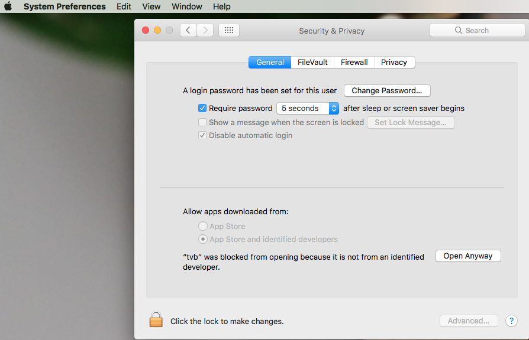

.. _installing_tvb:

Installing the Application
==========================

To download |TVB| check out the `download site <http://www.thevirtualbrain.org/tvb/zwei/brainsimulator-software>`_

The TVB software package can be used in 3 different configurations:

- on a single machine (personal usage).
  This machine will need to meet the `Application requirements`_ for both the visualization and the computation/storage part.
  Any operation launched will use resources from current machine (graphic card, CPU, disk and RAM).

- in a client/server configuration, where TVB is installed on a server and made accessible to an unlimited number of users.

  This configuration is recommended when you have a powerful server to be used as back-end, where TVB is running and simulation or analysis operations are to be executed.
  The server machine will not require powerful graphics, as visualization will not be done here at all. Only the computation requirements from above will need to be met by the server.

  The visualization can be accessed from a personal computers by a browser (via HTTP).
  A network connection needs to exist between the server where TVB is running and the computer doing the visualization and access.
  `http://${SERVER-IP}:8080` is the default URL.

- using a cluster (similar with server installation, but with parallelization support).
  Please note that for cluster installations, OAR is expected to be configured separately from TVB and accessible to the user for which the TVB software is launched.

To install |TVB| unzip the package and it will create a folder TVB_Distribution.

|TVB| developers might need to install TVB :ref:`differently <contributors_manual>`.

|TVB|'s interfaces
------------------

|TVB| has a web application GUI interface that can be accessed remotely.
See the :ref:`GUI guide <top_gui_guide>` for how to use it.

It also has several flavors of scripting interfaces. These are powerful programmatic interfaces.
Unlike the GUI they are not meant be used remotely and their leaning curve is steeper.
See the :ref:`console interface <shell_ui>` for usage.

Launching the application
-------------------------

In the TVB_Distribution folder you should find a sub-folder `bin` with a number of scripts:

- tvb_start
- tvb_clean
- tvb_stop
- distribution
- jupyter_notebook

On Linux these scripts will have the `.sh` termination, on Mac the `.command` termination and on Windows the `.bat` termination.
We will omit the termination in this manual. For example if you are using Windows and tvb_start is mentioned
in this document then tvb_start.bat is meant. The examples below are for Linux.

These scripts will start and control |TVB|.

Launching the GUI
.................

For Mac users the `TVB_Distribution` folder contains an application file `tvb.app`.
To start |TVB| in your web browser double click `tvb.app`.
Please be patient, as depending on your computer resources, the startup process might take about 1-2 minutes.

.. figure:: screenshots/install_mac_error.png
    :align: center
    :width: 300px

    Access error when launching TVB on Mac

On the latest versions of MacOS, you should allow from `Settings --> Security and Privacy` the newly downloaded
executable to run.

    Give access to TVB on Mac

For Linux and Windows users, to start |TVB| in your web-browser, run the `tvb_start` script in `TVB_Distribution/bin`.
On all platforms you can also double click the script's icon.

.. code-block:: bash

   $ cd TVB_Distribution/bin
   $ ./tvb_start.sh

To make sure that no processes will remain open after you use the application,
you should always close |TVB| by running the `tvb_stop` script.

.. code-block:: bash

   $ ./tvb_stop.sh

.. note::
    The first time you configure TVB, it will write a file *.tvb.configuration* in your `user home folder`.
    In case you run into problems when this write is about to happen, you can set environment variable `TVB_USER_HOME`
    to a value more appropriate for your environment (for example pointing towards TVB_Distribution unzipped location).
    Specify a value for the environment variable `TVB_USER_HOME` in  `distribution` command file to have it ready for
    multiple TVB runs.

Launching scripting interfaces
..............................

There are more scripting interface flavors. They differ in what shell is used and in how many |TVB| services they use.
In the COMMAND_PROFILE interfaces you can use the data management facilities of |TVB|.
In the LIBRARY_PROFILE you use |TVB| as you would use a library and it will not manage data for you.

The most user friendly interface is the Jupyter notebook one. It is a LIBRARY_PROFILE interface.
It's shell is the browser based jupyter notebook.
To launch it run the `jupyter_notebook` script from the `TVB_Distribution/bin/` folder.

.. code-block:: bash

   $ cd TVB_Distribution/bin
   $ ./jupyter_notebook.sh

The `distribution` script is used from a terminal to control the |TVB| distribution.
Run `distribution -h` too get help with this command:

.. code-block:: bash

   $ ./distribution.sh -h

To access the console interface, run in a terminal `distribution start COMMAND_PROFILE` or `distribution start LIBRARY_PROFILE`.
A Python shell will appear.

.. code-block:: bash

   $ ./distribution.sh start COMMAND_PROFILE

Configuring TVB
---------------

One of the first actions you will have to perform after starting |TVB| is to configure it.
If you are installing |TVB| for personal usage then the default configuration is sensible and you may accept it without detailed knowledge.

The default configuration will place |TVB| projects in a folder named TVB. This folder will be created in the users home folder.

* Linux: ``/home/johndoe/TVB/``
* Windows >= 7: ``c:\Users\johndoe\TVB``
* Mac : ``/Users/johndoe/TVB``

However for a client server or cluster setup you will need to take some more time to configure TVB.
See the :ref:`configuring_TVB` section for details.

Uninstalling TVB
----------------

To uninstall, stop |TVB|, then simply delete the distribution folder, `TVB_Distribution/` :

.. code-block:: bash

  $ ./tvb_stop.sh
  $ rm -r TVB_Distribution/

This will not remove user data.

Upgrading the Application
-------------------------

To upgrade to a new version, uninstall the current version then install the new distribution.

Do **not remove** your |TVB| projects stored in home_folder/TVB !
The first run after update will migrate your projects to the new version.

Removing user data
------------------

To purge all user data stored by |TVB| on your machine run the `tvb_clean`.
It will reset your TVB database and delete **all** data stored by |TVB|. Be careful!
Use this to get to a clean state, as if |TVB| had just been installed and never used.

.. note::
    You **do not** have to do this to uninstall or update |TVB| !

.. code-block:: bash

   $ # This will delete all TVB projects and configuration !
   $ ./tvb_clean.sh

The above operation will not touch `TVB_Distribution`, which represents your downloaded |TVB| app,
but only TVB generated user data, as result of using the GUI interface, mainly.

Finding TVB Demo Data
---------------------

We keep |TVB| demo data versioned on Github: https://github.com/the-virtual-brain/tvb-data.
There you can find a Default TVB Project, structural Connectivity, Surfaces, Mappings, Sensors, etc.

|TVB| application comes with a subset of this demo-data,
which can be found inside `TVB_Distribution` under the following path:

- On Windows `TVB_Distribution/tvb_data/Lib/site-packages/tvb_data/`
- On Linux `TVB_Distribution/tvb_data/lib/python3.x/site-packages/tvb_data/`
- On Mac `TVB_Distribution/tvb.app/Contents/Resources/lib/python3.x/tvb_data/`

.. note::
    Everything under `TVB_Distribution` is not to be removed or edited.

The files under `TVB_Distribution/..../tvb_data` and the git repository `tvb_data`,
can be used together with the GUI and/or the script interfaces, or taken as reference by you,
when creating TVB compatible dataset.

Supported operating systems
---------------------------

The current |TVB| package was tested on :

- Debian Stretch.
  Other Linux flavors might also work as long as you have installed a glibc version of 2.14 or higher.

- Mac OS X 10.13 High Sierra.

- Windows 10 and Windows 8.

Application requirements
------------------------

As |TVB| redefines what's possible in neuroscience utilizing off-the-shelf computer hardware, a few requirements are essential when using the software.

Requirements for front-end visualization:

- **High definition monitor** -
  Your monitor should be capable of displaying at least 1600 x 1000 pixels. Some views might be truncated if TVB is run on smaller monitors.

- **WebGL compatible browser** -
  We've tested the software on the latest versions of Mozilla Firefox, Apple Safari and Google Chrome.
  Using a different, less capable browser might result in some features not working or the user interface looking awkward at times.

- **WebGL-compatible graphics card** -
  The graphic card has to support OpenGL version 2.0 or higher. The operating system needs to have a proper card driver as well to expose the graphic card towards WebGL.
  This requirement only affects PCs, not (somewhat recent) Macs.

Requirements for computation/storage power, dependent on the number of parallel simulations that will be executed concurrently:

- **CPU power** -
  1 CPU core is needed for one simulation. When launching more simulations than the number of available cores, a serialization is recommended.
  This can be done by setting the "maximum number of parallel threads" (in TVB settings) to the same value as the number of cores.

- **Memory** -
  For a single simulation 8GB of RAM should be sufficient for region level simulations, but 16GB are recommended, especially if you are to run complex simulations.
  Surface level simulations are much more memory intensive scaling with the number of vertices.

- **Disk space** is also important, as simulating only 10 ms on surface level may occupy around 300MB of disk space. A minimum of 50GB of space per user is a rough approximation.

- Optional **MatLab or Octave** -
  A special feature in TVB is utilizing functions from the Brain Connectivity Toolbox.
  This feature thus requires a MatLab or Octave package on your computer (installed, activated and added to your OS' global PATH variable).
  The Brain Connectivity Toolbox doesn't need to be installed or enabled separately in any way, as TVB will temporarily append it to your MatLab/Octave path.
