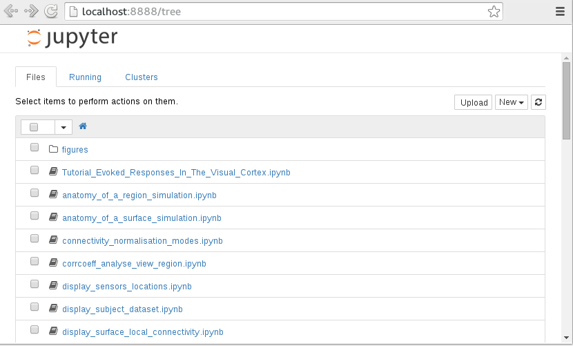
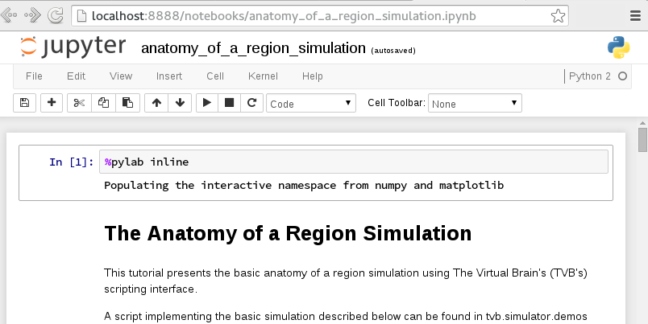

.. _shell_ui :

Console Interfaces of |TVB|
===========================

|TVB| has several flavors of scripting interfaces. These are powerful programmatic interfaces.
Unlike the GUI they are not meant be used remotely and their leaning curve is steeper.

They are a great tool to build a reproducible workflow.
The sequence of actions performed in the GUI are recorded as operations but a python script using the
console interface is more detailed and exact.

From these interfaces you also have full access to the API's of TVB.

The interfaces differ in what shell is used and in how many |TVB| services they use.

TVB Profiles
------------

Some of the features of TVB are optional. The GUI uses all of them but the scripting interfaces may select a subset.
Two profiles may be scripted:

In the LIBRARY_PROFILE you use |TVB| as you would use a library and it will not manage data for you.

In the COMMAND_PROFILE interfaces you can use the data management facilities of |TVB|.
Datatypes will be organized in projects and saved in the User/TVB/ folder.
You cannot use the web visualizers.

Ipython notebook shell
----------------------

The most user friendly interface uses the LIBRARY_PROFILE by default.
It differs from the standard ipython notebook only by having the tvb modules available.
See the :ref:`scripting_demos` for examples of how to use this interface.

Ipython will start in the demo folder. You will see a list of ipython notebooks.
These are the notebooks described in the :ref:`demos section <scripting_demos>`.
With this interface you can run the demos interactively, edit them and create new notebooks.
Click a notebook to open it. Click the new drop-down to create a new one.

    The demo notebooks

Once a notebook is open you can run the command cells by clicking them and pressing the play button.
See ipython notebook's documentation for more details.

    An open notebook

IDLE shell
----------

One console interface of |TVB| is an IDLE shell. All TVB services except GUI ones are available within this shell.

Within IDLE you can run a number of scripting demos to show how to build a network model and
run a simulation. 

To run any demo use the `execfile` command::

    execfile('/home/user/Downloads/TVB_Distribution/tvb_data/tvb/'
             'simulator/demos/region_deterministic.py')

The above command should work on Linux and Windows, as long as you replace '/home/user/Downloads/TVB_Distribution'
with your personal path towards the folder where TVB was being downloaded.
On Mac OS the path is just a little different::

    execfile('../Resources/lib/python2.7/tvb/'
             'simulator/demos/region_deterministic.py')
    execfile('/home/user/Downloads/TVB_Distribution/tvb.app/Contents/Resources/lib/python2.7/tvb/'
             'simulator/demos/region_deterministic.py')

Here is an illustration for the above.

.. figure:: screenshots/linux_shell_run_demo.jpg
    :width: 600px

    Run a |TVB| demo with execfile
   
   
Another way to run a script, that also allows to see and edit the code, is opening 
the file from the File menu. A new window will pop out. Then select Run Module 
from the Run menu. The script will be executed.

.. figure:: screenshots/linux_shell_run_demo_2.jpg
    :width: 600px

    Run a |TVB| demo from the Run Menu option

To work interactively in the Python shell you need a few tvb modules::

    from tvb.simulator.lab import *

This will import all the scientific simulator modules as well as some datatypes
that wrap important data as the `Connectivity` matrix and cortical `Surface`.

Terminal shell
--------------

If you are using |TVB| on a headless machine then Python IDLE is not an option.
In this scenario TVB's shell is a simple python console shell.
To launch a python terminal in the command profile use

.. code-block:: bash

    $ ./distribution.sh start COMMAND_PROFILE -headless
    Executing distribution.sh
    >>>

And in the library profile

.. code-block:: bash

    $ ./distribution.sh start LIBRARY_PROFILE -headless
    Executing distribution.sh
    >>>

The scripts are located in the `bin` folder and they have platform specific terminations.

The `distribution` script can be used to launch other profiles as well.
The `WEB_PROFILE` will start the web interface. The following has the same effect as `tvb_start`

.. code-block:: bash

    $ ./distribution.sh start WEB_PROFILE

Using the distribution script allows you to give additional options.
The `-reset` option will clean the |TVB| folder before starting the web interface

.. code-block:: bash

    $ ./distribution.sh start WEB_PROFILE -reset

