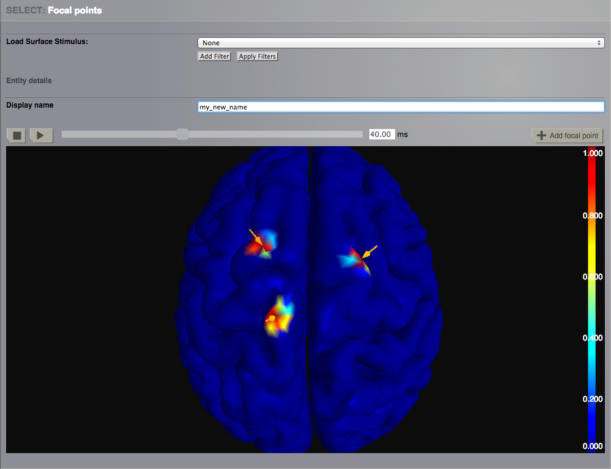

|example| Tutorial
------------------

**Generate a  spatiotemporal stimulus**

**Objective**: learn how to create a spatiotemporal pattern to study the 
influence of a stimulation paradigm to outline different patterns of neural 
activity. 

**Summary**
The intention is to have a platform capabable of having a representation of 
stable and unstable sources. The goal is to observe the effect of
the stimulation. 

  -  Assuming that you have already created your project:

  -  Go to the `Stimulus` area --> `Surface Stimulus` page.
  -  Enter a new name for the new `Surface Stimulus`.
  -  Choose the default `Cortical Surface`.
  -  Select the `Mexican-hat` equation to define the spatial spread of the 
     stimulus.

  - Spatial parameters are:

	============  	====== 
	Inputs        	Value 
	============  	======
	midpoint1     	20.0
	midpoint2 	 0.0
	amp1		 1.0
	amp2 		 1.0
	sigma1		20.0
	sigma2 		10.0
	============    ======

  - Temporal parameters are:

	============  	====== 
	Inputs        	Value 
	============  	======
	amp 		1.0
	frequency 	0.1
	============    ======
  
  - Click on `Edit Focal Points and View`

  - Select 10 focal nodes on the right hemisphere.

  - Click on `Save new Stimulus Surface`

  - Your spatiotemporal pattern should be available. You can load it and play
    the animation on the cortical surface.

  - Go back to `Edit Stimulus Equation`

  - Set new equations and parameters for both spatial and temporal profiles.

  - Add 10 focal nodes on the left hemisphere.

  - Enter a new name for this new `Stimulus Surface` and save it.

  - You can visualize the new pattern.

|

.. warning::

    The maximum number of focal points you are allowed to add is 20.
