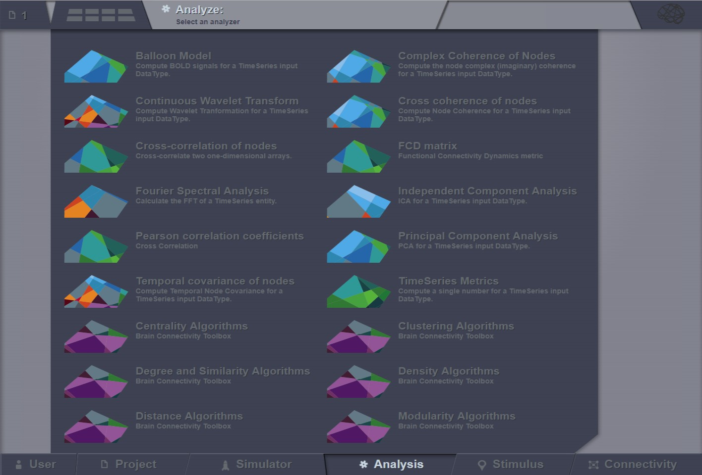


Analyze
-------

This area offers a set of techniques for data analysis.

   Current available analyzers

The Analyzers in |TVB| are not always the best implementations of the algorithms in
terms of performance, neither are we offering a complete analysis spectrum,
because analysis is not considered the focus feature of |TVB| and we do not intend
to offer a replacement for tools already existent and successful in this area.
We are merely offering some handy tools for people who want to directly process simulation
results inside |TVB|, although the advised long term strategy is to export simulated data
from |TVB| and analyze it intensively with specialized tools for your area of interest.
We advise you not to run our analysis algorithms with long timeseries, as some might take a
lot of time to finish.

The `Analysis` area has several interfaces that support the following operations 
for time-series analysis (and not only):

 - Cross-correlation of nodes
 - Fourier Spectral Analysis
 - Global TimeSeries Metrics
 - Cross coherence of nodes
 - Temporal covariance of nodes
 - Principal Component Analysis
 - Independent Component Analysis
 - Continuous Wavelet Transform

Cross-correlation of nodes
..........................

Compute pairwise temporal cross-correlation of all nodes in a 4D TimeSeries 
object. Cross-correlation, or normalized cross-covariance, is a measure that 
quantifies the degree of linear dependence between two time-series.

To calculate the correlation coefficient of all nodes of a given multi-node 
time-series, simply select the TimeSeries object from the drop-down list in the 
`Cross-correlation of nodes` interface and hit `Launch`.

The algorithm returns a CrossCorrelation object that contains cross correlation 
coefficients for all possible combinations of nodes. 
Results are visualized with the `Correlation viewer`.

Fourier Spectral Analysis
.........................

Compute a fast Fourier transform (FFT) of a TimeSeries object. FFT is an 
algorithm to compute the discrete Fourier transform (DFT) and its inverse for a 1
given sequence of values. DFT transforms a function into its frequency-domain 
representation, that is, a sum of weighted sinusoids while preserving all of the 
information about the original signal. After decomposing the signal, spectrum 
analysis quantifies the relative amounts of amplitudes, powers, intensities or 
phases of a component versus its frequency.

In order to perform a Fourier analysis of your time-series data follow these steps:

 - Go to the `Fourier Spectral Analysis` interface and select a `Windowing function`, you can choose among ‘hamming’, ‘bartlett’, ‘blackman’ and ‘hanning’.
 - Select the time-series.
 - Select a segment length.
 - Hit `Launch`.

TimeSeries Metrics
..................

Calculate one scalar metric to characterize the time-series dataset.

Cross coherence of nodes
........................

Calculate pairwise temporal coherence of all nodes in a 4D TimeSeries object. 
Coherence analysis, or cross-spectral analysis, can be used to estimate how two 
time series are related in the spectral domain. Cross-coherence indicates the 
degree to which amplitude and phase between two signals relate to each other as 
a function of frequency.

To calculate the cross-coherence of all nodes of a given multi-node time-series, 
simply select the TimeSeries object from the drop-down list in the `Cross coherence of nodes` 
interface, select an appropriate measure for data-point per block, and hit `Launch`.

.. The algorithm returns a CoherenceSpectrum object that is a xD-Matrix with the Dimensions {x,x,x…}.

The resulting coherence spectrum can be viewed with the `Cross coherence visualizer`.

.. image:: screenshots/visualizer_cross_coherence.jpg
     :width: 90%
     :align: center

Complex coherence of nodes
...........................

To calculate the complex-cross-coherence of all nodes of a given multi-node time-series,
simply select the TimeSeries object from the drop-down list in the `Complex coherence of nodes`
interface and hit `Launch`.

The resulting coherence spectrum can be viewed with the `Complex coherence visualizer`.

.. image:: screenshots/visualizer_complex_coherence.jpg
     :width: 90%
     :align: center

Temporal covariance of nodes
............................

Compute pairwise temporal covariance of all nodes in a 4D TimeSeries object. 
Covariance resembles the un-normalized correlation coefficient and measures how 
much two time-series change together.

To calculate the temporal covariance of all nodes of a given multi-node time-series, 
select the TimeSeries object from the drop-down list in the `Independent Component Analysis` 
interface and hit `Launch`.

The algorithm returns a Covariance object that is a 4D-Matrix with the Dimensions 
{nodes, nodes, 1, 1}. The resulting covariance matrix can be viewed with the `Covariance visualizer`.

.. image:: screenshots/visualizer_covariance.jpg
     :width: 90%
     :align: center

Principal Component Analysis (PCA)
..................................

Compute a PCA of a 4D TimeSeries object. PCA is a computational method for 
multivariate data analysis that uses an orthogonal transformation to convert a 
set of (possibly correlated) variables into a set of linearly uncorrelated 
variables called principal components.

To calculate a PCA of all nodes of a given multi-node time-series, select the 
4D-TimeSeries object from the drop-down list in the `Principal Components Analysis` 
interface and hit `Launch`.

The algorithm returns an PrincipalComponents object that is a xD-Matrix with the 
Dimensions {x,y,z}. The resulting time-series can be viewed with the `Pca viewer`.

.. image:: screenshots/analyzers_pca.jpg
     :width: 90%
     :align: center

Independent Component Analysis (ICA)
....................................

Compute a time-domain ICA decomposition of a 4D TimeSeries object. ICA is a 
statistical and computational method for separating a multivariate signal into 
additive subcomponents by maximizing the mutual statistical independence of 
source signals.

To calculate a temporal ICA of all nodes of a given multi-node time-series, 
select the 4D-TimeSeries object from the drop-down list in the `Independent Component Analysis` 
interface and hit `Launch`.

The algorithm returns an IndependentComponents object that is a xD-Matrix with the 
Dimensions {x,y,z}. The resulting time-series can be viewed with the the corresponding ICA viewer.

Continuous Wavelet Transform (CWT)
..................................

Compute a CWT of a 4D TimeSeries object. CWT decomposes a signal into wavelets 
of different frequencies yielding a time-frequency representation of the signal.

To calculate a CWT of all nodes of a given multi-node time-series, select the 
4D-TimeSeries object from the drop-down list in the `Continuous Wavelet Transform` 
interface, specify transformation parameters like:

 - mother wavelet function 
 - frequency resolution and range
 - type of the normalization for the resulting wavelet spectrum
 - Q-ratio
 - Sampling period of the spectrum

and hit `Launch`.

The algorithm returns an `WaveletCoefficients` object that is a xD-Matrix with the Dimensions {x,y,z}.
The resulting spectrogram of wavelet power can be viewed with the `Wavelet viewer`.

.. image:: screenshots/visualizer_wavelet.jpg
     :width: 90%
     :align: center

Brain Connectivity Toolbox Analyzers
....................................

If you have `matlab` or `octave` installed and available through the command 
line then all the algorithms offered by `Brain Connectivity Toolbox` (BCT) 
can be used directly from |TVB| interface and the results can later be displayed
in one of our visualizers.

Additional BCT techniques are:

    - Degree and Similarity Algorithms
    - Centrality Algorithms
    - Distance Algorithms
    - Modularity Algorithms
    - Clustering Algorithms
    - Density Algorithms

.. _BCT: https://sites.google.com/site/bctnet/

For more details, please refer to BCT_ web site 

