Connectivity
------------

In this area you can edit both types of TVB connectivity objects:

    - long-range connectivity and,
    - local connectivity.
    
|

    .. figure:: screenshots/connectivity_area.jpg
      :width: 90%
      :align: center

      Preview for Connectivity Area

Long Range Connectivity
.......................

    .. figure:: screenshots/connectivity_large_scale.jpg
       :width: 90%
       :align: center

       Large Scale Connectivity configuration page

From this page you can access: 

  - an interactive display tool on the `Control` right column and 
  - several Long Range Connectivity visualizations on the left `View` column.

      - 3D Views

	- Edges
	- Nodes

      - 2D Projections

	- Left
	- Right
	- Top

      - a MPLH5 matrix plot

Connectivity Matrix Editor
~~~~~~~~~~~~~~~~~~~~~~~~~~

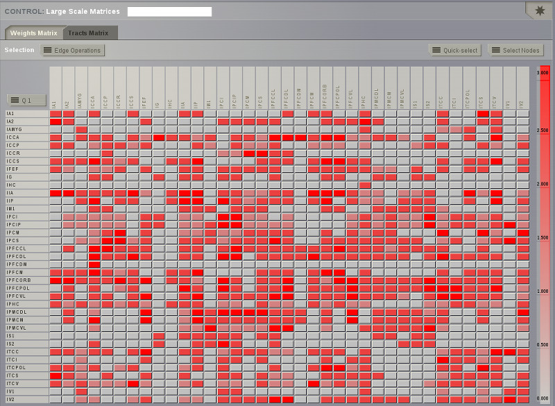

   Preview for the Matrix Editor

From this interactive 2D display you can:

  - easily edit the connectivity weights or tract lengths matrix; 
  - select a subset of the available nodes;
  - perform basic algebraic operations on that group; and
  - save the new version as a new connectivity matrix.

  The Connectivity datatype will be available in the Simulator area. 

.. hint:: 

    In the Connectivity Editor only one quadrant is displayed at a time.
    You can select which quadrant is shown by accessing the quadrant selector 
    button in the upper left corner of the matrix display.

    Assuming that the connectivity matrix is sorted such that the first half
    corresponds one single hemisphere:

    - quadrants 1 and 4 will represent the intra-hemispheric connections,
    - and quadrants 2 and 3 will be the inter-hemispheric connections. 

      .. figure:: screenshots/connectivity_quadrants.jpg
	:width: 50%
	:align: center

      Preview for Quadrant Selection

You can create a smaller selection by clicking on the `Quick-select` button and
editing the list of node names. 

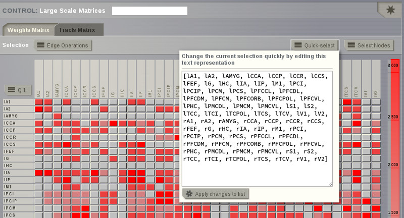

   Preview for `Quick-select` list

.. |staricon| image:: icons/star_icon.png

TVB enables you to save:
 
  - a particular selection by entering a name and clicking on |savetick| or,
  - a new `Connectivity` object by clicking on |staricon|. This entity can be 
    used later on in |TVB| `Simulator`.

The **Weights** button opens a menu to perform basic algebraic operations on
a group of edges. You can select multiple nodes from the current connectivity
(by default all nodes are selected); thus you will end up with two sets of
nodes: the set of **selected nodes** and the set of **un-selected nodes**. These two
sets of nodes, determine four categories of edges:

    - In --> In:  are only the edges connecting the nodes of the selected set. 
    - In --> Out: are the edges that connect nodes in the selected set (rows) to nodes in the unselected set (columns).
    - Out --> In: are the edges connecting nodes in the unselected set (rows) to nodes in the selected set (columns). 
    - Out --> Out: are edges connecting pair of nodes in the 'unselected set'.

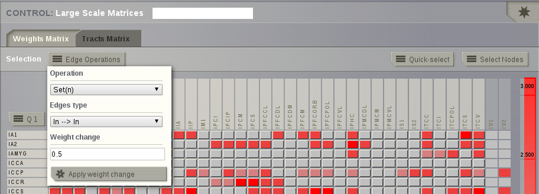

   Preview for Bulk Operations on edges

.. note:: 
  Available operations are:

  - Assignation (set): assigns the given numeric value to all the edges within
    the set.
  - Addition (add): adds the new value to the current value in the connectivity 
    weights matrix.
  - Subtraction (decrease): subtracts the new value to the current value in the 
    connectivity matrix of weights.
  - Multiplication (multiply): multiplies the current value in the connectivity 
    matrix of weights by the given numeric value.
  - Division (divide): divides the current value in the connectivity matrix of weights by
    the given numeric value.

Click on the `Apply weight change` button to perform the selected operation on a group of edges.

Example: **HOW TO REMOVE INTER-HEMISPHERIC CONNECTIONS**

1. Select multiple nodes from the Connectivity, for instance those from the left hemisphere. 

    .. figure:: screenshots/connectivityeditor_SelectASetOfNodes_a.jpg
      :width: 90%
      :align: center

      Node selection

2. Apply the changes. The selected nodes appear in green. 

    .. figure:: screenshots/connectivityeditor_SelectASetOfNodes_b.jpg
      :width: 90%
      :align: center

      Node selection

3. Save the selection to make it easier later. 

    .. figure:: screenshots/connectivityeditor_SaveSelection.jpg
      :width: 90%
      :align: center

      Save node selection

4. The Connectivity editor will be aware of two sets of nodes: the ones in your
selection (green nodes) and the ones that are not selected (white nodes).

5. Move to the third quadrant (Q3) for instance. 

    .. figure:: screenshots/connectivityeditor_ShowConnections.jpg
      :width: 90%
      :align: center

      3D visualizer zoom-in to show the interhemispheric connections 

5. Then you can proceed to perform some operations on the edge values.

    .. figure:: screenshots/connectivityeditor_EdgeOperations.jpg
      :width: 90%
      :align: center

      Edge operations 

The four categories of edges in this particular case are:

  - edges IN-IN: intrahemispheric edges from the left hemisphere.
  - edges OUT-OUT: intrahemispheric edges from the right.  
  - edges IN-OUT:  interhemispheric edges in quadrant 2 (Q2)   
  - edges OUT-IN:  interhemispheric edges in quadrant 3 (Q3)
  

6. Select operation "Set(n)" for edges **OUT-IN**, set the value to 0 and then press Apply.

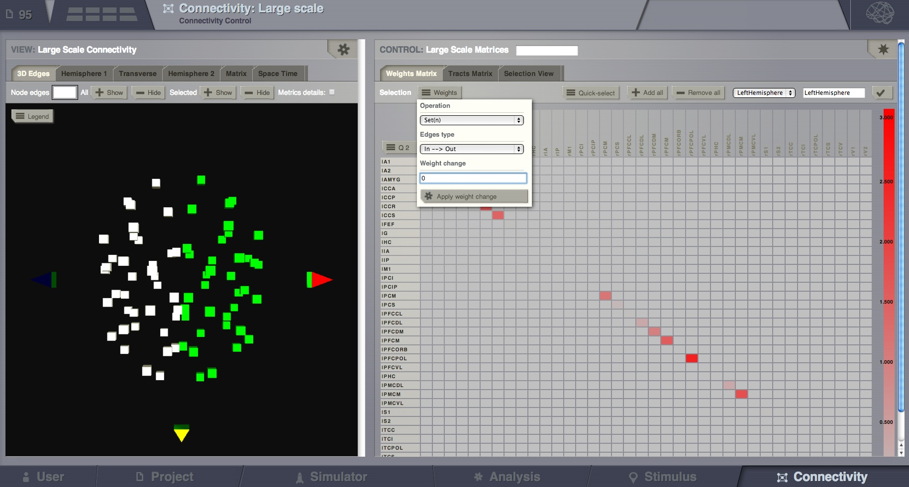

    Set IN-OUT edges to 0
 

7. Repeat for edges **IN-OUT**

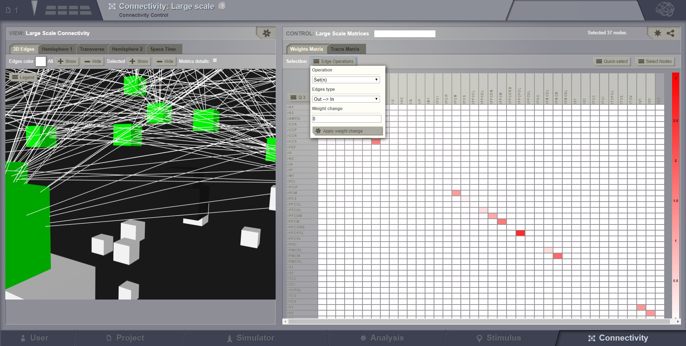

    Set OUT-IN edges to 0

The inter-hemispheric connections are gone. Do not forget to select all the nodes again before saving your new matrix.

.. figure:: screenshots/connectivityeditor_NewMatrix.jpg
    :width: 90%
    :align: center

    New matrix

8. Save your new matrix 

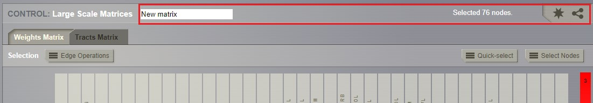

    Save new matrix

9. Once you have your new matrix, you can launch the connectivity visualizers and
check that these connections are not there any more.

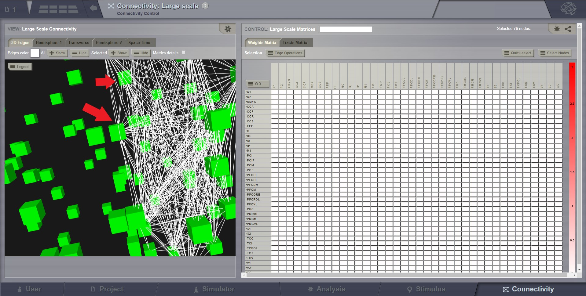

    Reload view

.. note::

    TVB is designed to handle connectivity matrices whose values are:
    
      - positive real values, meaning that there is a connection, or
      - zero values, meaning the absence of a connection

.. warning:: 

      - TVB does not handle unknowns such as NaNs or Infs.

      - If your connectivity matrix contains negative values, such as -1 values
        you should either set these values to zero or an estimated value based 
        on your research assumptions. 
 

By default the set of selected nodes includes all the available nodes in the connectivity matrix.

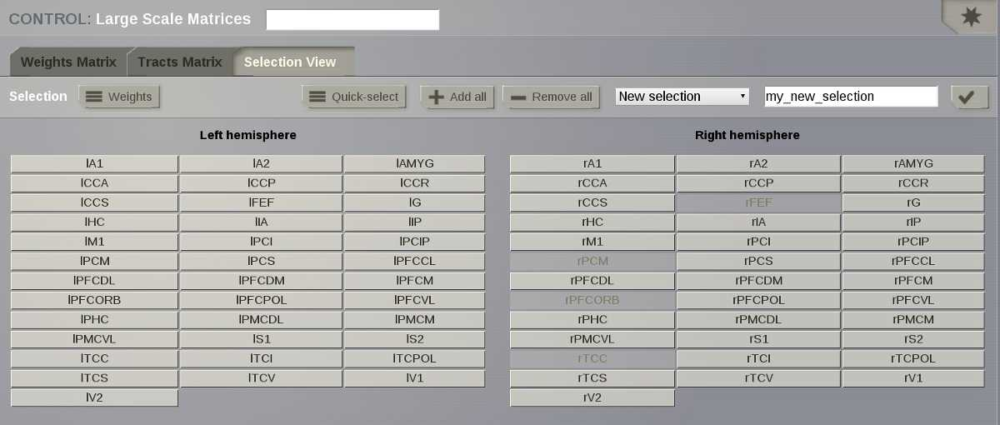

    Preview for New Selection

|
|

Viewers
~~~~~~~

Connectivity 3D Edges
~~~~~~~~~~~~~~~~~~~~~

This connectivity visualizer allows you to see the structural information as a
base model part of TVB. 

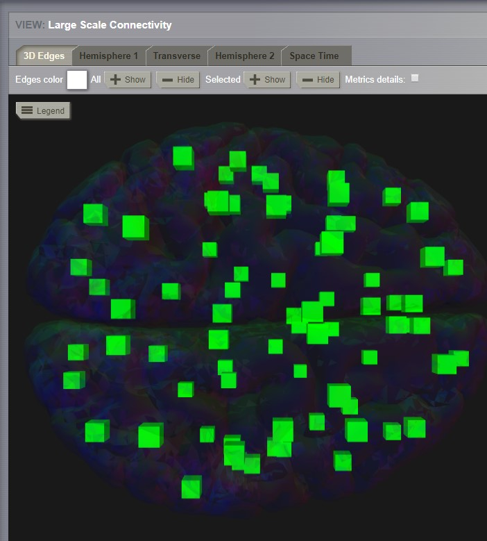

   Preview for Connectivity Viewer 3D Edges

The 3D semi-transparent surface around the connectivity nodes, whether it is
the cortical surface or the outer-skin, is used just for giving space guidance.

You can select an individual node and right-click on it to activate the incoming
or outgoing edges. 

For each node you can choose a different color to apply to its
edges.

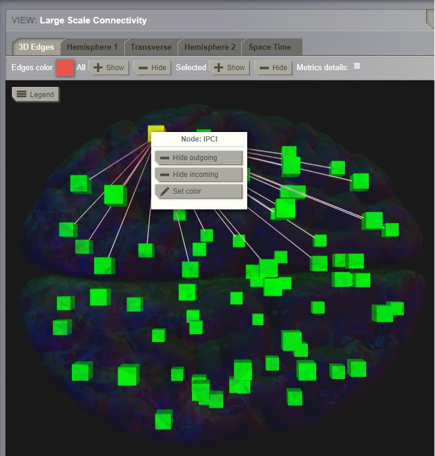

   Preview for Connectivity Viewer 3D Edges - Coloring incoming / outgoing edges

|
|

Connectivity 2D Viewer
~~~~~~~~~~~~~~~~~~~~~~

A 2D representation of the connectivity matrix nodes and edges. 

There are three main views (projections):
 
  - Left sagittal view
  - Transverse view
  - Right sagittal view

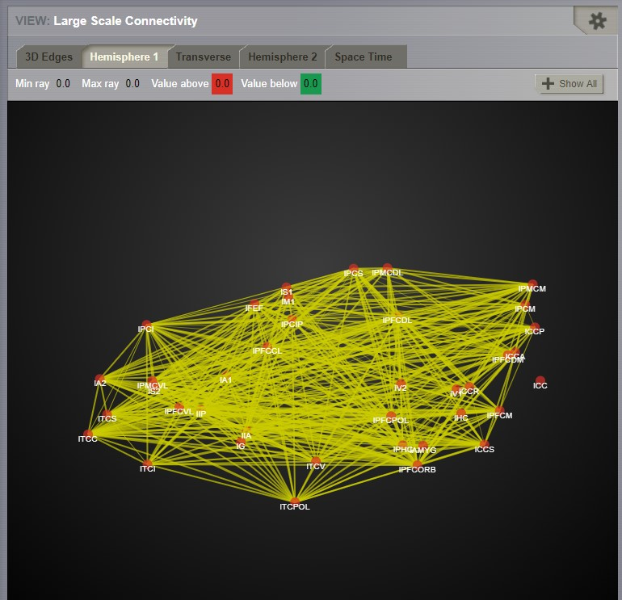

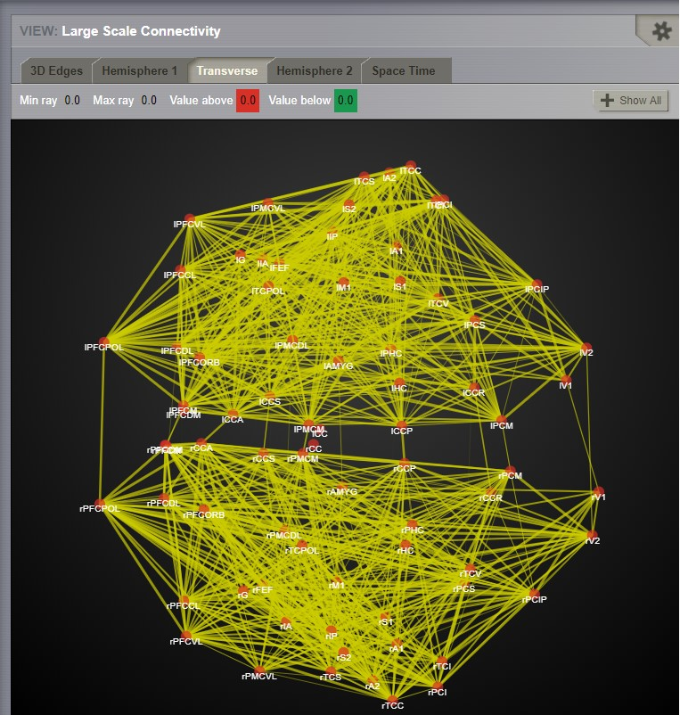

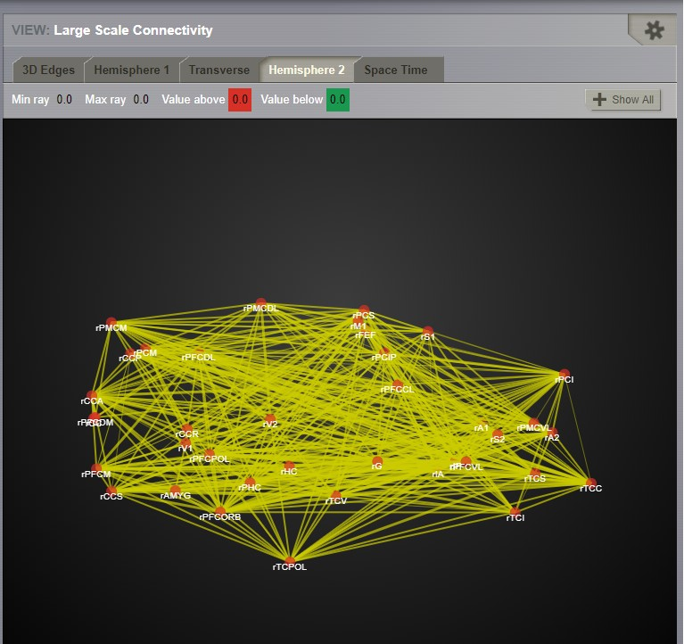

   Preview for Connectivity 2D Viewer

|

The node size can be defined using a ConnectivityMeasure datatype 
(e.g. the output of a BCT Analyzer). Additionally, a threshold can be set for
the node color. The nodes with values above the threshold will be red and those
whose value are below the threshold will be yellow.

To display the changes, click on the `Show details` button.

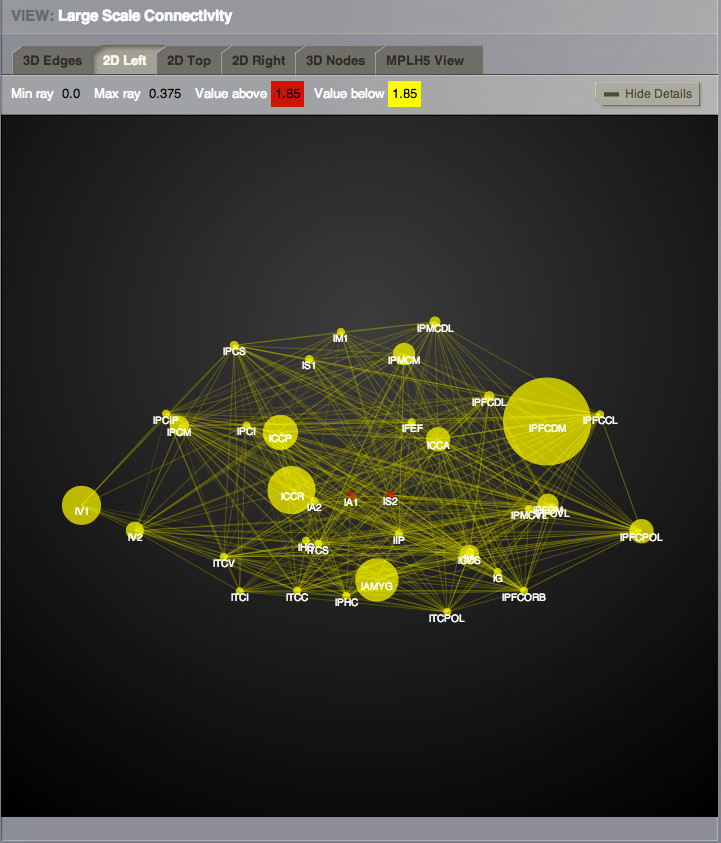
   
   Preview of 2D Connectivity Viewer (left lateral view). Node size is defined
   by the Participation Coefficient. Color threshold is 1.8; this values is based 
   on the the Clustering Coefficient (BU) of the default Connectivity matrix.

.. tip::

    If you wish to change: 

                            - the color threshold,
                            - the metrics used to define the node features,
                            - the colormap used in the Connectivity Matrix Editor, or
                            - the Connectivity entity

   go to the `brain` menu on the top right corner
   
   .. figure:: screenshots/connectivity_context_menu.jpg
      :width: 50%
      :align: center

|
|

Matrix Overview
~~~~~~~~~~~~~~~~

A 2D matrix plot to have a complete overview of the initially selected weighted
connectivity matrix.

.. figure:: screenshots/connectivity_mplh5.jpg
   :width: 50%
   :align: center
   
   Preview for Matrix Overview display

|
|

Space-Time
~~~~~~~~~~~

This is a three-dimensional representation of the delayed-connectivity
structure (space-time) when combined with spatial separation and a finite
conduction speed.  The connectome, consists of the weights matrix giving the
strength and topology of the network; and the tract lengths matrix giving the
distance between pair of regions. When setting a specific conduction speed,
the distances will be translated into time delays. The space-time visualizer
disaggregate the *weights* matrix and each slice correspond to connections
that fall into a particular distance (or delay) range. the first slice is the
complete weights matrix. Click on any of the subsequent slices to see the
corresponding 2D matrix plot.

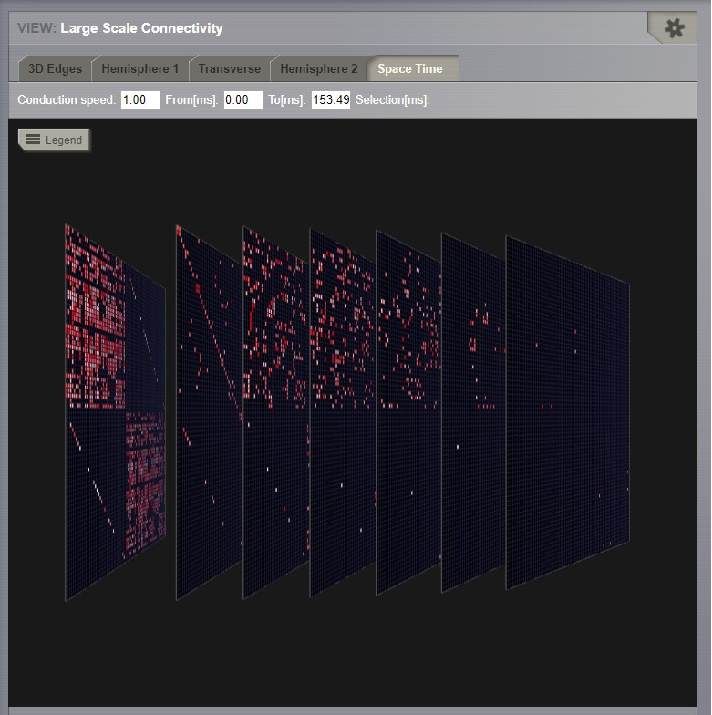
   
   Preview for the space-time display

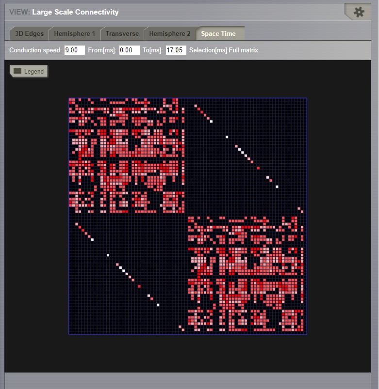
   
   The first slice is the full weights matrix

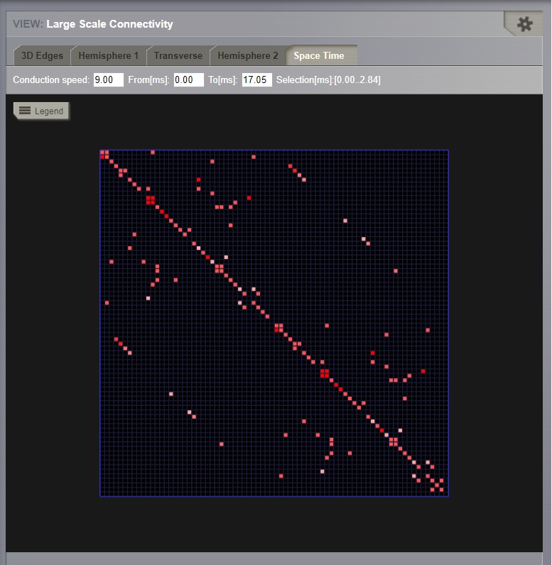
   
   Connections that are between 0 and 2.84 ms, for a conduction speed of 9 mm/ms

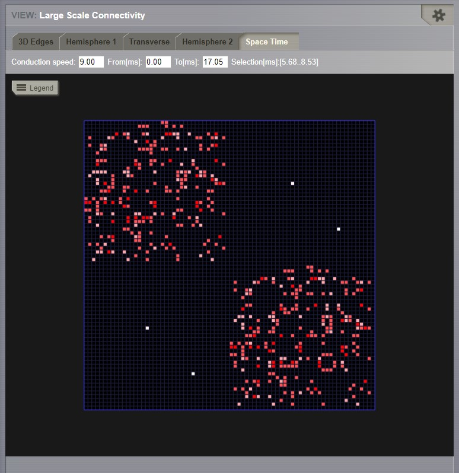
   
   Connections that are between 2.84 and 5.68 ms, for a conduction speed of 9 mm/ms

Local Connectivity
..................

In this page, you can generate the spatial profile of local connectivity that 
will be used in surface-based simulations.

    .. figure:: screenshots/connectivity_local.jpg
      :width: 90%
      :align: center

    Local Connectivity editing page

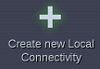

On the lower right of the browser you will have access to different 
functionalities by clicking on:

    - `Create new Local Connectivity` button: to generate the Local Connectivity entity.

    - `View Local Connectivity` button: to launch a 3D brain visualizer displaying the spatial profile of the newly generated entity.

	.. figure:: screenshots/local_connectivity_viewer.jpg
	  :width: 70%
	  :align: center

	Local Connectivity Viewer

    - `Edit Local Connectivity` button: to go back to the main Local Connectivity editing page.

On the right column there is a display showing different estimations of the 
spatial profile based on the length of :

  - Theoretical case: is the ideal case.
  - Most probable case: resolution is based on the mean length of the edges of the surface mesh. 
  - Worst case: resolution is based on the longest edge in the surface mesh.
  - Best case: resolution is based on the shortest edge in the surface mesh.

      .. figure:: screenshots/local_connectivity_estimations.jpg
	 :width: 70%
         :align: center 

         Local connectivity profile estimations.

and the red-dotted vertical line represents the cut-off distance. 

The x-axis range is automatically set to two times the cut-off distance.
