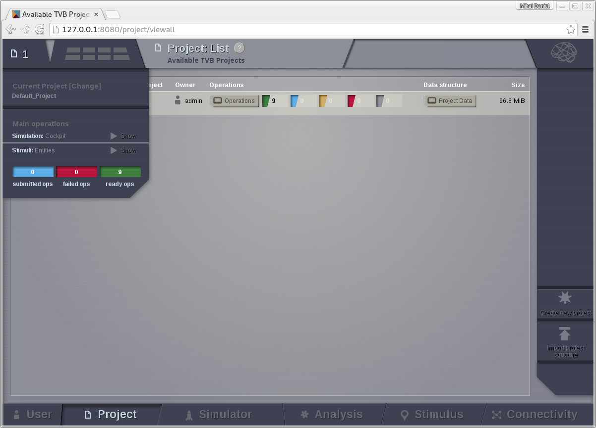
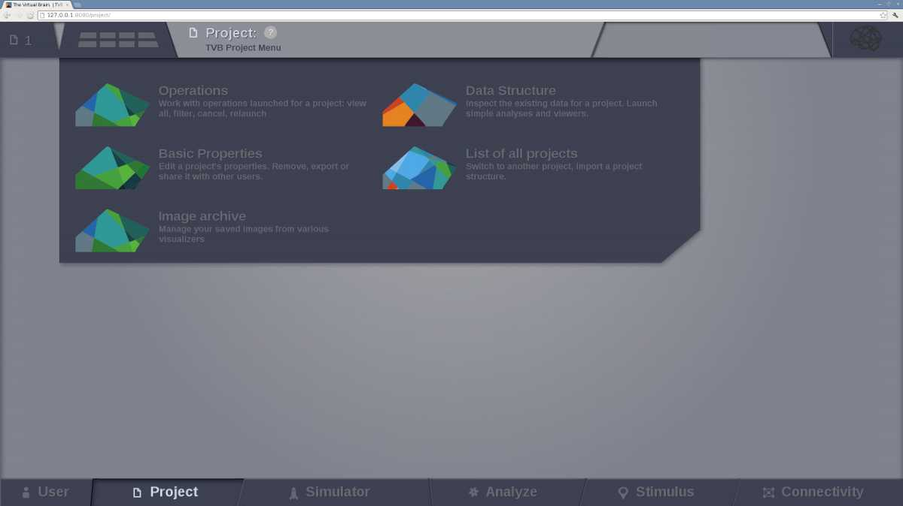
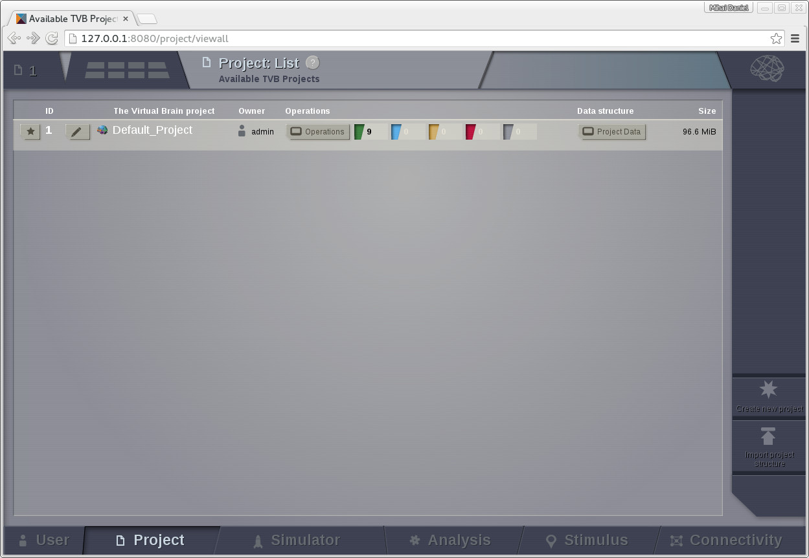
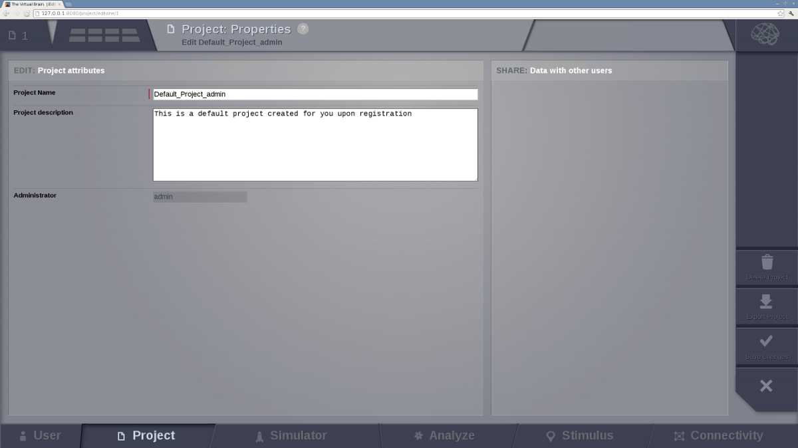
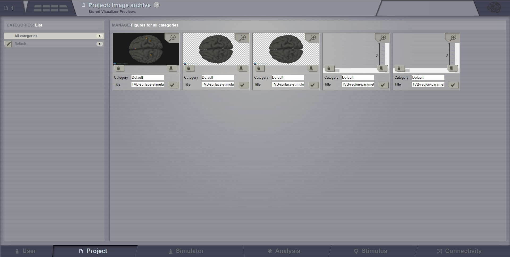
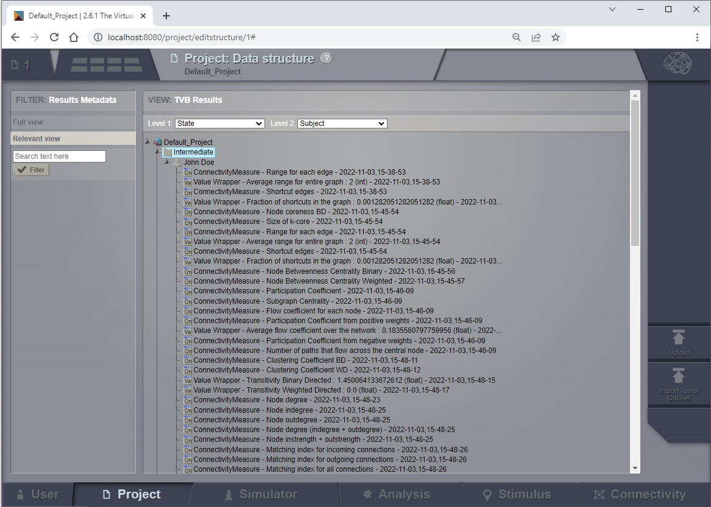
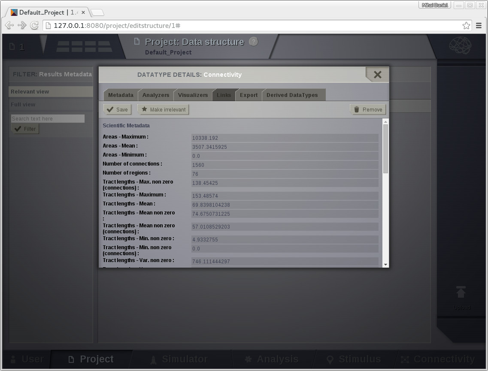
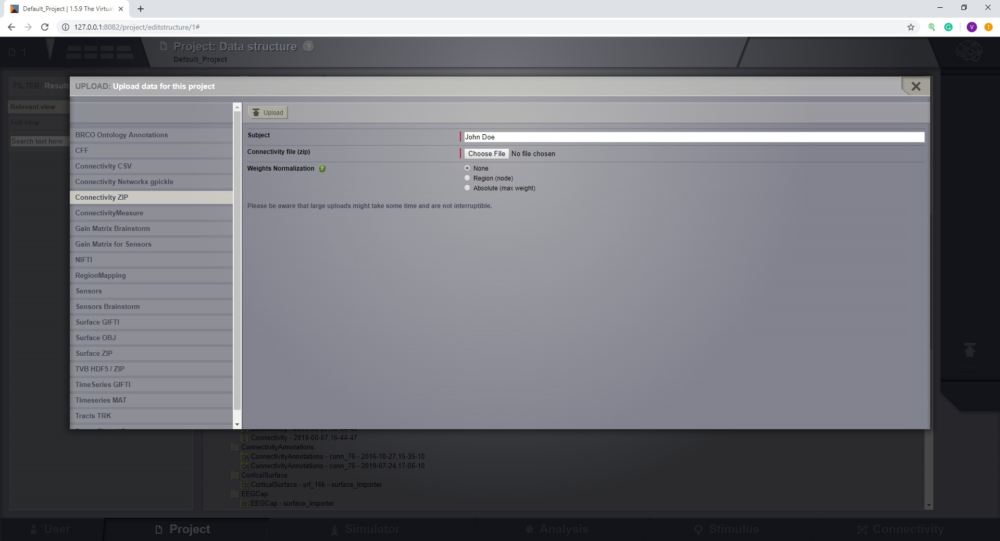
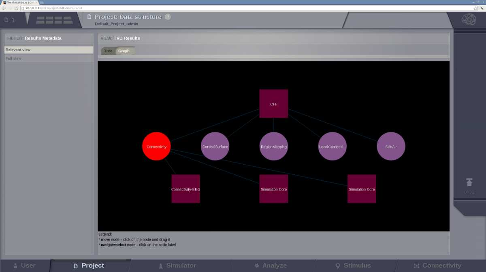

Project
-------

Projects are the way you organise data and simulations in |TVB|. They
correspond to directories where related data sets and simulation results
are stored.

Information on the currently selected project is always
available by clicking on the upper left corner of the interface:

    The main information about the selected project.
    

The `Project` tab provides access to the projects that you have created within
|TVB|. The second level menu in the top left corner, next to the Project number,
allows you to navigate between five main subpages, each of which is described in
more detail in the sections below:

- List of All Projects
- Basic Properties
- Operations
- Data Structure
- Saved Figures
    
|

    The Project second level menu
    

List of All Projects
....................

This page provides an overview of all the existing projects.
    
The star column allows you to select the currently active project.

Some columns display basic information such as the id, name and owner of a project.
The last column shows an estimated total size of a project. It is handy when you run out of disk space and want to clean up old big data.

The colored numbers represent the number of completed, in progress, pending, failed and cancelled operations.

The button columns are linking to the `Basic properties`_, `Operations`_ and `Data Structure`_ pages for the project.
Clicking any will also make that project the current one.

In addition to the list of existing projects, the right hand menu provides a
way to:

- Create a new project.
- Import an existing project structure (for example, Exported from a
  colleague's installation of |TVB|).

Upon first user registration, a default project is created for you:

    The default Project

Basic Properties
................

From this page you can export the project or delete it.

Also you can edit the current project's properties.
You are directed to this page when you first create a new project:

    The Project Properties page

Note that the project name may not contain spaces.

If there are other users registered in the framework, you can choose to
share the project with them by checking their respective "Visible for"
boxes.

On the right side of the browser there is the `Action Column`.
There are buttons to delete or export the project.
The last two buttons allow you to save changes or go back to the `List of All Projects` page.

If you were creating a new project it should now be visible.

.. warning::

  Project properties cannot be edited while operations are running!

Image Archive
.............

|TVB| provides you with the possibility of saving image snapshots.

From this page you can manage all the images stored within the current working 
`Project`, as well as:

- edit figure title,
- create categories to group your images,
- search through your figure collection,
- visualize, download and delete your images.

.. note::

  Only the current project figures will be available. If you want to visualize 
  images from another project, you will have to switch to that project.

    The Image Archive page

.. _operations_ui:

Operations
..........

A table with the history of operations related to the currently selected
project is displayed. From this board the user can filter, view, reload or
cancel any operation:

.. figure:: screenshots/default_operations.jpg
    :width: 90%
    :align: center

    The operation page with default operations

Data Structure
..............

This page shows all datatypes of a project in a tree view.

This tree has three levels. Each level groups the datatypes.
The first level groups by the state of a datatype, then each state group is further divided in groups for each subject.
The leaf nodes are all datatypes of the project.

You can change the criteria of this grouping. Experiment with the level1 and level2 drop down menus found above the tree.

Besides grouping the datatypes you may also filter them.
The left-most area of the Data Structure page contains basic filters for the
centrally displayed entities.
We display fixed filters (entities declared relevant / irrelevant) of free-text
filtering (when using the input text field and then pressing Button 'Filter').
Filtering based on free-text searches into all fields of an entity, and it is case insensitive.

.. _tree_view_ui:

    The data structure of the default project.

Note that the color of the datatype icons in the tree view indicate their category:

1. Green are the raw datatypes. These are mostly imported in TVB (eg. connectivities, surfaces, sensors etc.)
2. Yellow are adjacent datatypes. These usually imported in TVB (eg. lookup tables and matrices etc.)
3. Red are time series datatypes either created by simulations or imported.
4. Blue are analyser results.
5. Pink are some datatypes created by TVB (eg. stimuli, local connectivities etc.)

Selecting a data node in the Tree structure causes an overlay to appear.

From this overlay, the user can:

- edit metadata
- launch `Analyzers` and `Visualizers`
- link data to other projects
- export data.

    A data nodes overlay

On the most-right area of this page, an `upload` button appears. This
launches an overlay with tabs for each type of TVB-compatible data:
    

    The data upload overlay
    
For a detailed description of the supported file formats see :ref:`data_formats`

Launching any uploader with success will generate you a new leaf in the Tree 
displayed centrally on this page.

The central area also contains a Graph view.
The main target for the Graph view is to show you in a mixed manner both DataTypes and Operations.
The edges that link the Graph are of type: 'Operation generated DataType' and 'DataType is input for Operation'.
When switching from the Tree display to the Graph display, the same node (if DataType) remains selected.
This way you could filter entities in the Tree display, check generic meta-data, then switch to the Graph display and see what Operation was parent for this entity.

    A graph view of the project's data-structure

.. this is a hack needed by the online help. The Project page docs have to include the
   visualizers docs because visualizers launched from the project page live in it's context.
   The body of the only directive is emitted only when the online_help tag is defined

.. only:: online_help

    .. include:: UserGuide-UI_Simulator-Visualizers.rst
