.. VISUALIZERS COLUMN

.. This is orphan because it is ..included in other files.
   The inclusion is forced by the need of the online help to have the visualizer docs on both the simulator and project pages in line.
   The normal docs will not like that and would prefer a toctree.
   This situation is handled by a conditional :only: include in the UserGuide-UI_Project.rst and a unconditional include in the simulator rst
   This makes this file part of the simulator page.
   Sphinx however will assume that we might do a double include and will complain with warnings.

:orphan:

Simple Visualizers
..................

.. _brain_activity_view:

Brain Activity Visualizer
~~~~~~~~~~~~~~~~~~~~~~~~~

A 3D scene of the brain activity.

Mouse interaction:

You can change the view by pressing a mouse button and dragging it.

* the left button rotates the brain around the center of the screen.
* the right button translates the brain.
* the middle button and the scroll wheel zoom towards the center of the screen.

Pressing the shift key and the left button has the same effect as the right button.

Pressing the control key will rotate or translate in the model space.

The SPACE key will show a top view. The CURSOR Keys will show axis aligned views.

For region level time series the brain is represented by a coarse granularity - each
region is represented with only one color. For surface level time series each vertex
has an individual measure.

The color coding is determined by the current color scheme. A legend of it is on the right side of the brain view.
You can change this color scheme and other viewer parameters from the brain menu in the upper right corner.

From the visualizer toolbar you can pause and resume the activity movie.
For region level time series there is a selection component in the toolbar.
Use it to show activity only for the selected regions.

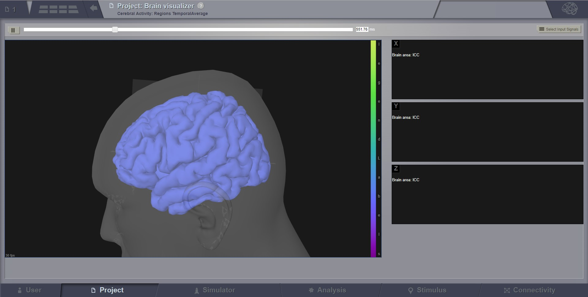

   Preview for Brain Activity Visualizer at the region level

.. _ts_svg_ui:

Time Series Visualizer (svg/d3)
~~~~~~~~~~~~~~~~~~~~~~~~~~~~~~~

In the center area you click and drag to zoom, click once to reset zoom and use the scroll wheel to scroll signals.

The horizontal bottom part is the temporal context. Here the solid line marks the mean across channels, in time.
The shaded area marks standard deviation across channels, in time.
You Click and drag to select a subset of signals. The selection can be changed again by dragging it.
Click outside selection box to cancel and reset view.
You can resize the view by dragging blue box in the bottom right corner.

The vertical left part is the signal context. Here solid lines show each signal. Selection works like in the temporal context.

In the brain menu there is a slider you use to change the signal scaling.

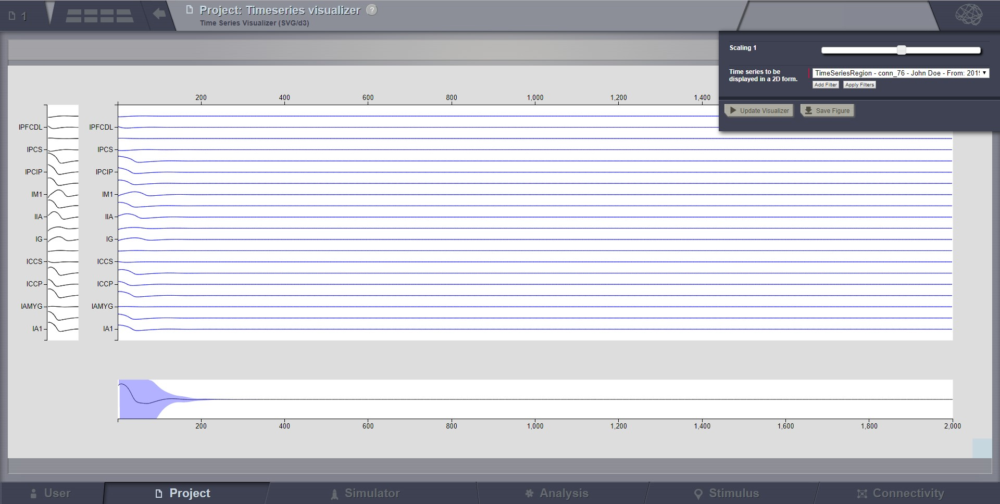

   Preview for Time-Series Visualizer (svg/d3)

Animated Time Series Visualizer
~~~~~~~~~~~~~~~~~~~~~~~~~~~~~~~

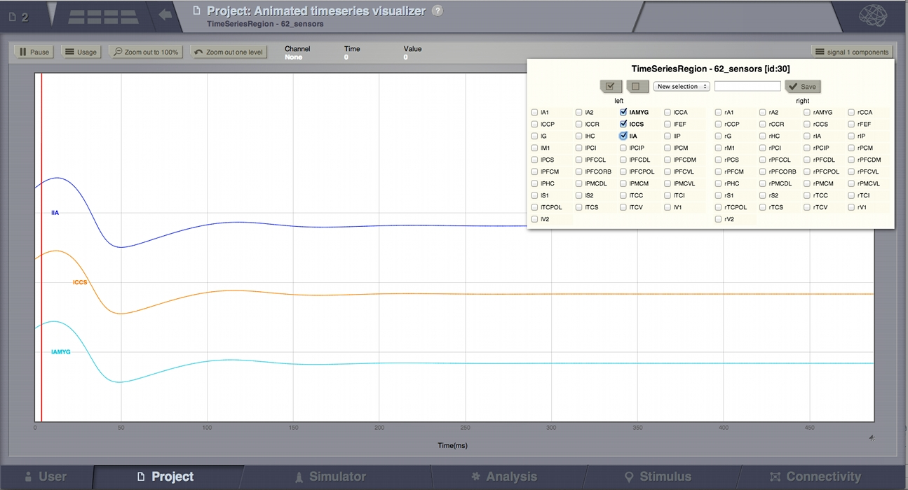

   Preview for Animated Time Series Visualizer

This is an alternative for the `Time Series Visualizer (svg/d3)`_.
It is used to display signal lines in 2D.

The label "animated" comes from the red line which will pass the entire signal step by step, at a configurable
speed. In single mode, this red-line might not be very useful, but it makes more sense when the same 2D display
gets reused in the Dual Visualizers (combined with the 3D display on a surface) where the red-line shows the
current step displayed in the 3D movie on the left.

Select zoom area with your mouse (you may do that several times to zoom in further).
From the toolbar you can pause resume the activity and zoom out.

This viewer can display multiple time series.
On the right side of the toolbar there will be a selection component for each signal source.
These selection components determine what signals are shown in the viewer.
To select additional time series use the brain menu in the upper left corner.
From that menu you can change viewer settings. The page size determines how much data should appear at once in the viewer.
The spacing determines the space between the horizontal axis of each signal. Setting it to 0 will plot all signals in the same coordinate system.
A side effect of this setting is that as you decrease this axis separation the amplitude of signals is scaled up.

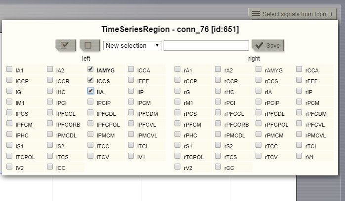

   Selecting the "channels" to be displayed (available in several viewers of TVB).
   
.. _brain_dual_view:

Dual Brain Activity Visualizer
~~~~~~~~~~~~~~~~~~~~~~~~~~~~~~

This visualizer combines the brain activity movie shown in a 3D display on the left,
with the explicit channels recording lines on the right.
Movie start/stop, speed control, color schema change, channel selection are some of the features available in this visualizer.

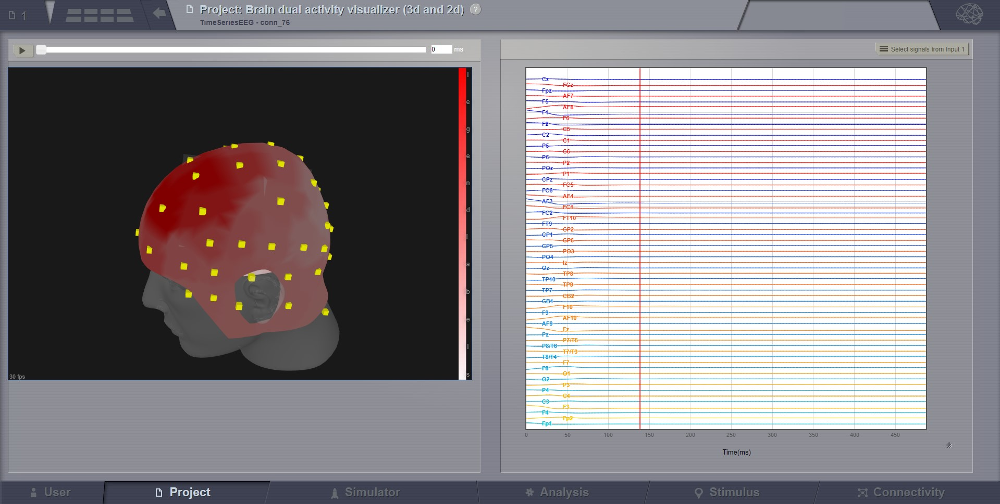

   Brain activity wit EEG recordings.

.. figure:: screenshots/visualizer_dual_seeg_and_regions.jpg
   :width: 90%
   :align: center

   Brain activity with sEEG recordings (on the left instance) and region level activity (on the right).

.. _brain_volumetric:

Time Series Volume Visualizer
~~~~~~~~~~~~~~~~~~~~~~~~~~~~~

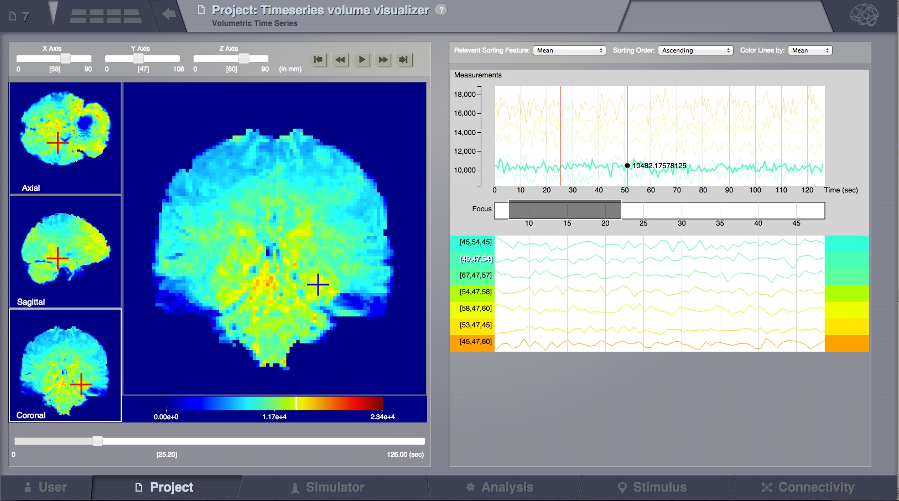

   TimeSeries Volume with selections

This visualizer displays time series of volumetric data, like fMRI.

There are 3 navigation and viewing quadrants on the left and one main "focus quadrant" (left-central).
It is  possible to navigate in space using the slide controls on the
top-left toolbar or by clicking on the 3 navigation quadrants on the most left part of the screen.
So clicking in the 3 left squares will change the X, Y, Z of the planes slicing through the currently displayed volume
(as the sliders on top are doing), while clicking in the main (central) square will select the clicked point for display
of details on the right.

The playback function is activated by clicking the play button on the top bar,
and it will then change the display with time (left and right areas);
The time series data is buffered from the server according to the currently section of view.

A different color map can be selected by clicked the Brain call-out in the top-right side of the screen.

**Time Series Line Fragments**

This is the right part of the TimeSeries Volume visualizer and is composed of three main parts:

*Global Time Series Graph*
All selected lines are shown here (top area), with the same scaling. Some transparency is applied to
the lines and only one line is highlighted at a time. Highlighting can be done
be passing the mouse over the line on the global graph or by clicking the
selected line in the sortable graphs bellow. Vertical scaling is done based only on the
selected values and not on the complete data set. A red vertical line shows the
current time point (correlated with the movie in TimeSeries Volume section).
A blue line follows the mouse showing the value of the highlighted line at each point.

*Time slice selection (focus):*
This function can be used to display only a portion of the data, zooming on it bellow.
The user can manually define the time slice with the mouse actions
,while it will automatically set itself around the current time point
with a default extent during playback.

*Sortable Graphs:*
Every selected time series from the volume is shown on a separate line and labeled
based on its coordinates from the 3D space.
Adding lines in this section can be done by clicking in the left area on the main quadrant.
The lines are colored following the selected feature
in "Color Lines by" at the top of the screen. They are then sorted automatically
by one of the selected methods or manually, by dragging and dropping each line
in the desired position, as seen on the picture bellow. Lines can be removed by
dragging them to the top "trash bin area" that appear every time a line is
selected to be dragged.

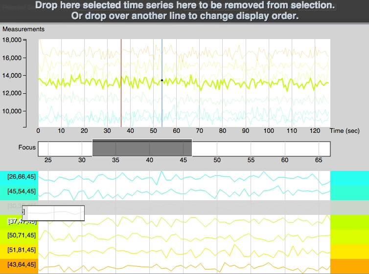

   TimeSeries Fragment

Connectivity Measure Visualizer
~~~~~~~~~~~~~~~~~~~~~~~~~~~~~~~

This visualizer can be used for displaying various Brain Connectivity Measures, related to a given Connectivity.

On the X axis, we will see the Connectivity nodes listed, and for each of them, we see the computed measure on the Y axis.

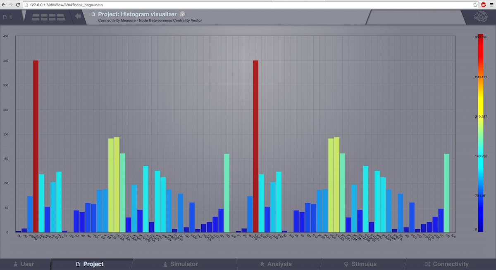

   Connectivity Measure Visualizer.

Topographic Visualizer
~~~~~~~~~~~~~~~~~~~~~~

This visualizer can be used for displaying various Brain Connectivity Measures, related to a given Connectivity.
Its input is same as for the previous visualizer (Connectivity Measure Visualizer), but the display is completely different.
Instead of a discrete view, this time, we can have a continous display (with gradients).

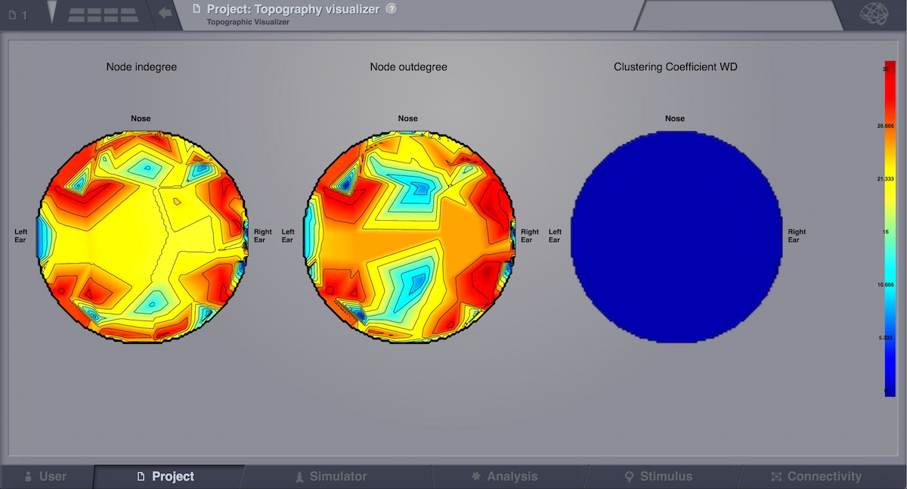

   Preview for Topographic Visualizer

Surface Visualizer
~~~~~~~~~~~~~~~~~~

This visualizer can be used for displaying various Brain Surfaces. It is a static view,
mainly for visual inspecting imported surfaces in TVB.
Optionally it can display associated RegionMapping entities for a given surface.
Navigate the 3D scene like in the `Brain Activity Visualizer`_.

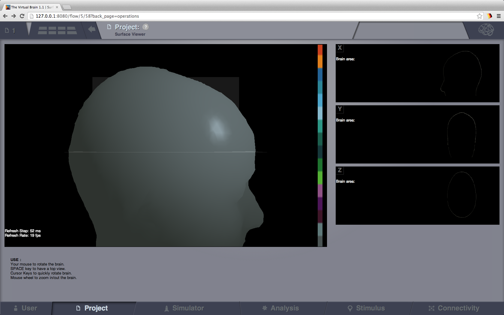

   Surface Visualizer.

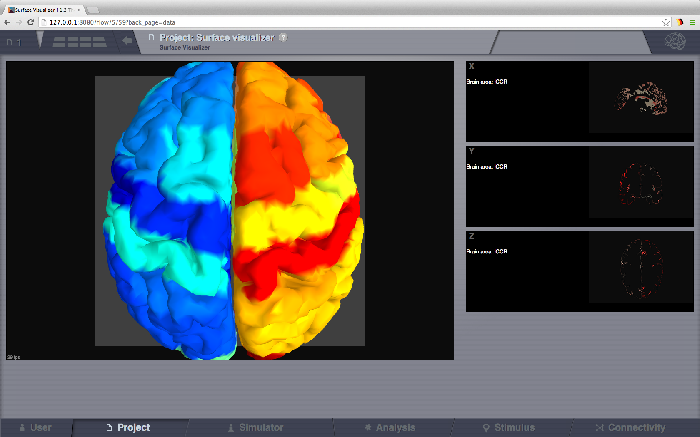

   Cortical Surface Visualizer with Region Mapping applied.

Sensor Visualizer
~~~~~~~~~~~~~~~~~

This visualizer can be used for displaying EEG, MEEG, and internal sensors .
It is a static view, intended for visual inspecting imported sensors in TVB.
Optionally it can display the sensors on a EEG cap surface.

To show sensors displaying on a Cap, check the call-out on the top-right corner.

When displaying the EEG sensors on a EEG Cap surface, we are automatically computing a "parcellation".
Currently this parcellation has no anatomical meaning, it is only based on distance (a vertex gets coloured as
the closest sensor).

Navigate the 3D scene like in the `Brain Activity Visualizer`_.

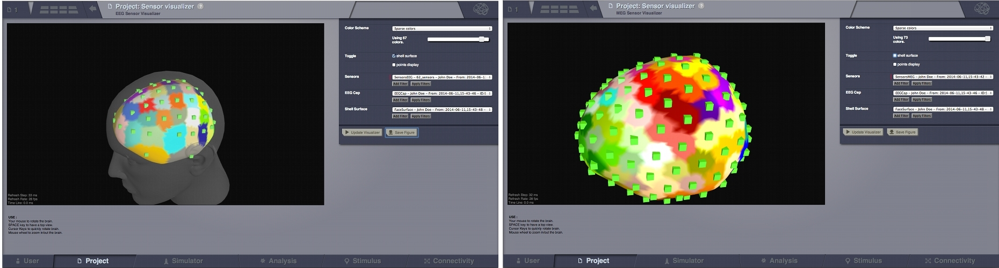

   EEG and MEG Sensors.

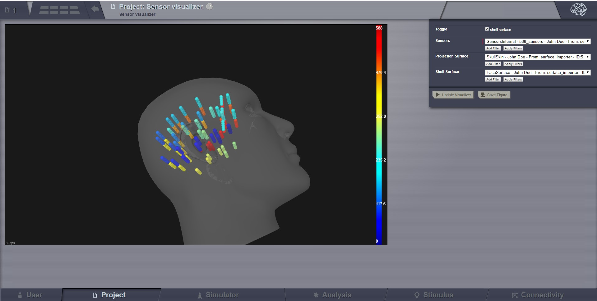

   Internal Sensors.

Local Connectivity Visualizer
~~~~~~~~~~~~~~~~~~~~~~~~~~~~~

Once a Local Connectivity dataTypes (which in fact is a huge sparse matrix of max size surface
vertices x surface vertices, shaped after the cut-off) gets computed, one can view the correlation
of a given vertex compared to all its neighbours, by launching this viewer (from the DataType overlay).

In order to see some correlation, one should pick (by mouse click) a vertex on the 3D cortical
surface once it loads in the canvas.

Annotations Visualizer
~~~~~~~~~~~~~~~~~~~~~~

This viewer shows ontology annotations linked with TVB connectivity regions. It is composed of two main display areas:
 - 3D left-side canvas with TVB regions. These regions are color coded, based on the connectivity region index
 (similar to `Surface Visualizer`_ when a Region Mapping entity is selected). From the most top-right corner menu,
 you can change the color scheme used to draw these regions coloring.
 - 2D tree display of ontology annotations. A tooltip will appear if you go with the mouse over various nodes,
 and will show you details imported from the ontology.

 The two areas (left and right) are linked, both ways:
- You can pick a vertex in 3D and have the corresponding tree node highlighted on the right-side, or backwards:
- Click on the tree, and have the corresponding region(s) highlighted in 3D.

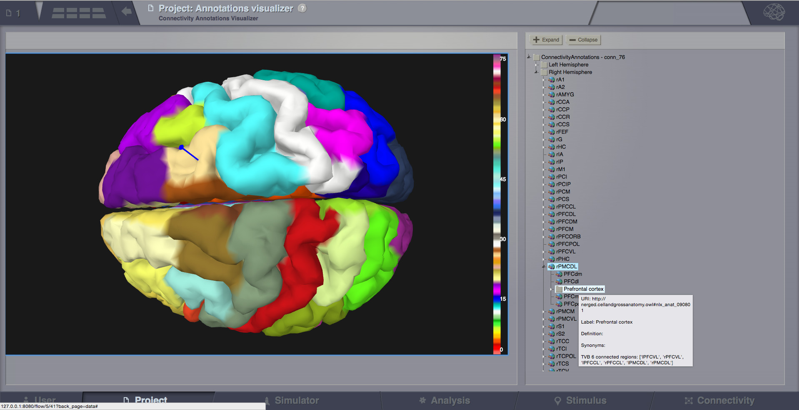

   Pick a vertex in 3D and have the corresponding tree node selected on the right.

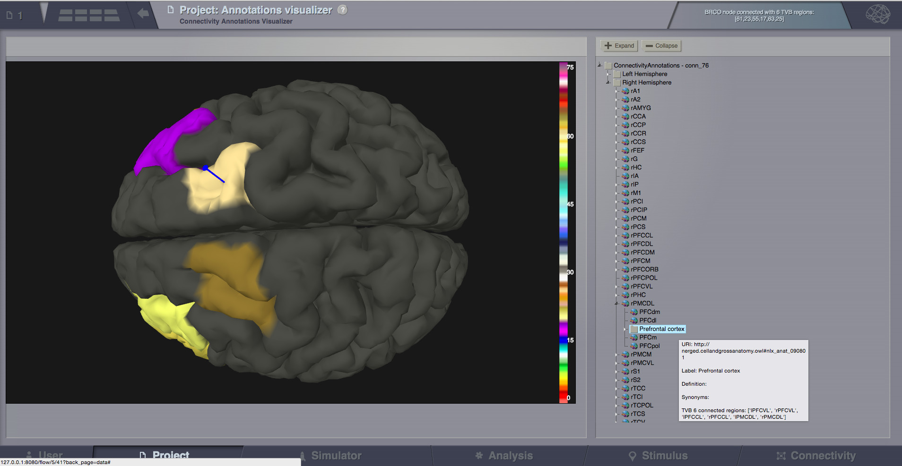

   Select a tree node on the right, and have the linked regions highlighted in 3D.

Group Display
.............

Discrete PSE Visualizer
~~~~~~~~~~~~~~~~~~~~~~~

Discrete Parameter Space Exploration View, will show up to two measures of the Simulator results,
after varying input Simulator Parameters. The two displayed measures are emphasized in the node shapes and node colors.

When running a range of Simulations in TVB, it is possible to do it by varying up to 2 input parameters (displayed on
the X and Y axis of current viewer).This visualizer supports to display results when the resulting space is not bigger
than 200 points.

.. figure:: screenshots/simulator_pse_configuration.jpg
   :width: 90%
   :align: center

   Preview for Discrete PSE Visualizer, when varying two input parameters of the simulator

When moving with your mouse cursor over a graph node, you will see a few details about that particular simulation result.
When clicking a node, an overlay window will open, which gives you full access to view or further analyze that
particular Simulation result.

Isocline PSE Visualizer
~~~~~~~~~~~~~~~~~~~~~~~

Continuous Parameter Space Exploration View, will show the effect of varying Simulator parameters in a continuous form.

When running a range of Simulations in TVB, it is possible to do it by varying up to 2 input parameters (displayed on
the X and Y axis of current viewer). This visualizer supports ranges with 2 dimensions only, it does not support ranges
with only one dimension. Also both varying dimensions need to be numeric parameters (no DataType ranges are supported
for display in this visualizer).

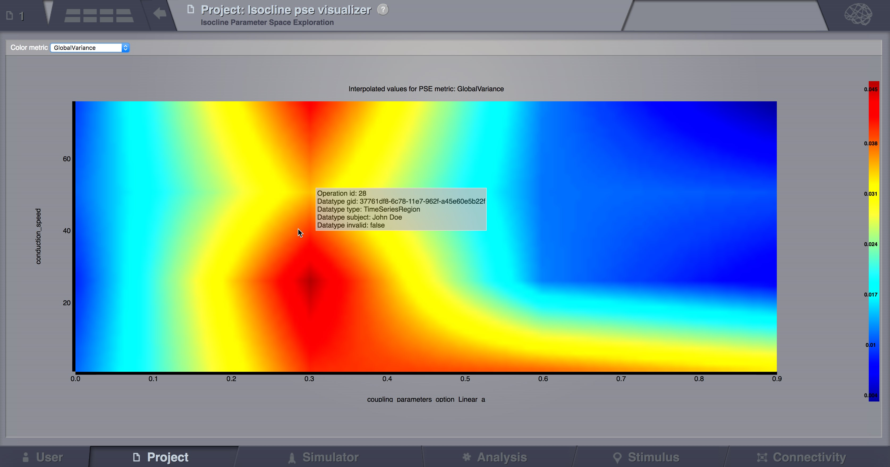

   Preview for Continuous PSE Visualizer, when varying two numeric input parameters of the simulator

Controls for scaling or zooming the graph are available in this viewer. When you click on the coloured area, an overlay
window will open, containing possibility to view or further analyze the simulation result closest to the point where
you clicked.

Analyzers + Visualizers
.......................

Covariance Visualizer
~~~~~~~~~~~~~~~~~~~~~

Displays the covariance matrix. 
The matrix size is `number of nodes` x `number of nodes`

.. figure:: screenshots/visualizer_covariance.jpg
   :width: 90%
   :align: center

   Preview for Covariance Visualizer

Cross Coherence Visualizer
~~~~~~~~~~~~~~~~~~~~~~~~~~

Displays the cross-coherence matrix. Axes represent brain nodes.
The matrix size is `number of nodes` x `number of nodes`.

 
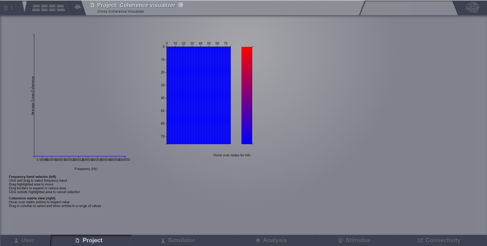

   Preview for Cross Coherence Visualizer

Complex Coherence Visualizer
~~~~~~~~~~~~~~~~~~~~~~~~~~~~

Displays the complex-cross-coherence matrix. Axes represent brain nodes.
The matrix is a complex ndarray that contains the `number of nodes` x `number of nodes` cross
spectrum for every frequency frequency and for every segment

This visualizer is very similar with the previous one (Cross Coherence Visualizer).

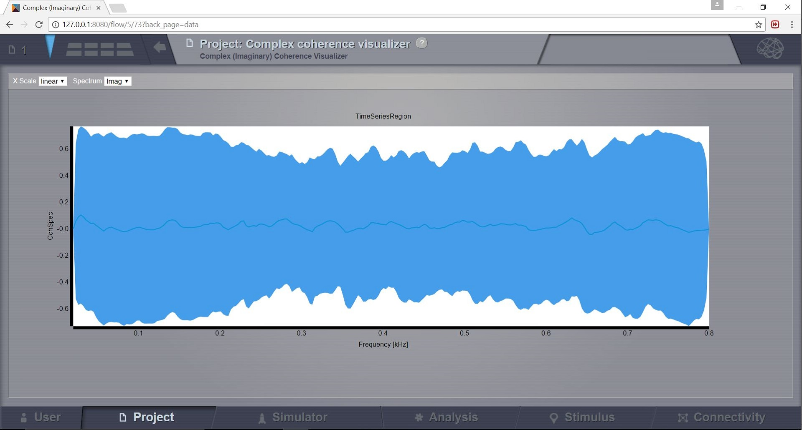

     Preview for Complex Coherence Visualizer

Cross Correlation Visualizer
~~~~~~~~~~~~~~~~~~~~~~~~~~~~

Displays the cross-correlation matrix. Similar to the previous three visualizers.

Pearson Coefficients Visualizer
~~~~~~~~~~~~~~~~~~~~~~~~~~~~~~~

Displays the Pearson correlation coefficients matrix.

.. figure:: screenshots/visualizer_pearson_mplh5.jpg
   :width: 90%
   :align: center

   Preview for Pearson Visualizer (MPLH5)

Fourier Spectrum Visualizer
~~~~~~~~~~~~~~~~~~~~~~~~~~~

Plots the power spectrum of each node time-series.

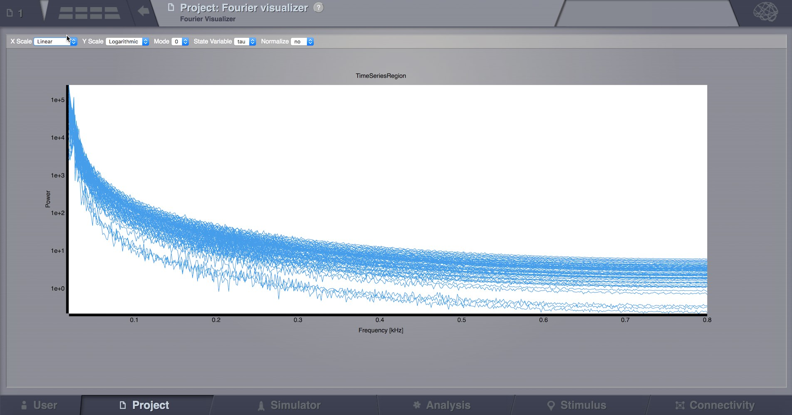

   Preview for Fourier Spectrum Visualizer

Principal Component Visualizer
~~~~~~~~~~~~~~~~~~~~~~~~~~~~~~

On the left, the ring plot displays the fraction of the variance that is 
explained by each component.

On the right, the first ten components are plotted against the brain nodes 
(variables). 

.. figure:: screenshots/analyzers_pca.jpg
   :width: 90%
   :align: center

   Preview for Principal Components Analysis Visualizer

Independent Component Visualizer
~~~~~~~~~~~~~~~~~~~~~~~~~~~~~~~~

ICA takes time-points as observations and nodes as variables.

As for PCA the TimeSeries datatype must be longer (more time-points) than the number of nodes.
Mostly a problem for TimeSeriesSurface datatypes, which, if sampled at 1024Hz, would need to be greater than
16 seconds long.

.. figure:: screenshots/analyzers_ica.jpg
   :width: 90%
   :align: center

   Preview for Independent Components Analysis Visualizer

Wavelet Spectrogram Visualizer
~~~~~~~~~~~~~~~~~~~~~~~~~~~~~~

2D representation that shows how the signals wavelet spectral coefficients (frequency) 
vary with time.

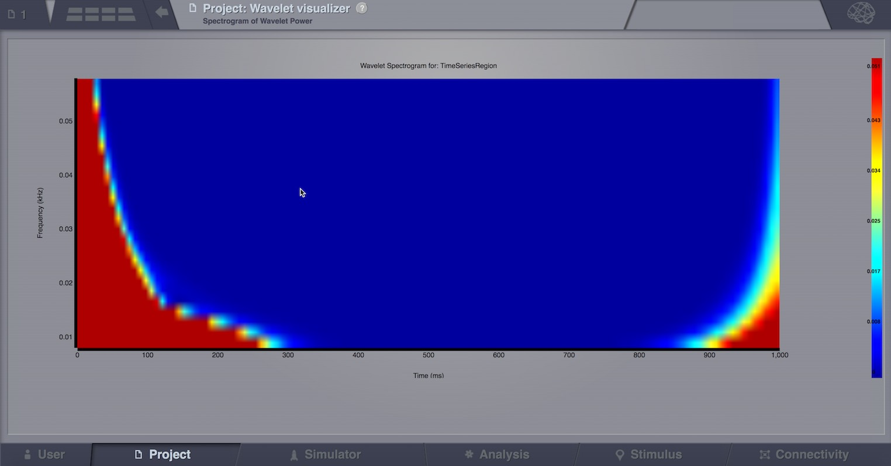

   Preview for Wavelet Visualizer

