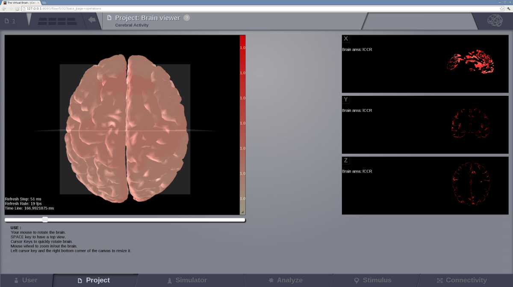
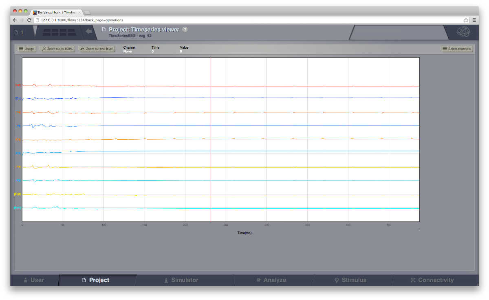
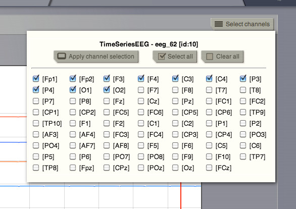
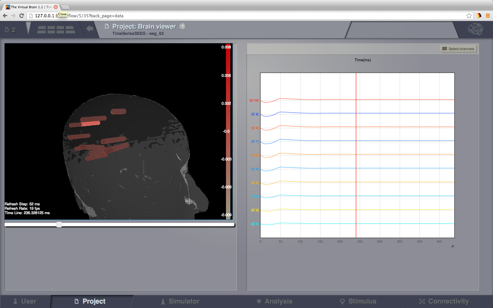

.. VISUALIZERS COLUMN

Simple Visualizers
..................

Brain Activity Visualizer
~~~~~~~~~~~~~~~~~~~~~~~~~

A 3D scene of the brain activity:

- at the region level: the brain is represented by a coarse granularity - each 
  region is represented with only one color.

   Preview for Brain Activity Visualizer at the region level

- at the surface level: the brain is represented by a fine granularity - each 
  surface vertex has an individual measure.

Time Series Visualizer (svg/d3)
~~~~~~~~~~~~~~~~~~~~~~~~~~~~~~~

.. figure:: screenshots/visualizer_timeseries_svgd3.jpg
   :width: 90%
   :align: center

   Preview for Time-Series Visualizer (svg/d3)

Time Series Volume Visualizer
~~~~~~~~~~~~~~~~~~~~~~~~~~~~~~~

This visualizer is still work in progress.

EEG Time Series Visualizer
~~~~~~~~~~~~~~~~~~~~~~~~~~

   Preview for EEG Time Series Visualizer

If you used an EEG monitor to record the activity of your large-scale brain 
simulation, this display allows you to select the channels of the 62-sensors 
EEG recording. 

   Selecting the "channels" to be displayed.
   
   
Dual Brain - EEG Visualizer
~~~~~~~~~~~~~~~~~~~~~~~~~~~

   Preview for EEG Time Series Visualizer

This visualizer combines the brain activity on top of a 3D display of the pacient's 
head and on the right column, the EEG channels recordings. Channel selection is 
also available.

.. figure:: screenshots/visualizer_dual_head_eeg.jpg
   :width: 90%
   :align: center

   Brain activity wit EEG recordings.

Dual Brain - sEEG Visualizer
~~~~~~~~~~~~~~~~~~~~~~~~~~~~~

This visualizer combines the brain activity on top of a 3D display of the pacient's
head and on the right column, the sEEG (Stereo EEG) channels recordings. Channel selection is
also available.

   Brain activity wit sEEG recordings.

Connectivity Measure Visualizer
~~~~~~~~~~~~~~~~~~~~~~~~~~~~~~~~~

This visualizer can be used for displaying various Brain Connectivity Measures, related to a given Connectivity.

On the X axis, we will see the Connectivity nodes listed, and for each of them, we see the computed measure on the Y axis.

.. figure:: screenshots/visualizer_histogram.jpg
   :width: 90%
   :align: center

   Connectivity Measure Visualizer.

Topographic Visualizer
~~~~~~~~~~~~~~~~~~~~~~

This visualizer can be used for displaying various Brain Connectivity Measures, related to a given Connectivity.
Its input is same as for the previous visualizer (Connectivity Measure Visualizer), but the display is completely different.
Instead of a discrete view, this time, we can have a continous display (with gradients).

.. figure:: screenshots/visualizer_topographic.jpg
   :width: 90%
   :align: center

   Preview for Topographic Visualizer

Surface Visualizer
~~~~~~~~~~~~~~~~~~~~

This visualizer can be used for displaying various Brain Surface. It is a static view,
mainly for visual inspecting imported surfaces in TVB.
Optionally it can display associated RegionMapping entities for a given surface.

.. figure:: screenshots/visualizer_surface.jpg
   :width: 90%
   :align: center

   Surface Visualizer.

Sensor Visualizer
~~~~~~~~~~~~~~~~~~~~

This visualizer can be used for displaying EEG, MEEG, and internal sensors .
It is a static view, intended for visual inspecting imported sensors in TVB.
Optionally it can display the sensors on a EEG cap surface.

Group Display
.......................

Discrete PSE Visualizer
~~~~~~~~~~~~~~~~~~~~~~~~~

Discrete Parameter Space Exploration View, will show up to two measures of the Simulator results,
after varying input Simulator Parameters. The two displayed measures are emphasized in the node shapes and node colors.

When running a range of Simulations in TVB, it is possible to do it by varying up to 2 input parameters (displayed on
the X and Y axis of current viewer).This visualizer supports to display results when the resulting space is not bigger
than 200 points.

.. figure:: screenshots/simulator_pse_configuration.jpg
   :width: 90%
   :align: center

   Preview for Discrete PSE Visualizer, when varying two input parameters of the simulator

When moving with your mouse cursor over a graph node, you will see a few details about that particular simulation result.
When clicking a node, an overlay window will open, which gives you full access to view or further analyze that
particular Simulation result.

Isocline PSE Visualizer
~~~~~~~~~~~~~~~~~~~~~~~~~

Continuous Parameter Space Exploration View, will show the effect of varying Simulator parameters in a continuous form.

When running a range of Simulations in TVB, it is possible to do it by varying up to 2 input parameters (displayed on
the X and Y axis of current viewer). This visualizer supports ranges with 2 dimensions only, it does not support ranges
with only one dimension. Also both varying dimensions need to be numeric parameters (no DataType ranges are supported
for display in this visualizer).

.. figure:: screenshots/simulator_pse_iso.jpg
   :width: 90%
   :align: center

   Preview for Continuous PSE Visualizer, when varying two numeric input parameters of the simulator

Controls for scaling or zooming the graph are available in this viewer. When you click on the coloured area, an overlay
window will open, containing possibility to view or further analyze the simulation result closest to the point where
you clicked.

Analyzers + Visualizers
.......................

Covariance Visualizer
~~~~~~~~~~~~~~~~~~~~~~

Displays the covariance matrix. 
The matrix size is `number of nodes` x `number of nodes`

.. figure:: screenshots/visualizer_covariance.jpg
   :width: 90%
   :align: center

   Preview for Covariance Visualizer

Cross Coherence Visualizer
~~~~~~~~~~~~~~~~~~~~~~~~~~~

Displays the cross-coherence matrix. Axes represent brain nodes.
The matrix size is `number of nodes` x `number of nodes`.

 
.. figure:: screenshots/visualizer_cross_coherence.jpg
   :width: 90%
   :align: center

   Preview for Cross Coherence Visualizer

Complex Coherence Visualizer
~~~~~~~~~~~~~~~~~~~~~~~~~~~~~~

Displays the complex-cross-coherence matrix. Axes represent brain nodes.
The matrix is a complex ndarray that contains the `number of nodes` x `number of nodes` cross
spectrum for every frequency frequency and for every segment

This visualizer is very similar with the previous one (Cross Coherence Visualizer).

.. figure:: screenshots/visualizer_complex_coherence.jpg
     :width: 90%
     :align: center

     Preview for Complex Coherence Visualizer

Cross Correlation Visualizer
~~~~~~~~~~~~~~~~~~~~~~~~~~~~

Displays the cross-correlation matrix. Similar to the previous three visualizers.

Pearson Coefficients Visualizer
~~~~~~~~~~~~~~~~~~~~~~~~~~~~~~~~

Displays the Pearson correlation coefficients matrix.

.. figure:: screenshots/visualizer_pearson_mplh5.jpg
   :width: 90%
   :align: center

   Preview for Pearson Visualizer (MPLH5)

Fourier Spectrum Visualizer
~~~~~~~~~~~~~~~~~~~~~~~~~~~

Plots the power spectrum of each node time-series.

.. figure:: screenshots/visualizer_fft.jpg
   :width: 90%
   :align: center

   Preview for Fourier Spectrum Visualizer

Principal Component Visualizer
~~~~~~~~~~~~~~~~~~~~~~~~~~~~~~

On the left, the ring plot displays the fraction of the variance that is 
explained by each component.

On the right, the first ten components are plotted against the brain nodes 
(variables). 

.. figure:: screenshots/analyzers_pca.jpg
   :width: 90%
   :align: center

   Preview for Principal Components Analysis Visualizer

Independent Component Visualizer
~~~~~~~~~~~~~~~~~~~~~~~~~~~~~~~~~~~~

ICA takes time-points as observations and nodes as variables.

As for PCA the TimeSeries datatype must be longer (more time-points) than the number of nodes.
Mostly a problem for TimeSeriesSurface datatypes, which, if sampled at 1024Hz, would need to be greater than
16 seconds long.

.. figure:: screenshots/analyzers_ica.jpg
   :width: 90%
   :align: center

   Preview for Independent Components Analysis Visualizer

Wavelet Spectrogram Visualizer
~~~~~~~~~~~~~~~~~~~~~~~~~~~~~~~

2D representation that shows how the signals wavelet spectral coefficients (frequency) 
vary with time.

.. figure:: screenshots/visualizer_wavelet.jpg
   :width: 90%
   :align: center

   Preview for Wavelet Visualizer

