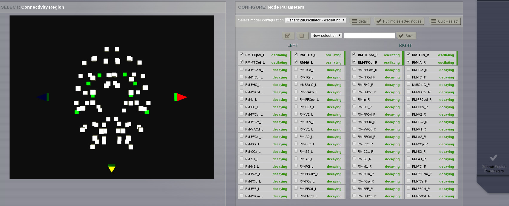
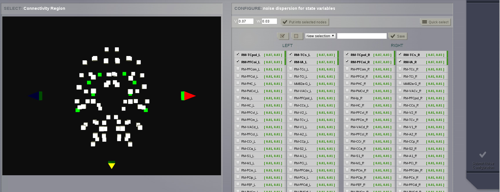
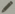
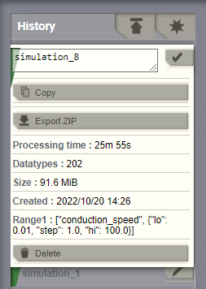
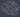

.. _simulator_ui:

Simulator
---------

A configurable multicolumn interface that combines |TVB| simulation, analysis 
and visualization capabilities.

    .. figure:: screenshots/simulator.jpg
      :width: 90%
      :align: center

      Preview for Simulator Area

.. SIMULATOR COLUMN

Configure a Simulation
......................

|

A simulation is configured from the middle column.

On the top of this column there is:
  - a field to enter the new simulation name,
  - the `Launch` button on the top right to start the simulation, and
  - the `Configure Interface` button to select which of the simulation 
    components are visible.
  - links to pages that allow detailed configuration

    - region model configuration
    - region noise configuration
    - surface level configuration (available for surface simulations)

|

    .. image:: screenshots/simulator_configuration_buttons.jpg
       :width: 90%
       :align: center

|

In this column you can change all the configurable parameters of a simulation:

  - Long Range Connectivity
  - Long Range Coupling Function
  - Conduction Speed
  - Cortical Surface
  - Stimulus
  - Local Dynamics Model

    - State Variable Range
    - State Variables to be recorded
    - Initial Conditions

  - Integration Scheme

    - Integration Step Size

  - Monitors
  - Simulation Length

You can find more detailed information by clicking on the |interrogationicon| 
icon next to each element.

.. note::

    **You can filter DataTypes (like Long Range Connectivity) from UI**

    .. image:: screenshots/filter_datatypes.png
       :width: 60%
       :align: center

    * Click on *Add Filter* button bellow a DataType
    * select the attribute to be filtered, the operator to apply and the value in this filter
    * click *Apply Filters* to have the results filtered in the selector component right above the filters
    * this ca also be used in the context of Parameter Space Exploration of |TVB|

.. _phase_plane:

The `Phase plane` page
~~~~~~~~~~~~~~~~~~~~~~

It is used to explore and define parameter configurations.
It is accessible from the top menu:

.. figure:: screenshots/simulator_phase_plane_link.jpg
      :width: 90%
      :align: center

This page allows you to observe how the dynamics of the physical model change as a
function of its parameters.

On the left column you select the `model` you want to explore and set it's parameters.

The selected model will generally have a n-dimensional phase space.
The right column shows a 2-dimensional axis cut of this space. Gradients are shown and nullclines if they exist.
To control this cut use the `Axes` and `State variables` regions in the left column.
There you can select what state variables should be shown and their ranges.
Also you can set values for the variables that are not shown.

If you click in the phase plane a state trajectory will be computed.
The integration method for this trajectory is configured on the left column.
To make trajectories longer increase the integration step. This will not influence the simulation.
For stochastic integrators decreasing the dispersion usually makes sense.
Below the phase graph you will see the signals for all state variables. These signals belong to the latest trajectory.

Finally to save a parameter configuration give it a name and click `Save new parameter configuration`.
This saved configuration can be used in `Region-based simulations`_

    .. figure:: screenshots/simulator_phase_plane_interactive.jpg
      :width: 90%
      :align: center

      The phase plane.

.. note::

  **TVB performs region-based and surface-based simulations**

  You can access specific configuration pages for both types of simulation.

Region-based simulations
~~~~~~~~~~~~~~~~~~~~~~~~

The `Set up region Model` button leads you to the region model page.
Here you can associate model parameter configurations to connectivity nodes.

      Region model configuration.

The `Configure noise` button leads to the region noise page.
Here you can associate noise dispersions to connectivity nodes.
Select some nodes using any of the selection components or the 3d view.
Choose dispersions for all state variables then place those values in the selected nodes.

      Region noise configuration.

Surface-based simulations
~~~~~~~~~~~~~~~~~~~~~~~~~

If you are launching a surface-based simulation, then it is possible to add 
more complexity by spatially varying the model parameters.
 
In order to do that, click on `Set up surface model`. A new configuration page 
will be loaded.

    .. figure:: screenshots/simulator_spatialized_parameters.jpg
      :width: 90%
      :align: center

      Preview for surface model configuration.

.. tip::

  **Parameter Space Exploration**

  It is possible to launch parallel simulations to systematically explore the 
  parameter space of the local dynamics model. In the current TVB version, up to  
  2 parameters can be inspected at the same time.

    .. figure:: screenshots/simulator_pse_configuration.jpg
      :width: 60%
      :align: center
               
      The results will be presented in a discrete two dimensional graph. Each 
      point represents the results of a simulation for an unique combination of
      parameters. The disk size corresponds to Global Variance and the color
      scale corresponds to Variance of the Variance of nodes.  

.. HISTORY COLUMN

Simulation History
..................

On the left column, a history of all simulations is kept and can be 
accessed at any time. Each simulation can be renamed or deleted by 
clicking on the upper right |pencil_icon| icon. 

   
   Simulation editing menu

.. caution:: 
    Please notice that **deleting a simulation will also delete all 
    resulting data that had been produced**.

Each simulation has a color label that represents its current status:

    - pale blue: simulation is running,
    - green: simulation is finished,
    - red: an error occured during the simulation.

.. note::

   You cannot rename a Simulation while it is running.
   
        .. figure:: screenshots/simulator_history_running.jpg
           :width: 20%
           :align: center
           
.. tip::

    The star button allows you to create a new simulation.
    using the default 
    `Simulator` parameters. 

.. VIEW COLUMN

Display Simulation Results
..........................

On the right column you will find an area where you can configure displays to exhibit
your simulation results.

.. hint::

    Maximize this column by clicking on the `zoom` icon located in the top right
    corner.

There are 4 tabs: 

  - three `View` tabs you can set up by selecting:

      - TVB time-series `Visualizers` that directly plot the resulting time-series or

      - `TVB-Visualizers` associated with a `TVB-Analyzer`. In this case, simulation
        results undergo two steps: they are first analyzed and those secondary results
        are shown in a corresponding visualizer.

  - one `Results` tab containing the current simulation data structure tree. You
    can inspect each element through this tree in the same way as in 
    `Projects` --> `Data Structure`.
    A full list of visualizers and analyzers is available from the component 
    overlay menu.

.. |launch_full_viz| image:: icons/button_launch_full_visualizer.png

.. tip::

    Once your results are available, by clicking on |launch_full_viz| you will be 
    redirected to a new page where only the currently selected visualizer is 
    presented. In this new page, you can click on |brainicon| in the top right corner 
    to access a new menu which will allow you to:

      - `Save` a snapshot of the current figure.
      - `Relaunch` the visualizer using a different entity, if available. For instance, a 
        different time-series.

      .. figure:: screenshots/visualizer_save_figure.jpg
        :width: 90%
        :align: center

        Preview for Full Visualizer mode.

All the snapshots you save can be managed in  `Projects` --> `Image Archive` 
page.

.. do not move this relationship to a toc tree. The online help for the simulator page
    assumes that the simulator doc page will contain the visualizers docs
    This is because the visualizers have no url but live in the context of the
    project and simulator pages.

.. include:: UserGuide-UI_Simulator-Visualizers.rst
