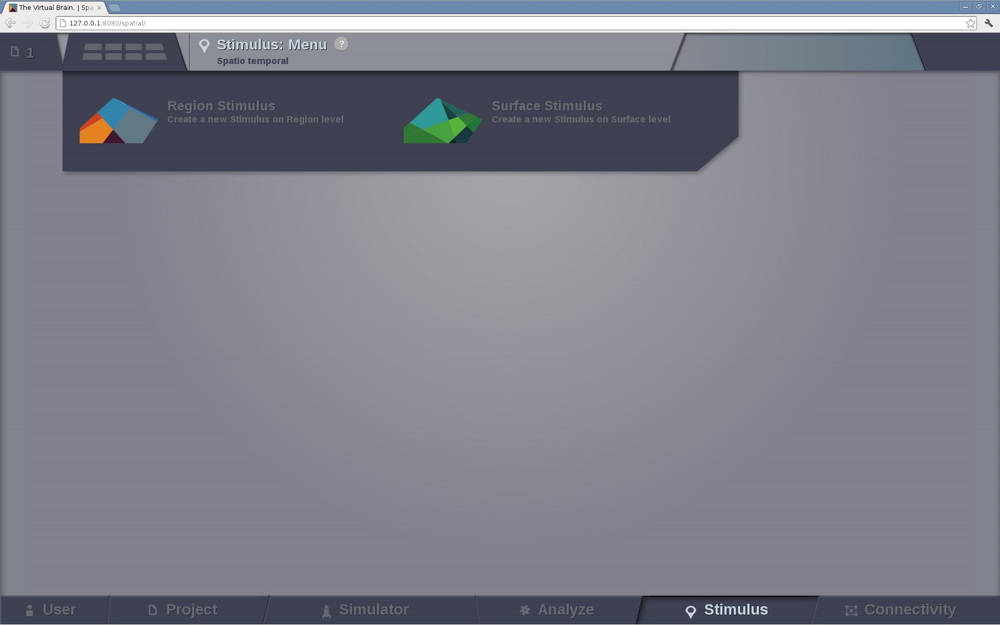
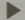

Stimulus
--------

Spatio-temporal patterns can be generated to create stimulation patterns.

   Preview for Stimulus Area. Select the type of stimulus you want to define / inspect

.. note:: 
  
   **You can build stimuli for region-based and surface-based simulations**

Region level stimulus
.....................

**Edit Stimulus Equations page**

On this page we can define a stimulus temporal profile for the connectivity nodes.

    .. figure:: screenshots/stimulus_region_edit.jpg
      :width: 90%
      :align: center

On the left column, we have configurable fields that allows us to:
	
    - load a preexisting `Region Stimulus` entity,
    - enter the name for a new entity and
    - select the associated `Connectivity` matrix that will be used to create a stimulus pattern.
    - Most importantly, we can select the Temporal Equation that defines the profile and play with its parameters.

On the right column, the stimulus temporal profile is presented, with constant refresh,
as the user changes the Temporal Equation parameters on the left.

|

From the action bar in the right side you have access to:

|

**Set Region Scaling** page (step 2) where you can:

    - select the nodes to which the temporal stimulus will be applied and
    - set the scaling value (stimulus strength) for each of the nodes independently.

    .. figure:: screenshots/stimulus_region_set_scaling.jpg
        :width: 90%
        :align: center

        Preview for node selection in Stimulus on region level

Click on **Save New Stimulus Region** button to create the new stimulus entity,
but before that, do not forget to write a name for the new entity in the left column
(field *Display name*).
 

Surface level stimulus 
......................

**Edit Stimulus Equations**

In the case of a surface level stimulus, besides the temporal profile, you can
define the spatial profile of your pattern as well.

    .. figure:: screenshots/stimulus_surface_edit.jpg
      :width: 90%
      :align: center
      
      Preview for Stimulus Surface equations

On the left column:
    
    - choose a preexisting `Surface Stimulus` or
    - enter the name for a new entity and
    - select the associated `Surface` datatype.
    - select the Spatial Equation that describes the spatial spread of the stimulus and set its parameters.
    - select the Temporal Equation and set its parameters.

On the right column, the stimulus temporal and spatial profiles are presented, with constant refresh,
as the user changes the equation parameters on the left.

From the action bar in the right side you have access to:

**Edit Focal Points and View** page (step 2) where you are able to select the spatial focal points:

    - click on the surface, a pin will point you the selected vertex;
    - click on `Add Focal Point` button to mark this vertex, an orange arrow will mark the added point;
    - repeat for each focal point you want added.

|

.. figure:: screenshots/stimulus_surface_set_focal_points.jpg
   :width: 90%
   :align: center

   Preview for selecting the focal points of a Surface Level Stimulus

On the right column you will have the list of the selected focal points. You can 
delete them independently.  

.. hint :: 

    The spatial pattern will be centered around the focal points.

Finally, click on **Save New Stimulus Surface** button to create the
new stimulus entity; but do not forget to give it a meaningful name
(left column *Display name* input field).

Regardless if the current Stimulus entity is stored or not yet,
you can visualize the evolution of the spatio-temporal pattern.
Click on the |play_icon| button to launch the animation.

.. figure:: screenshots/stimulus_surface_play.jpg
   :width: 90%
   :align: center
   
   Preview of a spatiotemporal stimulus animation

.. tip::

    You can increase the complexity of a stimulus pattern by building on top of one Stimulus entity.

    For an example on how to do it, please read the Test Cases in the User Guide document.

