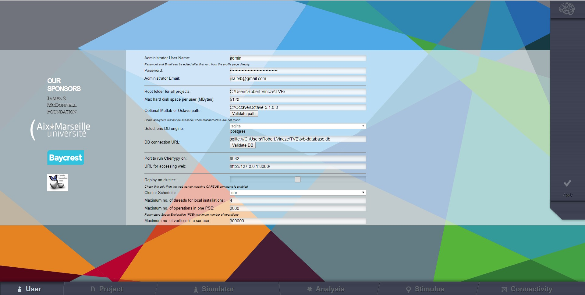
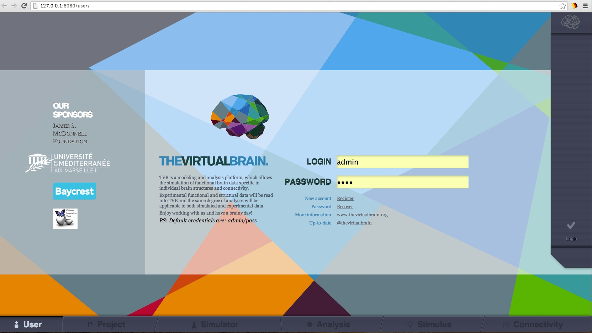
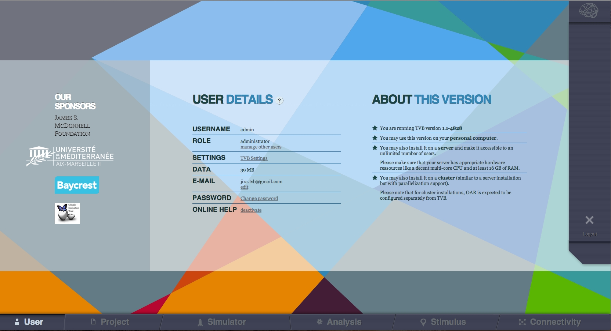

User
----

TVB Settings
.............

Once started, |TVB| should automatically open your default browser and start on 
the default `http://127.0.0.1:8080/settings/settings`. If not, you should 
manually open your favorite browser from our list of supported browsers and 
open the before mentioned URL. This should open up the following settings page:

   Settings Page

These are the configurable settings for |TVB|. Note that the `Name` of the administrator
is the only one that cannot be changed later on. The others will be accessible afterward
from the profile page of the administrator. These settings are:

Administrator User Name:
	the name of the administrator. Default value here is `admin`.
	Remember it, as you will need this account for validating other accounts created with `Register` function.

Password:
	the password of the administrator. Default value here is `pass`.
	Remember it, as you will need it at a first login.
	This password can be changed later by clicking the `Change password` link, from the profile page
	(available only after a login).

Administrator Email:
	the email of the administrator. Emails requesting validations for new users will
	be sent to this address. This can be changed by clicking the `edit` link from the
	profile page.

Root folder for all projects:
	this is the root storage for |TVB|. All your projects will be stored here, as well
	as the logging file and the files used as input and output for the backend server.
	Please provide here a valid folder path, on a drive which has enough space for storing TVB data.
	This field will be present on the settings page later on, but you won't be able to change it.
	In case you are forced to change this path/folder, we recommend that you export your 
	existing projects, stop |TVB|, start it with the clean option (and configure 
	new folder) and then import your projects back into the system.

Max Disk Size (in MB):
	Is the amount of disk space that you (as administrator) can specify as the 
	limit for each user, to occupy with |TVB| data. When a user exceeds this limit, 
	they are no longer allowed to run simulations or other operations producing 
	data. When this limit is exceeded, the user will still be able to 
	visualize their previously created data, and, if desired, to remove data for making space for new results.
	For instance:
	 
	    - A default region level simulation with length 1000 ms takes 
	      approximatively 1 MB of disk space.
	    - A surface level simulation, with Local Connectivity pre-computed, 
	      Raw monitor and length of 10 ms takes 280 MB.

    Default value here is 5GB. We validate upon setup that a value not greater than the available physical
    disk free space is specified. In case you later get errors when running simulations (with `disk full`
    messages), but you still have free space on your hard-drive, feel free to come on this settings page and
    increase this value of space allocated to |TVB|.

DB engine:
	For benchmarking purposes currently supported are *sqlite* and *postgresql* 
	databases. You will need to provide a valid database URL in case you choose 
	postgresql. In the case of sqlite a default `tvb-database.db` will always 
	be used. Please take into consideration that when switching to a new database 
	**your existing data will be lost**.

Server name:
	usually the IP of the server that will run |TVB|. You can also leave it as the default
	if you are just running |TVB| locally.

Cherrypy port:
	the port used by cherrypy. You need to make sure this port is not used by some other
	application otherwise |TVB| will not start.

Matplotlib port:
	the port used by matplotlib. You need to make sure this port is not used by some other
	application otherwise some visualizers will not work.

Deploy on cluster:
	set true if you want to run |TVB| on a cluster environment.

RPC server:
	if you are not running on a cluster, this will be the port used by the backend server. If
	`Deploy on cluster` is checked this will not be used.

Maximum number of vertices: 
	maximum number of vertices for a surface. 

After selecting your desired settings press the `Apply` button. This will restart |TVB| with the
new settings. The restart could take a few minutes.

Login
.........

In order to access |TVB|, you need to have a user account.

There is a single Administrator account in TVB (created when installing the application).
Its default user-name and password are **admin** and **pass** (exactly these words).
These are the default values, but when you setup |TVB| for the first time (section `Settings` from above)
you can specify different values, if wanted. Please remember what you specify for this Administrator account,
as you are the sole responsible for it (|TVB| being installed in your own environment
we have no control of your storage).
With the Administrator account you will be able to later validate other TVB accounts.

   |TVB| login page

Register
.........

If you want to create a new user in |TVB|, you should `register` using the corresponding link
(available on the `User Login` page), which takes you further to the following form:

.. figure:: screenshots/register.jpg
   :width: 90%
   :align: center

   |TVB| register page

When the `register` button is clicked (on the right), an email is sent to `ADMINISTRATOR_EMAIL`
address. It is the administrator's task to validate the new account. The
administrator needs to be logged in to validate an account. Without validation from the administrator, you will not
be able to use the new accounts. For details on how `validation` is done, see the `User Profile` section.

User Profile
..............

This area is available after you login and gives you some basic information, such as:

- current logged user-name, and his role (left column)
- how much disk space is occupied with TVB Data created by current user (left column, `Data` field)
- what version of |TVB| you are currently running (top of the right column)
- a summary of recent changes to |TVB| software (right column)
- availability of updated versions of |TVB| (when a new version is available, a tooltip will appear on the top of the User-pages).

   The User details page (also called `User Profile`)

You have also functionality on this page:

- `Manage other users` (available on the left column, only when logged with Administrator account), takes you to a page for validating or invalidating other user accounts (accounts created with the `register` function)
- access `TVB Settings` (same settings as in the first setup iof TVB; although some of the fields become read-only after the first setup)
- change the password and the email address for current logged user (also links on the left column)
- enable or disable `Online Help` for current user. By `Online Help` we mean a bunch of question marks spread all over the application which can display a tooltip when clicked). In case you find the question marks annoying, feel free to disable them for your user from this page.
- logout function (button on the right side)

