.. _tutorial_0_GettingStarted:

===============
Getting Started
===============

First things first. We are going to use *tvb-data* which is present within the distribution
(at TVB_Distribution/tvb_data/Lib/site-packages/tvb-data)
or it can be downloaded from `here <https://zenodo.org/record/4263723#.YL9x4jaA7t0>`_.
Other than that, please follow
`this link <https://www.thevirtualbrain.org/tvb/zwei/client-area/public?_ga=2.222814555.1504534223.1522695590-1355432300.1522695590#>`_
to download the *ModelingEpilepsy.zip* project.

Objectives
----------

This tutorial presents the basic steps to upload a project, and share data with
other users and/or link data to other TVB projects.  After this tutorial you
should be able to import a new dataset, create, import, export and delete a project and
share your data with among your projects or with a colleague.

------------------------

Adding A New User
---------------------------

In this exercise we will assume that multiple users are working with the
same TVB installation.

#. By default your are the *Admin* user.

#. Change the admin email.

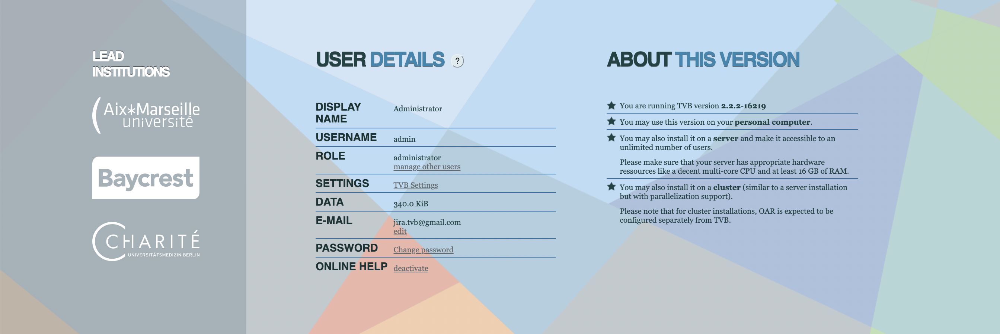

#. Create a user for someone else by registering a new user.

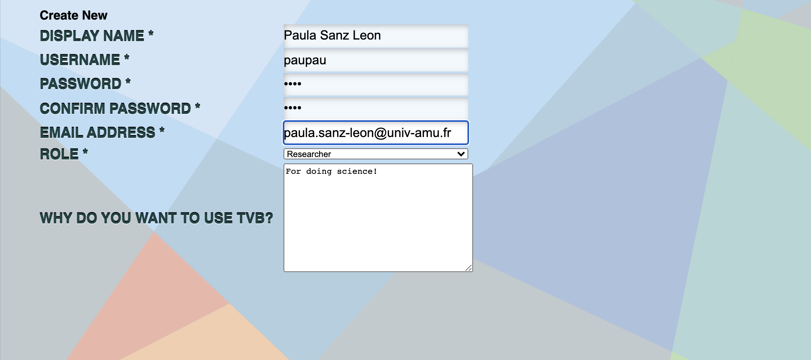

#. You’ll receive a notification email.

#. Make sure the new user has been validated.

.. figure:: figures/Users_ValidateNewUser.png
   :scale: 40%

#. Login with the Admin account.

--------------------------------------------

Creating, Importing, Exporting and Deleting Projects
---------------------------------------------------------

We assume that you have already created an account on your machine. If not, you
can always work with the default account *admin*.

Normally when you start TVB you should have the *Default Project* from *tvb_data* already imported.
If you don't have it, go to step 4 to see how you can import a new project.

#. Go to *Project > List of all projects*.

#. On the right column, bottom corner, click on *Create new project*.

#. Choose a project name (e.g. *NewProject*) and optionally add a description as well.
   On the right column, bottom corner, click on *Save Changes* when you are done.

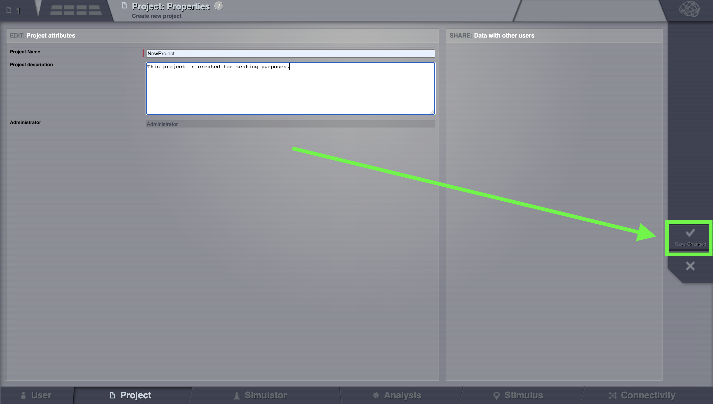

   The new project will appear in the list of all projects.

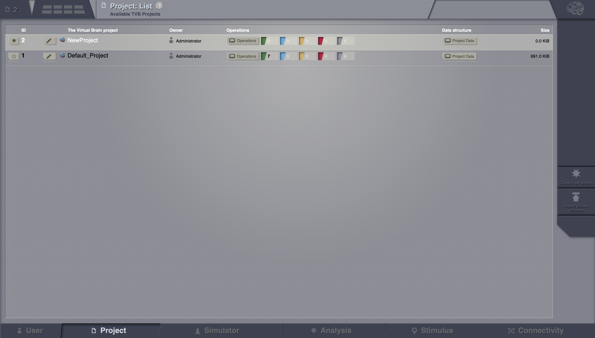

#. If you wish to import a project, on the right column, bottom corner,
   click on *Import project structure*.

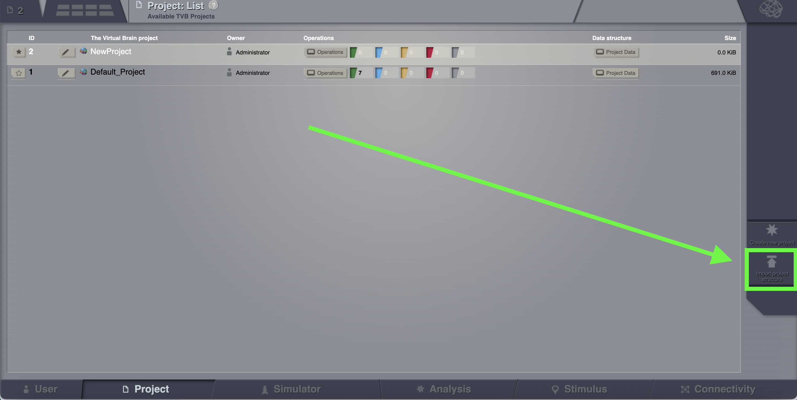

Chosing the ModelingEpilepsy.zip project and then Click on *Upload*.

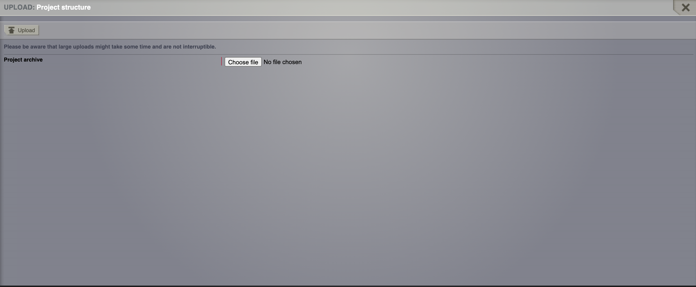

#. Be patient.

.. figure:: figures/Projects_Wait.png
   :alt: Be patient, it will take a few minutes.
   :scale: 30%

#. You can now see the project on the *List of all projects*.

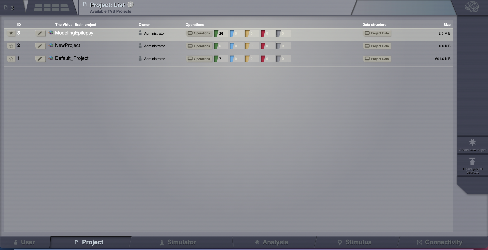

#. If you wish to export a project, click on the pencil icon located left to the project name.

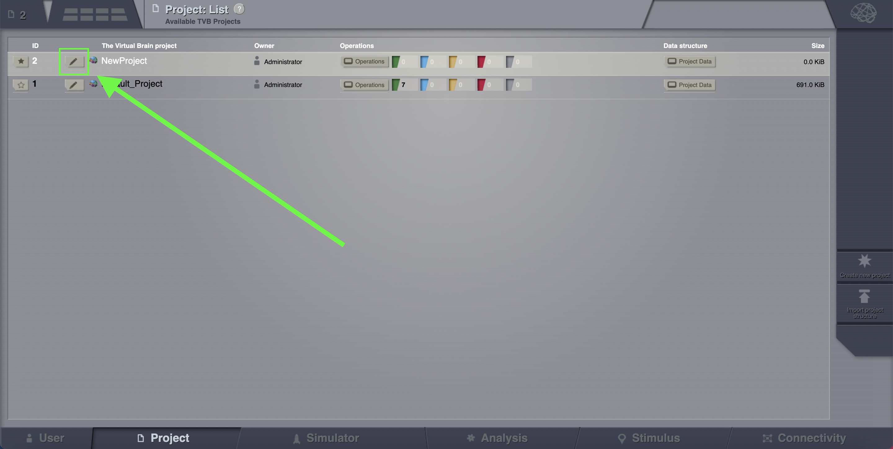

   Clicking on it will open the Properties page of the project. Click on the Export Project button.

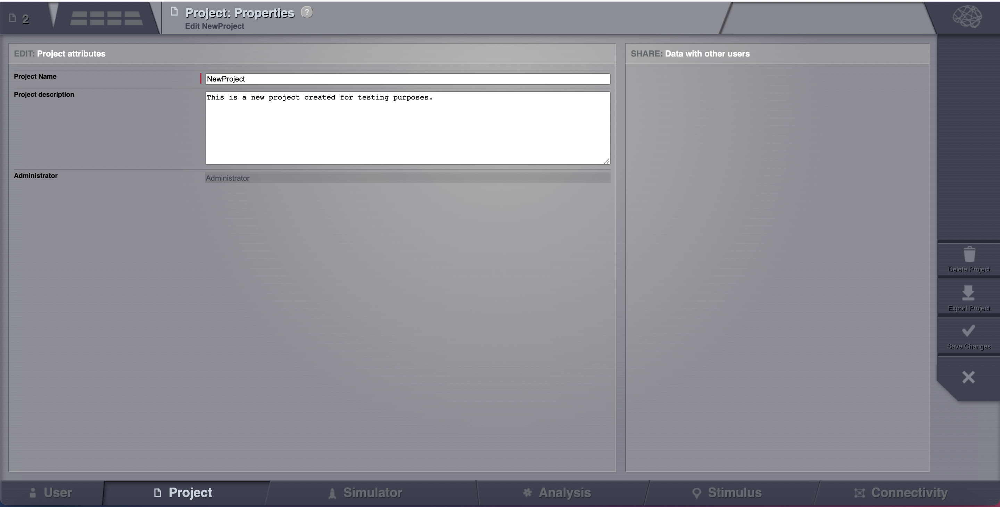

#. If you wish to delete a project, you click on the *Delete* button and the project
   will disappear from the list.

#. Select one of the projects (e.g. ModelingEpilepsy.zip). You select a project by clicking
   on the star icon.

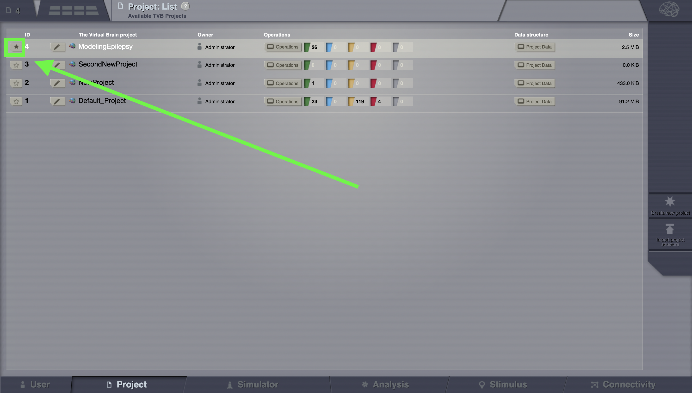

------------------------

Importing A Connectivity
------------------------

#. Assuming that you are working in the previously created project, upload a Connectivity in
   a zip file. Go to *Projects > Data structure*. Click on *Upload*. An
   overlay with the current supported formats will appear. 

#. Select *Connectivity ZIP*.

#. From your downloaded tvb-data folder select the file *connectivity_96.zip* found at *tvb_data/connectivity/*.

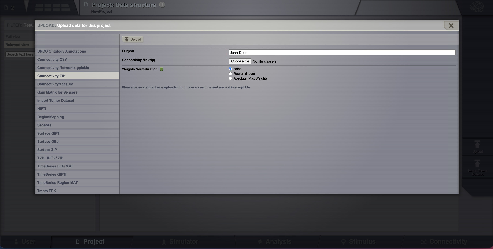

#. Add a personalized tag to this newly created datatype (e.g.
   *conn\_96*).

#. Save the changes.

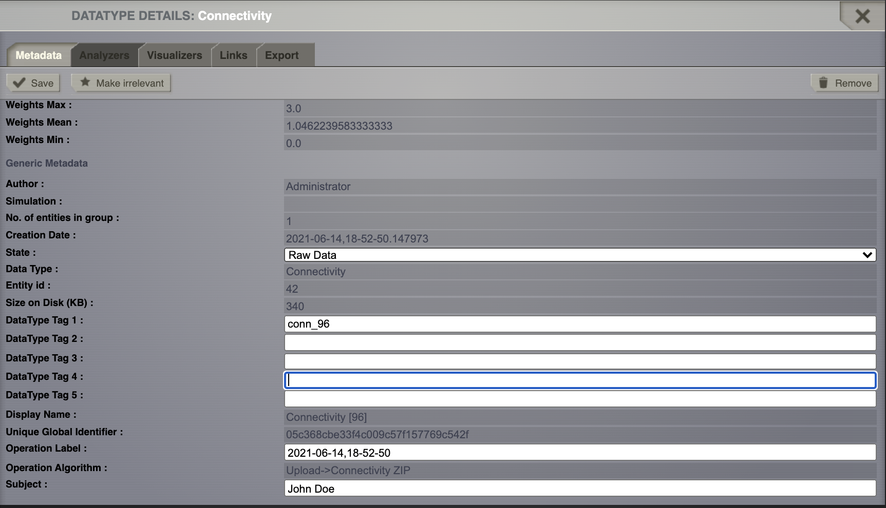

------------------------

Link And Share
---------------

#. Select the connectivity you want to share.

#. In the *metadata overlay*, go to the tab *Links*. You’ll see a list with all
   your projects except the current one.

#. Link this datatype (connectivity) with *SecondNewProject*.

.. figure:: figures/LinkAndShare_LinksTab.png
   :alt: Links tab.
   :scale: 30%

#. Go to *Project > List of all projects*.

#. Switch to *SecondNewProject*.

#. Then at *Project > Data Structure* you should see
   the datatype (connectivity) that you shared (the name is written in italics).

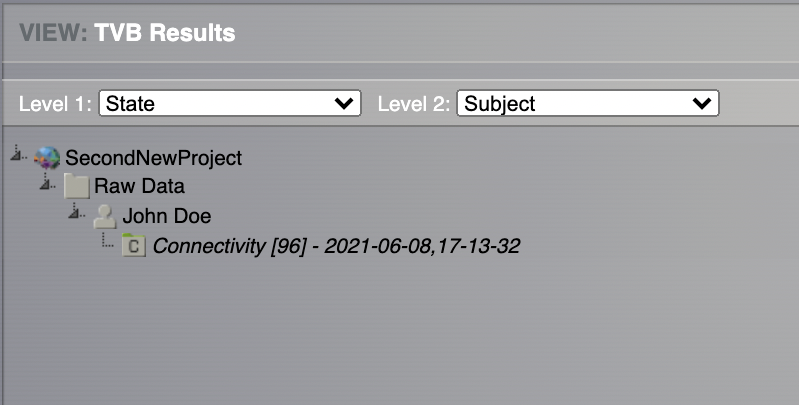

#. Go to *Project > List of all projects*.

#. Switch to *ModelingEpilepsy*.

#. Then from Project > Basic properties share this project with the other user account.

.. figure:: figures/LinkAndShare_LinkedProject.png
   :alt: Click on the checkbox next to the user you want to share the project with
   :scale: 30%

#. Logout from your account and login with the other user.

You should be able to see the *ModelingEpilepsy* project in your other account as well.

------------------------

Export and Read a Datatype
---------------

#. Select *ModelingEpilepsy* as your current project.

#. Go to *Project > Data structure*

#. Click on |node_tr| from TimeSeriesRegion.

#. From the overlay, *Export* tab, download only the time series h5 file by clicking on *TVB format* (h5).

#. If you wish to download not just the time series file, but the linked datatypes as well,
   choose the *TVB Format with links* option.

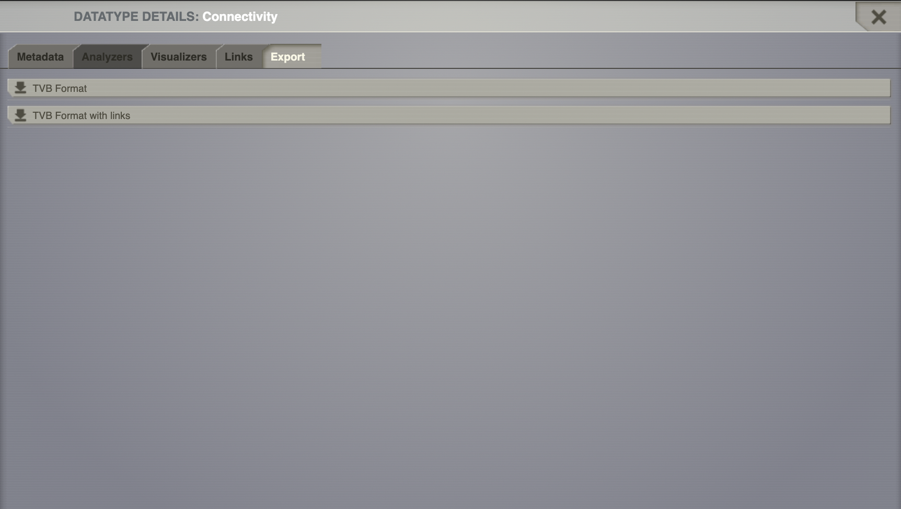

#. Rename the file if you want (e.g. *LinkAndShare\_TimeSeriesRegion*).

From an **ipython** shell you can follow the commands presented below. 
You can also use a **ipython notebook** by going into *TVB_Distribution/bin/* and 
start the jupyter_notebook script.

::

    In [1]: import h5py
    In [2]: import matplotlib.pyplot as plt

    In [3]: f = h5py.File('LinkAndShare_TimeSeriesRegion.h5', 'r')

    In [4]: f.keys()
    Out[4]: <KeysViewHDF5 ['data', 'time']>

    In [5]: f.attrs.keys()
    Out[5]: 
    <KeysViewHDF5 [
     'TVB_Data_version',
     'TVB_connectivity',
     'TVB_create_date',
     'TVB_gid',
     'TVB_invalid',
     'TVB_is_nan',
     'TVB_labels_dimensions',
     'TVB_nr_dimensions',
     'TVB_operation_tag',
     'TVB_region_mapping',
     'TVB_sample_period',
     'TVB_sample_period_unit',
     'TVB_sample_rate',
     'TVB_start_time',
     'TVB_state',
     'TVB_subject',
     'TVB_title',
     'TVB_user_tag_1',
     'TVB_user_tag_2',
     'TVB_user_tag_3',
     'TVB_user_tag_4',
     'TVB_user_tag_5',
     'TVB_visible',
     'TVB_written_by']>

    In[6]: plt.plot(f['time'], f['data'][:, 0, :, 0])
           plt.xlabel('time [ms]')
           plt.ylabel('amplitude [au]')
           plt.title(f.attrs['TVB_Title'])
    Out[6]: <matplotlib.text.Text at 0x118eb0ad0>

.. figure:: figures/LinkAndShare_IpythonTimeSeriesRegion.png
   :scale: 40%

In **Matlab** :

::

    >> hinfo = hdf5info('LinkAndShare_TimeSeriesRegion.h5');
    >> hinfo.GroupHierarchy.Datasets.Name
    ans =
    /data
    ans =
    /time
    >> hinfo.GroupHierarchy.Attributes.Name
    ...
    >> data = hdf5read(hinfo.GroupHierarchy.Datasets(1));
    >> time = hdf5read(hinfo.GroupHierarchy.Datasets(2));
    >> plot(time, squeeze(data))
    >> xlabel('time [ms]')  
    >> ylabel('amplitude [au]')

.. figure:: figures/LinkAndShare_MatlabTimeSeriesRegion.png
   :scale: 60%

In **R**:

::

    > data <- h5read("/Users/paupau/GithubProjects/tvb-handbook/
    tvbworkshop/LinkAndShare_TimeSeriesRegion.h5", "data")

    > time <- h5read("/Users/paupau/GithubProjects/tvb-handbook/
    tvbworkshop/LinkAndShare_TimeSeriesRegion.h5", "time")

    > data = drop(mydata)

    > plot(mytime, data[,1], type="l")

.. figure:: figures/LinkAndShare_RTimeSeriesRegion.png
   :scale: 30%

------------------------

More Documentation
==================

Online help is available clicking on the |image| icons next to each
entry. For more documentation on The Virtual Brain platform, please see
Sanz_Leon_et_al_, Woodman_et_al_.

------------------------

Support
=======

The official TVB website is
`www.thevirtualbrain.org <http://www.thevirtualbrain.org>`__. All the
documentation and tutorials are hosted on
`docs.thevirtualbrain.org <http://docs.thevirtualbrain.org>`__. You’ll
find our public repository at https://github.com/the-virtual-brain. For
questions and bug reports we have a users group
https://groups.google.com/forum/#!forum/tvb-users

.. |node_tr| image:: figures/nodeTimeSeriesRegion.png
            :scale: 40%

.. |image| image:: figures/butt_green_help.png
           :scale: 40%

.. [Sanz_Leon_et_al] Sanz-Leon P, Knock SA,, Woodman MM, Domide L, Mersmann J, McIntosh AR, Jirsa VK. The virtual brain: a simulator of primate brain network dynamics. Frontiers in Neuroinformatics, 7:10, 2013.

.. [Woodman_et_al] Woodman MM, Pezard L, Domide L, Knock SA, Salz-Leon P, McIntosh AR, Mersmann J, Jirsa VK. Integrating neuroinformatics tools in the virtual brain. Frontiers in Neuroinformatics, 8:36, 2014
