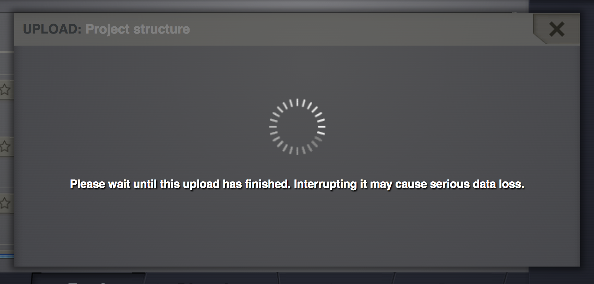
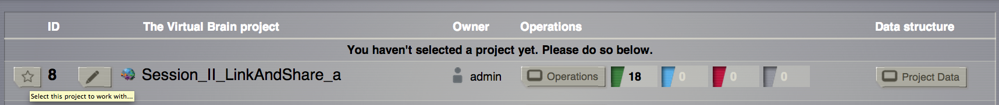
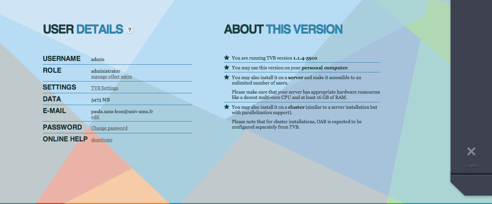
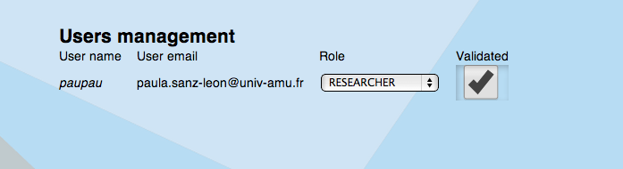
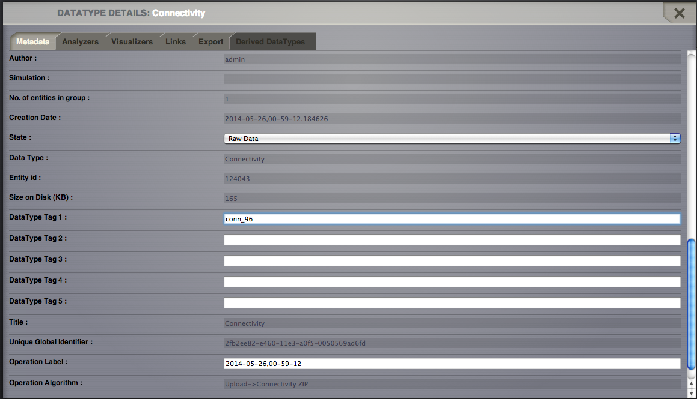
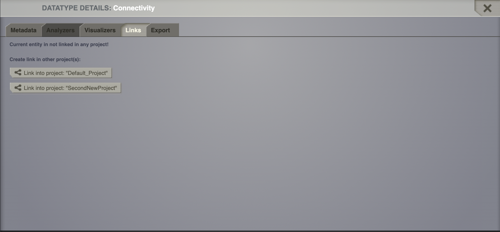
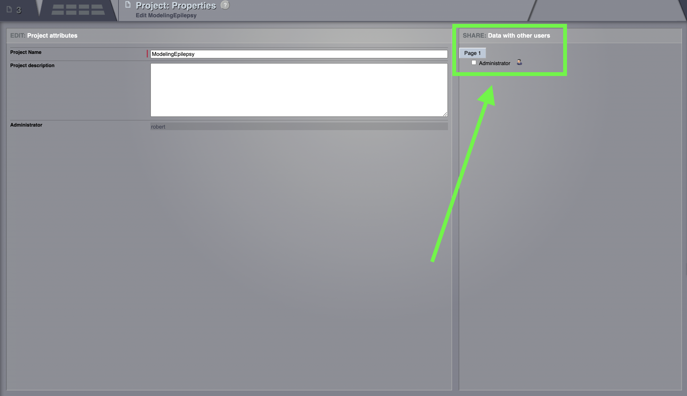
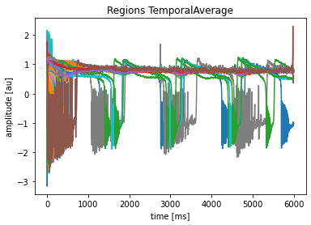
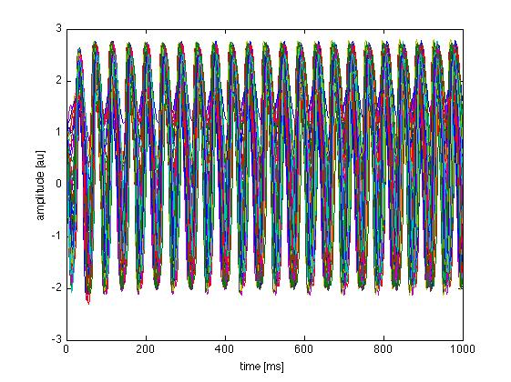
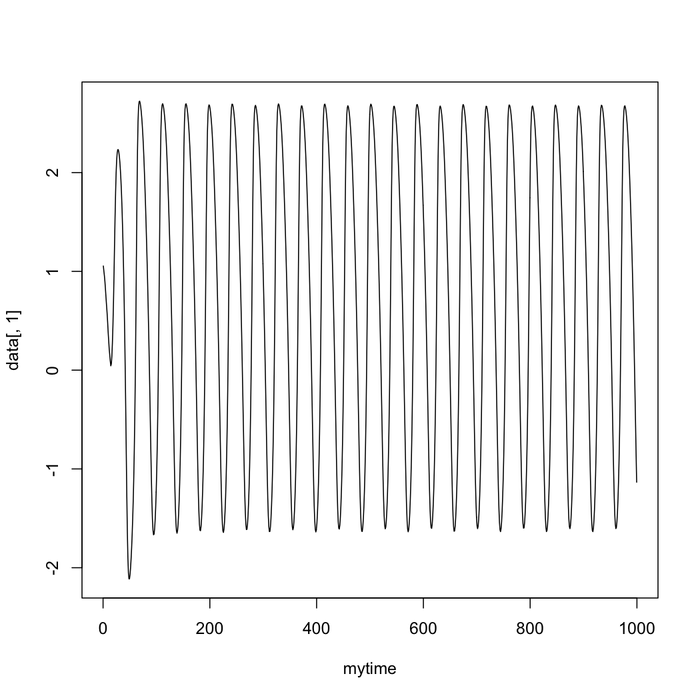

.. _tutorial_0_GettingStarted:

===============
Getting Started
===============

First things first. We need you to upload the projects from the `TVB sharing
area <http://www.thevirtualbrain.org/tvb/zwei/client-area/public>`_. This might
take some time, so while we continue with the program you can start importing
the projects into your copy of TVB.

============================    ========
 **Name**                       **Size** 
----------------------------    --------
 LinkandShare_a                 13.3 MB
 LinkandShare_b                 13.3 MB
 BuildingYourOWnBNM              1 GB
 Resting State Netowrks          1 GB 
 ModelingEpilepsy                1 GB 
============================    ========   

------------------------

Objectives
----------

This tutorial presents the basic steps to upload a project, and share data with
other users and/or link data to other TVB projects.  After this tutorial you
should be able to import a new dataset, export a project and share it with a colleague.

For your convenience, all the data were already generated. You can download
the LinkandShare_a.zip and LinkandShare_b.zip files in the `TVB sharing area
<http://www.thevirtualbrain.org/tvb/zwei/client-area/public>`_. We’ll only go
through the steps required to reproduce some simulations.  You can always start
over, click along and/or try to change parameters.

------------------------

Importing TVB projects
----------------------

We assume that you have already created an account in your machine. If not, you
can always work with the default account *admin*. Make sure you have
enough disk space, all the projects add up to 2 GB.

#. Go to *Projects > List of all projects*.

#. On the right column, bottom corner, click on Import project structure. 

.. figure:: figures/ImportingProjects_Import.png
   :alt: Click on Import project structure
   :scale: 30%

3. Select one of the projects. Click on *Upload*.

.. figure:: figures/ImportingProjects_ImportOverlay.png
   :alt: Click on Select files
   :scale: 30%

.. figure:: figures/ImportingProjects_Upload.png
   :alt: Upload.
   :scale: 30%

4. Be patient.

5. You can now see the project on the *List of all projects*.

------------------------

Import, link and share data
---------------------------

In this exercise we will assume that multiple users are working with the
same TVB installation.

#. By default your are the *Admin* user.

#. Change the admin email. 

3. Create a user for someone else by registering a new user. 

.. figure:: figures/LinkAndShare_AddNewUser.png
   :scale: 30%

4. You’ll receive a notification email.

5. Make sure the new user has been validated. 

6. Login with the Admin account.

------------------------

Importing A Connectivity
------------------------

1. Create a project (e.g. *LinkAndShare\_a*).

2. Create a second project (e.g. *LinkAndShare\_b*).

3. Assuming that you are working in the first project, upload a Connectivity in
   a zip file. This was already done but you can repeat these steps.

4. Go to *Projects > Data structure*. Click on *Upload Data*. An
   overlay with the current supported formats will appear. 

5. Select *Connectivity ZIP*.

6. Select the file *connectivity\_regions\_96.zip* found at
   *TVB\_Distribution/tvb\_data/*.

.. figure:: figures/LinkAndShare_Uploaders.png
   :alt: Supported data formats.
   :scale: 30%

7. Add a personalized tag to this newly created datatype (e.g.
   *conn\_96*). 

8. Save the changes.

------------------------

Link And Share
--------------

1. Select the connectivity you want to share.

2. In the *metadata overlay*, go to the tab *Links*. You’ll see a list with all
   your projects. 

3. Link this datatype (connectivity) with the project you’ll share (e.g.
   *Session\_II\_ShareAndLink\_b*).

4. Link the two time-series from simulations *SimulationConnectivity74*
   and *SimulationConnectivity96*.

5. Go to *Project > List of all projects*

6. Switch to *ShareAndLink\_b*.

7. Then from *Project > Basic properties* share this
   project with the other user account.

8. Logout from your account and login with the other user account.

You should be able to see the connectivity matrix (and other datatypes)
you linked from project *Session\_II\_ShareAndLink\_a*.

------------------------

Export and Read
---------------

#. Go to *Project > Data structure*

#. Click on |node_tr| from *TimeSeriesRegion - conn\_74*.

#. From the overlay, *Export* tab, download the data in TVB format (h5).

#. Rename the file if you want (e.g. *LinkAndShare\_TimeSeriesRegion*).

From an **ipython** shell you can follow the commands presented below. 

::

    In [1]: import h5py
    In [2]: import matplotlib.pyplot as plt

    In [3]: f = h5py.File('LinkAndShare_TimeSeriesRegion.h5')

    In [4]: f.keys()
    Out[4]: [u'data', u'time']

    In [5]: f.attrs.keys()
    Out[5]: 
    [u'TVB_User_tag_1',
     u'TVB_Title',
     u'TVB_Length_2d',
     u'TVB_Gid',
     u'TVB_Length_3d',
     u'TVB_Sample_period_unit',
     u'TVB_Labels_ordering',
     u'TVB_Length_1d',
     u'TVB_User_tag_4',
     u'TVB_User_tag_5',
     u'TVB_Subject',
     u'TVB_Length_4d',
     u'TVB_Data_version',
     u'TVB_User_tag_3',
     u'TVB_Is_nan',
     u'TVB_Type',
     u'TVB_Invalid',
     u'TVB_Connectivity',
     u'TVB_Create_date',
     u'TVB_User_tag_2',
     u'TVB_Labels_dimensions',
     u'TVB_Sample_rate',
     u'TVB_State',
     u'TVB_Start_time',
     u'TVB_Sample_period',
     u'TVB_Nr_dimensions',
     u'TVB_Visible',
     u'TVB_Module']

    In[6]: plt.plot(f['time'], f['data'][:, 0, :, 0])
    ...

    In [7]: plt.xlabel('time [ms]')
    Out[7]: <matplotlib.text.Text at 0x118e95310>

    In [8]: plt.ylabel('amplitude [au]')
    Out[8]: <matplotlib.text.Text at 0x118e9a190>

    In [9]: plt.title(f.attrs['TVB_Title'])
    Out[9]: <matplotlib.text.Text at 0x118eb0ad0>

In **Matlab** :

::

    >> hinfo = hdf5info('LinkAndShare_TimeSeriesRegion.h5');
    >> hinfo.GroupHierarchy.Datasets.Name
    ans =
    /data
    ans =
    /time
    >> hinfo.GroupHierarchy.Attributes.Name
    ...
    >> data = hdf5read(hinfo.GroupHierarchy.Datasets(1));
    >> time = hdf5read(hinfo.GroupHierarchy.Datasets(2));
    >> plot(time, squeeze(data))
    >> xlabel('time [ms]')  
    >> ylabel('amplitude [au]')

In **R**:

::

    > data <- h5read("/Users/paupau/GithubProjects/tvb-handbook/
    tvbworkshop/LinkAndShare_TimeSeriesRegion.h5", "data")

    > time <- h5read("/Users/paupau/GithubProjects/tvb-handbook/
    tvbworkshop/LinkAndShare_TimeSeriesRegion.h5", "time")

    > data = drop(mydata)

    > plot(mytime, data[,1], type="l")

------------------------

More Documentation
==================

Online help is available clicking on the |image| icons next to each
entry. For more documentation on The Virtual Brain platform, please see
Sanz_Leon_et_al_, Woodman_et_al_.

------------------------

Support
=======

The official TVB webiste is
`www.thevirtualbrain.org <http://www.thevirtualbrain.org>`__. All the
documentation and tutorials are hosted on
`docs.thevirtualbrain.org <http://docs.thevirtualbrain.org>`__. You’ll
find our public repository at https://github.com/the-virtual-brain. For
questions and bug reports we have a users group
https://groups.google.com/forum/#!forum/tvb-users

.. |node_tr| image:: figures/nodeTimeSeriesRegion.png
            :scale: 40%

.. |image| image:: figures/butt_green_help.png
           :scale: 40%

.. [Sanz_Leon_et_al] Sanz-Leon P, Knock SA,, Woodman MM, Domide L, Mersmann J, McIntosh AR, Jirsa VK. The virtual brain: a simulator of primate brain network dynamics. Frontiers in Neuroinformatics, 7:10, 2013.

.. [Woodman_et_al] Woodman MM, Pezard L, Domide L, Knock SA, Salz-Leon P, McIntosh AR, Mersmann J, Jirsa VK. Integrating neuroinformatics tools in the virtual brain. Frontiers in Neuroinformatics, 8:36, 2014
