.. _tutorial_1_BuildingYourOwnBrainNetworkModel:

=====================================
Building Your Own Brain Network Model
=====================================

TVB allows for a systematic exploration and manipulation of every underlying
component of a large-scale brain network model, such as the neural mass model
governing the local dynamics or the structural connectivity constraining the
space-time structure of the network couplings.

-------------------

Objectives
----------

This tutorial presents the basic anatomy of a brain network model at the region
level using The Virtual Brain’s (TVB’s) graphical interface. You are not
expected to launch all the simulations. However, following these steps you
should be able to reproduce the results from the simulations in the project
BuildingYourOwnBrainNetworkModel.

In this tutorial, all the data were already generated. You can download the 
BuildingYourOwnBrainNetworkModel.zip file in the `TVB sharing area
<http://www.thevirtualbrain.org/tvb/zwei/client-area/public>`_. We’ll only go through
the necessary steps required to reproduce some simulations. You can always
start over, click along and/or try to change parameters.

-------------------

Building A Discrete Brain Network Model
---------------------------------------

A basic simulation at the region level uses a coarse representation of the
brain and consists of five main components, each of these components is a
configurable object in TVB:

- *Model*  or *Local population model*, which is, at its core, a set of
  differential equations describing the local neuronal dynamic;

- *Connectivity*, represents the large scale structural connectivity of the brain, ie
   white-matter tracts;

- *Long range Coupling*, is a function that is used to join the local dynamics at distinct
   locations over the connections described in *Connectivity*;

- *Integrator*, is the integration scheme that will be applied to the coupled set
   of differential equations;

- *Monitors*, one or more *Monitors* can be attached to a simulation, they act to record the
   output data.

In this example, *AnatomyOfARegionSimulation\_a*, we will change the
default parameters and configure some visualizers on the right column to
have a quick idea of some properties of the simulated data.

1. Go to the simulator page.

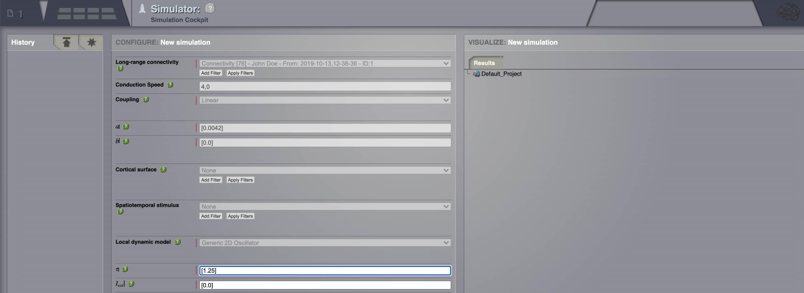

2. *Connectivity*: Define some structure for your network. Here, we’ll rely on **TVB’s
   default matrix.**

3. Set a *Long range coupling* function. For our present purposes, we happen to know that for
   the parameters we will use through TVB’s default *Connectivity* matrix, a linear
   function with a slope of :math:`\mathbf{a=0.0042}` is a reasonable
   thing to use.

4. *Conduction speed:* Alter the speed of signal propagation through the network to **4 mm/ms**.

5. *Local dynamics:* Then define a *Model* for the local dynamics. Here we’ll use the **generic 2
   dimensional oscillator**  with the parameters shown in the following table.

=================   =======
Model parameter     Value
-----------------   -------
  :math:`a`         1.05
  :math:`b`         -1.0
  :math:`c`         0
  :math:`d`         0.1
  :math:`e`         0
  :math:`f`         1/3
  :math:`g`         1
  :math:`I`         0
  :math:`\alpha`    1
  :math:`\beta`     0.2
  :math:`\gamma`    -1
  :math:`\tau`      1.25
=================   =======

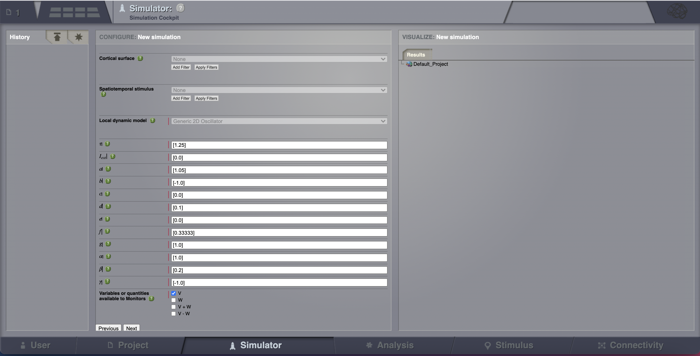

6. Now that we’ve defined our structure and dynamics we need to select
   an integration scheme. We’ll use **HeunDeterministic**. The most
   important thing here is to use a step size that is small enough for
   the integration to be numerically stable. Here, we chose a value of
   **dt = 0.1 ms**.

7. Select the **Temporal Average** monitor. It averages over a time window of
   length *sampling period* returning one time point every period. It also, by
   default, only returns those state-variables flagged in the *Models*
   definition as *Variables watched by Monitors*. For our example the
   *Monitor's sampling period* is **1 ms**.

Although there are Monitors which apply a biophysical measurement
process to the simulated neural activity, such as EEG, MEG, SEEG, etc.,
here we’ll select only one simple monitor just to show the idea. The Raw
Monitor takes no arguments and simply returns all the simulated data.

8. Provide the *simulation length*, that here we’ll use the default value of **1000 ms**.

9. Before launching the simulation, configure a set of *Visualizeds* and/or
   *Analyzers* by clicking on *Configure*, selecting the what you want to see
   and saving your choices. These windows will enable you to have a glimpse of
   the results as soon as the simulation ends.

10. Enter a name for the current simulation (e.g,
    *AnatomyOfARegionSimulation\_a*) and click on |arrow|.

-------------------

Looking at the Results
----------------------

The transient large amplitude oscillatory activity at the beginning of the
simulation is a result of the imperfectly set initial conditions.

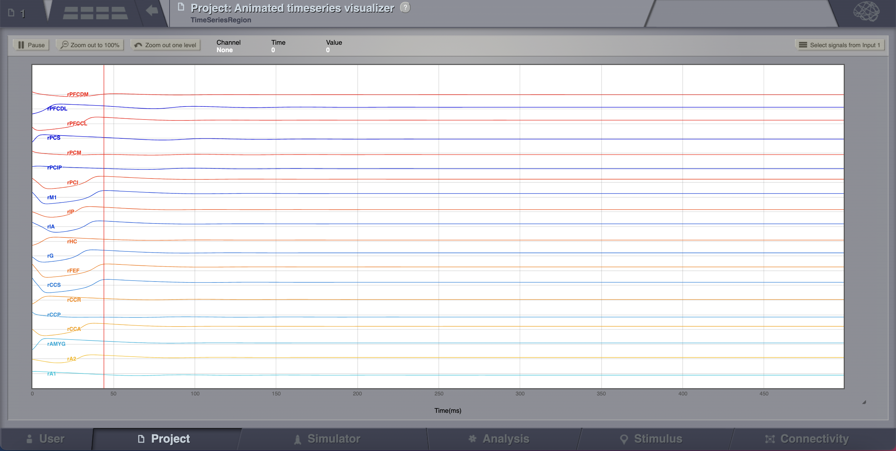

The initial history (i.e., initial conditions) is merely set by default to be
random walks within the general range of state-variables values expected from
the model. As the current simulation is configured with fixed point dynamics,
if we were to set the initial conditions exactly to the values corresponding to
that fixed point there would be no such initial transient (we will see how to
achieve that later on).

#. Go to *Projects > operations* dashboard.

#. Click on the icon of the time-series |tr|. From the metadata
   overlay’s visualizers tab, launch the *Animated Time Series Visualizer*.

#. Go back to the simulator page and check the Fourier spectrum. Select
   a linear scale on the Y axis. We see that the intrinsic frequency of
   the oscillations is set at about 11 Hz.

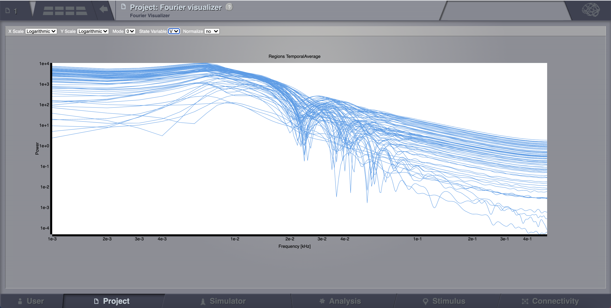

#. Now let’s have a look at a second simulation, which has the same
   parameters as *AnatomyOfARegionSimulation\_a* except that the
   coupling strength has been increased by an order of magnitude. Hence,
   the slope of the linear coupling function is
   :math:`\mathbf{a=0.042}`.

#. To make things easy, we copy the fisrt simulation by clicking on |pen| on the top right
   corner of a simulation tab. From the menu you can get a copy, edit
   the name the simulation or delete it. 

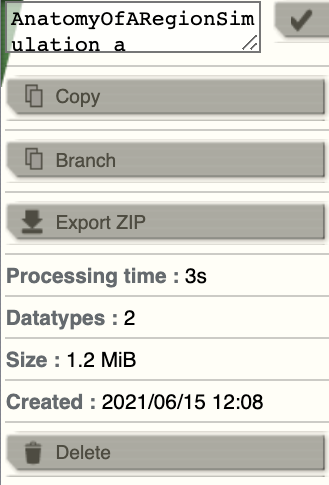

3. Change the name of the new simulation (e.g.,
   *AnatomyOfARegionSimulation\_b* ) and set the coupling strength to
   the value in step 1. Launch the simulation.

Looking at the time series of *AnatomyOfARegionSimulation\_b*, we can
see that the system exhibits self-sustained oscillations.

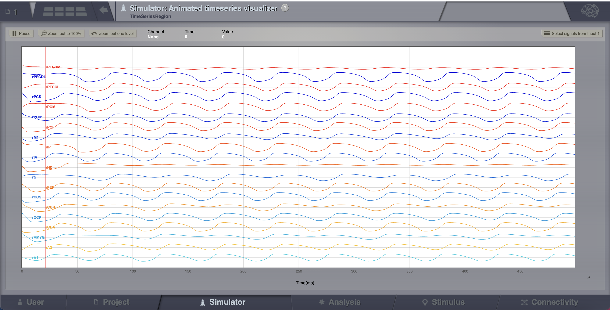

A frequent question is at which value of coupling strength this
“bifurcation” occurs. Well, we can easily set up a parameter search by
defining a range of values that will be explored. We’ll see how to do
this in the next section.

-------------------

Parameter Space Exploration (PSE)
---------------------------------

TVB will launch a simulation for every value. The example is set up in
*AnatomyOfARegionSimulation\_pse*.

#. In *Long range coupling function*, under **a**, click on |expand|. Set the range between
   :math:`\mathbf{0.012 \text{ and } 0.042}` and the step to
   :math:`\mathbf{0.002}`.

#. Do the same under *conduction speed*, setting the range between :math:`\mathbf{1-10}`
   and the step to **1 mm/ms**.

#. Set the *simulation length* to **2000 ms** and launch the simulations.

All the 150 simulations are presented as a discrete 2D map or a continous
pseudocolor map.

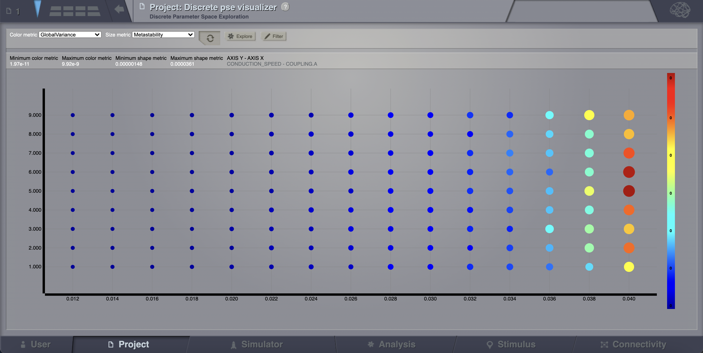

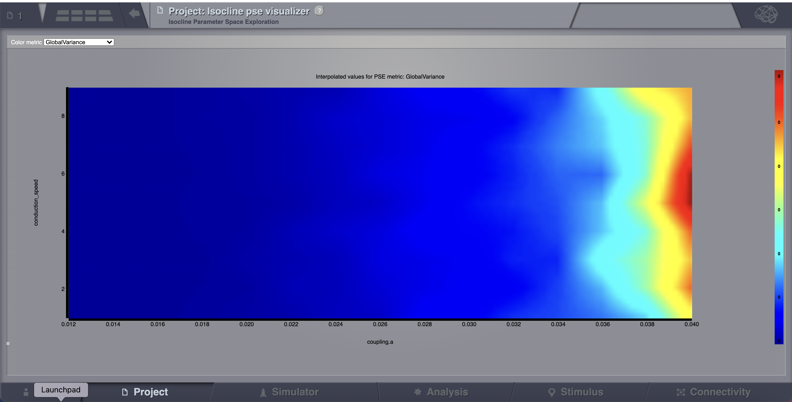

These results are those presented in Ghosh_et_al_ and Knock_et_al_.

-------------------

Simulation continuation or Branching
------------------------------------

Other parameters could be adjusted as well. We mentioned before that the big
transient at the beginning of the time-series is due to the initial conditions.
To overcome this issue we have a couple of alternatives. First, we could narrow
the range of the state variables around the values of a fixed point. How can we
know this value?

#. Clik on *Set up region model*, you’ll be redirected to a new working area.

In this area there’s a an interactive tool, the *Phase Plane*, which allows you to
understand the local dynamics, that is the dynamics of a single isolated
node, by observing how the model parameters change its phase plane. 

2. Click on any point of the phase plane. A trajectory will be drawn. We
   see that the fixed point is approx (V, W) = (1.5, -0.6)

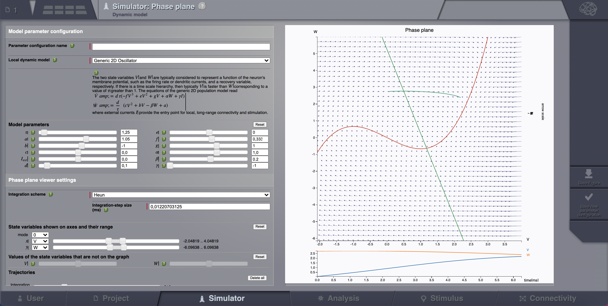

However, there certainly is a more elegant way.

3. Set your model with fixed point dynamics and a weak coupling strength
   (e.g., *AnatomyOfARegionSimulation\_a*)

4. Run a simulation for **1000 ms**.

TVB has a branching mechanism that allows you to use the data of a
simulation, as the initial history for a new simulation. The only thing
you need to know is that the spatio-temporal structure of the network
should remain unchanged (e.g., the number of nodes, conduction speed,
the recorded state-variables, integration time-step size and selected
monitors should be the same.)

-  In *AnatomyOfARegionSimulation\_a*, set :math:`\mathbf{a=0.042}` in
   the . Then, click on |branch|.

*AnatomyOfARegionSimulation\_a\_branch1* is an example of this
functionality, using the results from *AnatomyOfARegionSimulation\_a* as
initial conditions.

-------------------

Stochastic Simulations
----------------------

As a last point, we will show the basics of running a simulation driven
by noise (i.e., using a stochastic integration scheme). Here we’ll also
use a region level simulation, but the considerations for surface
simulations are the same. In a stochastic integration scheme *Noise* enters
through the integration scheme.

Here we’ll define a simple constant level of noise that enters all nodes
and all state variables, however, the noise is configurable on a per
node and per state variable level, and as such the noise can be
reconfigured to, for example, only enter appropriate state variables of
certain thalamic nodes, thus emulating a very crude model of external
inputs to the brain.

The *Noise* functions are fed by a random process generated by a pseudo-random
number generator (PRNG). The random processes used have Gaussian
amplitude and can potentially be given a temporal correlation. The
random process is defined using two parameters plus the seed of the
PRNG. The two parameters are: :math:`\mathbf{D}`, defining the standard
deviation of the noise amplitude; and :math:`\boldsymbol{\tau}` which
defines the correlation time of the noise source, with
:math:`\boldsymbol{\tau = 0}` corresponding to white noise and any value
greater than zero producing coloured noise.

1. After configuring a model similar to the one presented in
   *AnatomyOfARegionSimulation\_b*, we select **HeunStochastic** as our
   integration scheme.

2. Set the values for :math:`\boldsymbol{\tau=0}` and **seed=42**.

3. Set the noise dispersion, :math:`\mathbf{D=0.005}`

*AnatomyOfARegionSimulation\_b* and
*AnatomyOfARegionSimulation\_stochastic* have the same parameters but
the latter has an extra background noisy input.

Observe the differences using the *Spectrogram of the Wavelet Transform*.

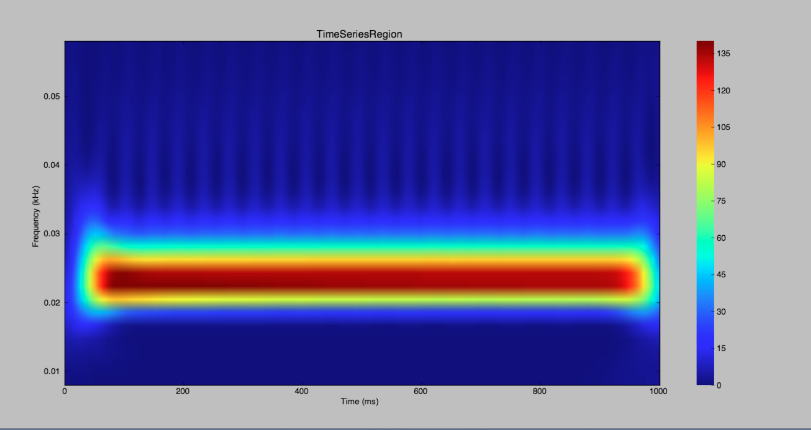

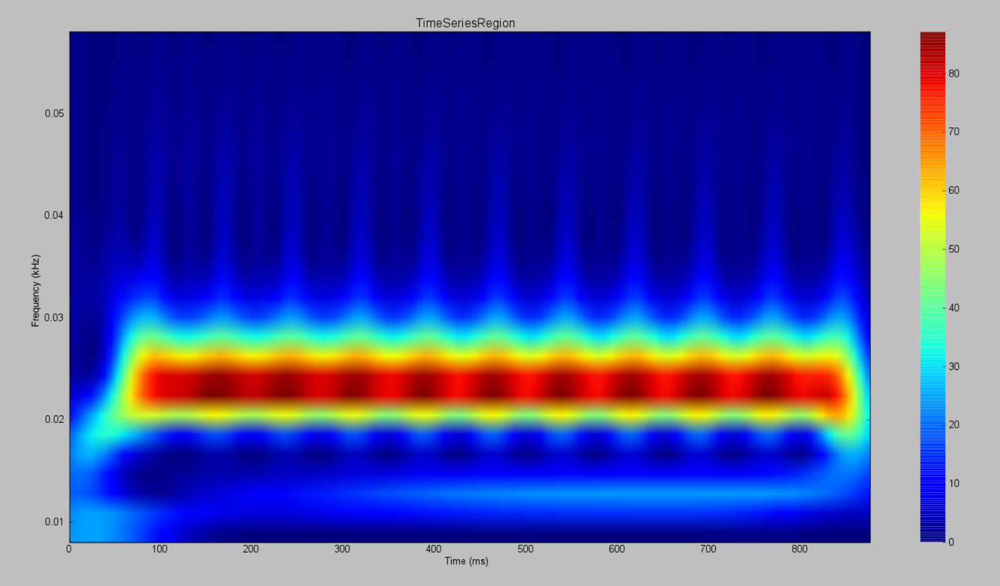

-------------------

Modeling the Neural Activity on the Folded Cortex
--------------------------------------------------

This extends the basic region simulation to include the folded cortical
surface to the anatomical structure on which the simulation is based. If
you haven’t read or followed was written above you probably should do
that now as here we only really discuss in detail the extra components
that are specific to a simulation on the cortical surface.

In addition to the components discussed for a region simulation here we
introduce two major components, that is:

-  *Cortical Surface*, which is a mesh surface defining a 2d representation of the
   convoluted cortical surface embedded in 3d space.

-  *Local Connectivity*, that represents the probability of the interactions between
   neighbouring nodes on a local patch.

-  *Region Mapping*, a breakup that defines to which anatomical region in the *Connectivity* each
   vertex of the mesh belongs to.

#. The *connectivity*, *speed*, *coupling strength* and and its parameters are the same described in
   *AnatomyOfARegionSimulation\_b* and Table [tab:modeltab].

#. Select the **TVB’s default Cortical Surface**, which has 16384 nodes.

#. We rely on **TVB’s default Local Connectivity**.

#. Rescale the *Local Connectivity* with *Local coupling strength* equal to :math:`\mathbf{0.1}`.

#. For the integration we’ll use **HeunDeterministic**. Here,
   integration time step size is the default:
   :math:`\mathbf{dt=0.1220703125}`\ **ms**.

The first significant thing to note about surface simulations is that *Monitors*
certain make a lot more sense in this context than they do at the region
level, and so we’ll introduce a couple new *Monitors* here.

6. The first of these new *Monitors* is called **SpatialAverage**. To select
   several monitors press the key Command or Control while you select
   them.

7. The second of these new monitors, which is an instantiation of a
   biophysical measurement process, is called **EEG**. The third will be
   the **Temporal Average**.

8. The *Monitors period* is left with the default value **1.953125 ms** which is equivalent to a
   sampling frequency of 256 Hz.

9. Lastly, the *simulation length* is **500 ms**.

10. Run the simulation.

11. Once the simulation is finished, without changing any parameters,
    click on |branch|.

These simulations are *AnatomyOfASurfaceSimulation* and
*AnatomyOfASurfaceSimulation\_branch1*.

The first of these new *Monitors*, will average over the space (nodes) of the
simulation. The basic mechanism is general, in the sense that the nodes
can be broken up into any non-overlapping, complete, set of sets. In
other words, each node can only be counted in one collection and all
nodes must be in one collection.

The second of these new Monitors, *EEG*, hopefully also unsurprisingly,
returns the EEG signals resulting from the simulated neural dynamics
using in the process a lead-field or *Projection Matrix*.

EEG signals measured on the scalp depend strongly on the location and
orientation of the underlying neural sources, which is why this monitor
is more realistic and useful in the case of surface based simulations –
where the simulation is run on the explicit geometry of the cortex,
which can potentially have been obtained from a specific individual’s
brain. In addition a simulation being built on the specific anatomical
structure of an individual subject, the specific electrodes used in
experimental work can also be incorporated, providing a link between
simulation and experiment. 

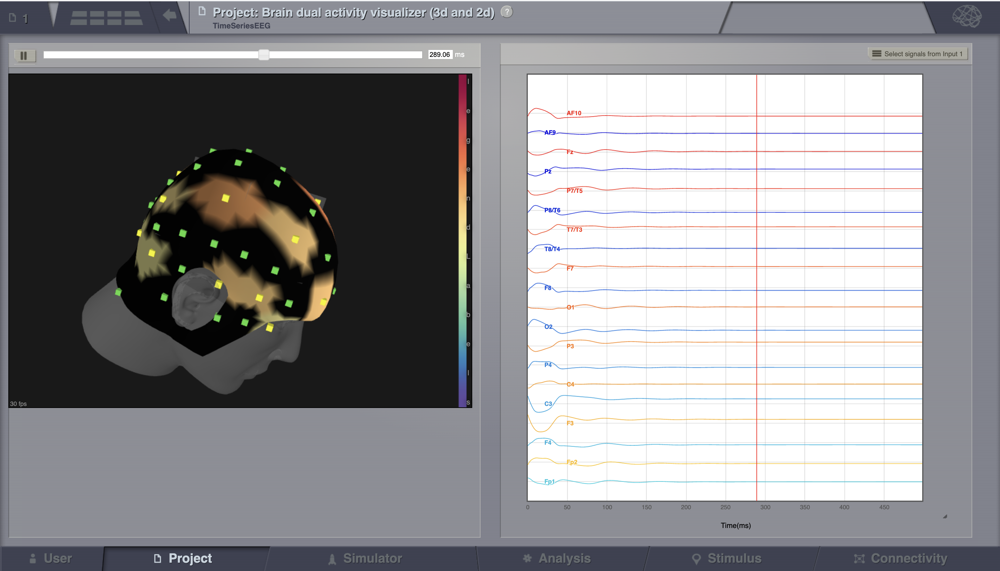

-------------------

Define Your Own Local Connectivity
----------------------------------

The regularized mesh can support, in principle, arbitrary forms for the local
connectivity kernel. Coupled across the realistic surface geometry this allows
for a detailed investigation of the local connectivity’s effects on larger
scale dynamics modelled by neural fields.

#. Go to *Connectivity > Local Connectivity*. In this area we’ll build two
   different kernels: a Gaussian and a Mexican Hat kernel. We’ll start with the
   Gaussian kernel.

#. Select the *equation defining the spatial profile* of your *local
   connectivity*. Here, we’ll set **sigma** to **15 mm**.

#. Ideally, you want the function to have essentially dropped to zero by the
   **cutoff distance**. The *cutoff distance*, that is, the distance up to
   which a given node is connected to its neighbourhood (Spiegler_et_al_,
   Sanz_Leon_et_al_) is set to **40 mm**.

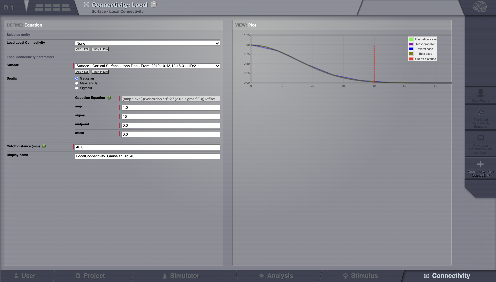

4. Name your *Locl Connectivity* and save it by clicking on *Create new Local
   Connectivity* on the bottom left corner.

This data structure is saved under the name
*LocalConnectivity\_Gaussian\_zc\_40*.

5. Select the *Mexican Hat equation*. Here, we changed the default parameters. See the values
   in the following Table.

===============   =========
**Parameter**     **Value**
---------------   ---------
midpoint\_1       0 mm 
midpoint\_2       0 mm 
amp\_1            2 au 
amp\_2            1 au 
sigma\_1          5 mm 
sigma\_2          15 mm 
cutoff distance   40 mm 
===============   =========

6. Save your new local connectivity.

This data structure is saved under the name
*LocalConnectivity\_MexicanHat\_zc\_40*.

Finally, we will run two more simulations using different local
connectivity kernels.

7. Copy *AnatomyOfASurfaceSimulation*.

8. Change the **local connectivity** to
   ***LocalConnectivity\_Gaussian\_zc\_40*** and set the **local
   connectivity strength** to **0.001**. Run the simulation.

9. Copy again *AnatomyOfASurfaceSimulation*.

10. This time select ***LocalConnectivity\_MexicanHat\_zc\_40***. The
    **local connectivity strength** is set to **-0.001**. Run the
    simulation.

These results are those of
*SurfaceSimulation\_MexicanHatLocalConnectivity* and
*SurfaceSimulation\_GaussianLocalConnectivity* respectively.

-------------------

More Documentation
==================

And that’s it for this session, while the simulations are not
particularly scientifically interesting, hopefully it gave you a sense
of the anatomy of a simulation within TVB and many of the configurable
parameters and output modalities. Online help is available clicking on
the |help| icons next to each entry. For more documentation on The
Virtual Brain, please see the following articles

-------------------

Support
=======

The official TVB webiste is
`www.thevirtualbrain.org <http://www.thevirtualbrain.org>`__. All the
documentation and tutorials are hosted on
`http://docs.thevirtualbrain.org <http://docs.thevirtualbrain.org>`__. You’ll
find our public repository at https://github.com/the-virtual-brain. For
questions and bug reports we have a users group
https://groups.google.com/forum/#!forum/tvb-users

.. [Ghosh_et_al] Ghosh A, Rho Y, McIntosh AR, Kötter R, Jirsa VK. Noise during rest enables the exploration of the brain(s dynamic repertoire. PLoS Computation Biology, 4(10), 2008

.. [Sanz_Leon_et_al] Sanz-Leon P, Knock SA, Woodman MM, Domide L, Mersmann J, McIntosh AR, Jirsa VK. The virtual brain: a simulator of primate brain network dynamics. Frontiers in Neuroinformatics, 7:10, 2013.

.. [Spiegler_et_al] Spiegler A, Jirsa VK. Systematic approximation of neural fields through networks of neural mases in the virtual brain. Neuroimage, 83C:704-725, 2013

.. [Knock_et_al] Knock SA, McIntosh AR, Sporns O, Kötter R, Hagmann P, Jirsa VK. The efect of physiologically plausible connectivity structure on local and global dynamics in large scale brain models. Journal of Neuroscience Methods, 183(1):86-94, 2009

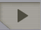
.. |tr| image:: figures/nodeTimeSeriesRegion.png
        :scale: 40% 
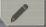
.. |expand| image:: figures/butt_expand_range.png
            :scale: 50% 
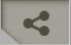
.. |help| image:: figures/butt_green_help.png
          :scale: 40% 
