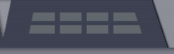
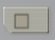
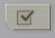
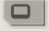

.. _tutorial_2_RestingStateNetworks:

======================
Resting State Networks
======================

-------
Context
-------

A current topic in system neuroscience literature is the presence of
brain activity in the absence of a task condition. These task-negative,
spontaneous fluctuations occur in the so-called rest state, and a
recurring theme of these fluctuations is that they have a network structure.
Because TVB uses the structural connectivity of the brain as the backbone
for simulating spontaneous activity, resting state activity and its network
structure is a prime candidate for modeling in TVB.

----------
Objectives
----------

This tutorial will demonstrate a brain network model approach to the human
resting state and its network structure, with the goals of understanding how
to parametrize a neural mass model, place it in a network context, identify
and explore the relevant parameter space, perform extended simulations in the
realistic region of parameter space and finally analyze the resulting
simulated fMRI BOLD signals to reproduce experimental results published in
the resting state literature.

This tutorial is a work in progress and will be continuously expanded over
the next several months. For a tutorial on the same topic which uses the scripting
interface, with TVB as a Python library, please see `the resting state network
scripting tutorial <http://nbviewer.jupyter.org/url/docs.thevirtualbrain.org/tutorials/tutorial_s2_ModelingRestingStateNetworks.ipynb>`_.

All of the model configurations and data shown in the following are available
as a TVB project in the RestingStateNetworks.zip file in the `TVB sharing area
<http://www.thevirtualbrain.org/tvb/zwei/client-area/public>`_.  We will only go
through the necessary steps required to reproduce these simulations, along with
the relevant outline.  You can always start over, click along and/or try to
change parameters.  We will use the default subject connectivity matrix and
surface.

------------------------------------------
Parameterizing the local neural mass model
------------------------------------------

*work in progress*

-------------------------------------------
Placing the mass model in a network context
-------------------------------------------

*work in progress*

--------------------------
Identify a parameter space
--------------------------

*work in progress*

---------------------------
Perform extended simulation
---------------------------

*work in progress*

-----------------------------
Analyze fMRI BOLD time series
-----------------------------

*work in progress*

Power spectra
`````````````

*work in progress*

Seed-region correlation
```````````````````````

*work in progress*

------------------
More Documentation
------------------

For more information on modeling resting state networks with TVB, see Ghosh_et_al_,
Knock_et_al_, Spiegler_et_al_.


-------
Support
-------

The official TVB webiste is
`www.thevirtualbrain.org <http://www.thevirtualbrain.org>`__. All the
documentation and tutorials are hosted on
`http://docs.thevirtualbrain.org <http://docs.thevirtualbrain.org>`__. You will
find our public repository at https://github.com/the-virtual-brain. For
questions and bug reports we have a users group
https://groups.google.com/forum/#!forum/tvb-users



.. |bm| image:: figures/butt_brain_menu.png
        :scale: 50%
        







.. |branch| image:: figures/butt_branching.png
        :scale: 50%
