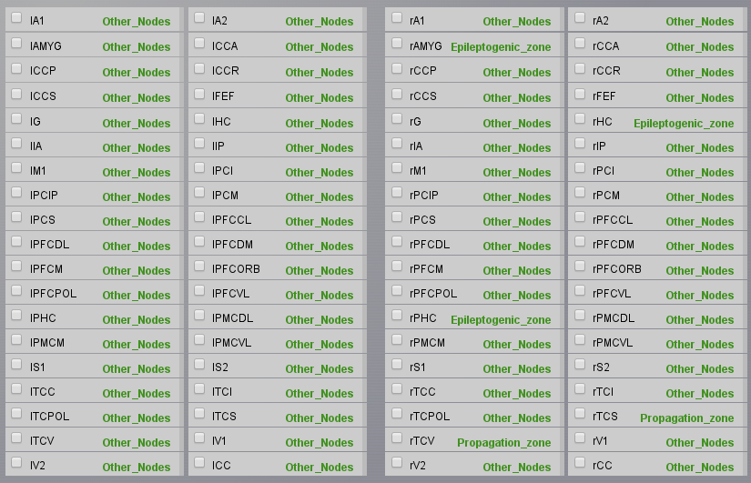
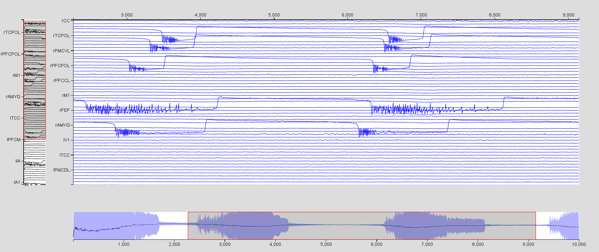
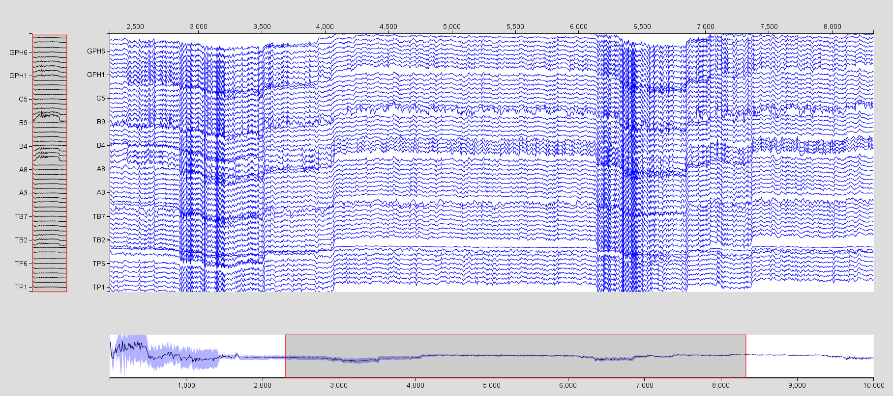
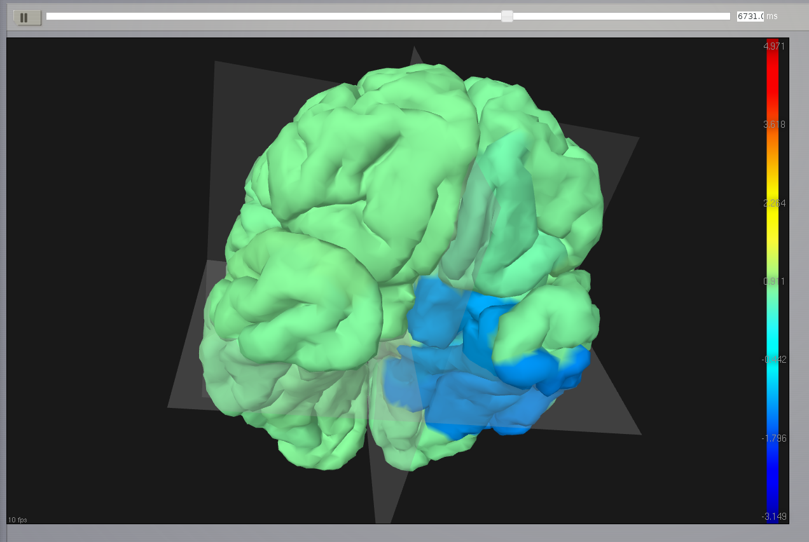
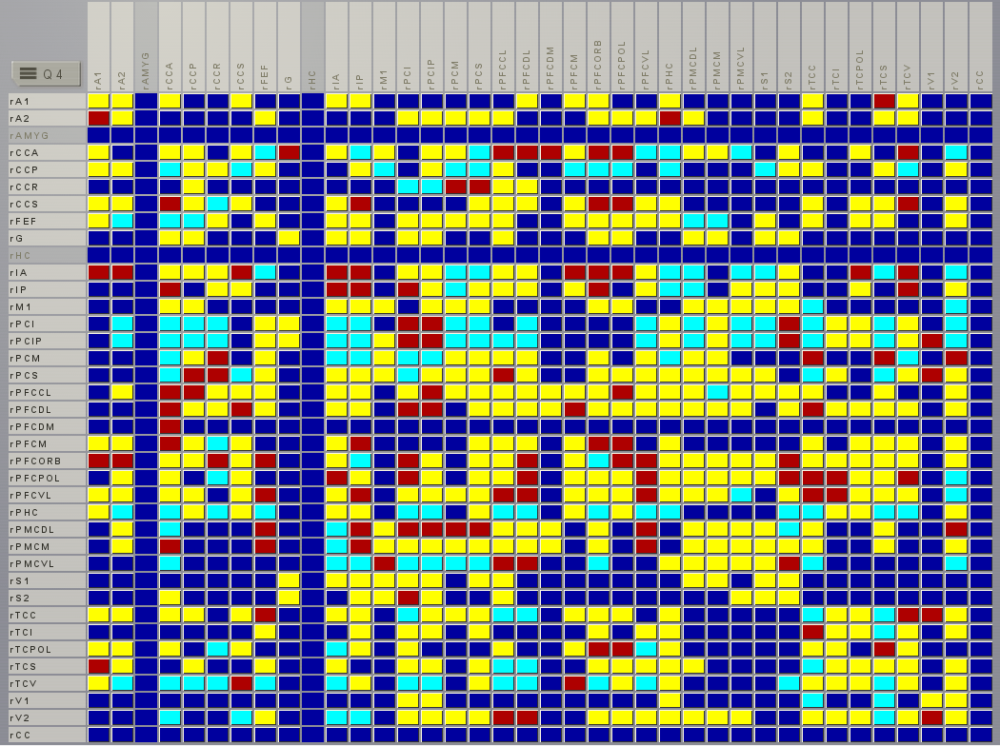
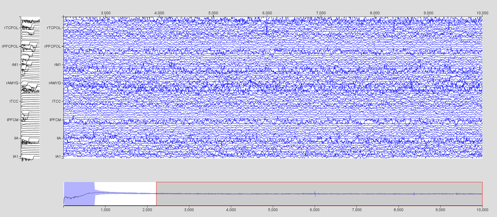

.. _tutorial_3_ModelingEpilepsy:

=================
Modeling Epilepsy
=================

TVB can be used to model large-scale epileptic seizure dynamics.  Using
relevant neural mass models, TVB allows to ask multiple questions such as the
localisation of the epileptogenic zone or the validity of different
neuroimaging modalities to assess the epileptogenicity of a brain structure.
Here we will present an example of such a modelisation.

-------------------

Objectives
----------

The main goal of this tutorial is to provide a clear understanding of how we
can reproduce clinically relevant senarios such as the modelisation of
propagation of an epileptic seizure in the human brain, electrical stimulation
of a brain region that can trigger a seizure, or surgical resection of brain
regions.

In this project, all the data were already generated. You can download the
ModelingEpilepsy.zip file in the `TVB sharing area
<http://www.thevirtualbrain.org/tvb/zwei/client-area/public>`_.  We’ll only go
through the necessary steps required to reproduce these simulations, along with
the relevant outline.  You can always start over, click along and/or try to
change parameters.  We will use the default subject connectivity matrix and
surface.

-------------------

Exploring the Epileptor model
-----------------------------

The Epileptor is a phenomenological neural mass model able to reproduce
epileptic seizure dynamics such as recorded with intracranial EEG electrodes
(see Jirsa_et_al_).  Before launching any simulations, we will have a look at
the phase space of the Epileptor model to better understand its dynamics. We
will use the phase plane interactive tool.

1. Go to *simulator >* |burst_menu| *> Phase plane* and select the
   :math:`\mathbf{Epileptor}` model.

2. Look at the phase space. We have here the first population (variables
   :math:`y_0` in abscissa and :math:`y_1` in ordinate). The left most
   intersection of the nullcline defines a stable fixed point, representing the
   interictal state,  whereas the rightmost intersection is the center of a
   limit cycle, being the ictal state. Both states are separated by a
   separatrix, as you can se by drawing different trajectories in this phase
   space (left click on the figure).

.. figure:: figures/ModelingEpilepsy_PhasePlane.png
   :alt: :math:`y_0-y_1` phase plane for the first population.
   :scale: 50%

3. You can also look at other variables in the phase space, such as
   the second population :math:`y_3`/:math:`y_4`, responsible for the interictal 
   spikes in the Epileptor model. Change the lower and upper bound of the axis 
   to see correctly the phase space.

 .. figure:: figures/ModelingEpilepsy_PhasePlane_2.png
   :alt: :math:`y_3-y_4` phase plane for the second population.
   :scale: 50%
  
4. You can continue to play along to explore the dynamics of this model.  For
   instance, try changing the number of *integration steps*, or choosing a
   **HeunStochastic** *integrator* and varying the scaling of the noise
   (parameter *D*).

-------------------

Region-based modeling of a temporal lobe seizure
------------------------------------------------

We will model  temporal lobe epilepsy (TLE) using the Default TVB Subject.
Here, using the tools in *Set up Region model*, we will set different values of
epileptogenicity (:math:`x_0` parameter in the Epileptor) according to the
region positions, thereby introducing heterogeneities in the network
parameters. We will set the right limbic areas (right hippocampus (rHC),
parahippocampus (rPHC) and amygdala (rAMYG)) as epileptic zones. We will also
add two lesser epileptogenic regions: the inferior temporal cortex (rTCI) and
the ventral temporal cortex (rTCV).

1. First, we will configure the different parameter regimes we will use. Go on
the *Simulator* page, click on the |burst_menu| *> Phase plane*, in *Parameter
configuration name* give the name **Other Nodes**, select the **Epileptor**
*model*, set :math:`\mathbf{x_0=-2.4}`, and *Save new parameter configuration*
on the right menu. Dynamic saved you should appear on the top right.  Repeat
the operation for an **Epileptogenic zone** with :math:`\mathbf{x_0=-1.6}`, and
a **Propagation zone** with :math:`\mathbf{x_0=-1.8}`. Set
:math:`\mathbf{R=0.00015}`. All the other model parameters are the default ones
and are given in the following table.

===============   =======
Model parameter    Value
---------------   -------
 :math:`Iext`       3.1
 :math:`Iext2`      0.45
 :math:`slope`      0.0
===============   =======

2. Now we will set up the different spatial configurations of these parameters.
   Go back to *Simulator > Set up region Model*, on the right of *New
   selection*, choose an name, such as **Epileptogenic Zone** and select the
   nodes rHC, rPHC, and rAMYG, then *Save*. You can use the
   |unselect_all_nodes| button to go faster. Add also a *Propagation Zone* with
   the rTCI and rTCV nodes, and an *Other Nodes* selection with all nodes but
   rHC, rPHC, rAMYG, rTCI, and rTCV. You can use the
   |select_all_nodes| button to go faster. 
 
3. Now we will assign our parameter configurations to our spatial selections.
   In the same window, in *Select model configuration* select **Epileptor -
   Epileptogenic Zone**, select you precedent *Epileptogenic Zone*
   configuration, and click on *Apply to selected nodes*. A green label should
   appear on the right of the nodes assigned. Repeat the operation for the
   *Propagation Zone* and *Other Nodes*, then don't forget to *Submit Region
   Parameters* on the right menu, which will bring you back to the Simulator
   panel. You can check that your choices have been save if you see a list of
   parameters in front of the *X0* parameter for the **Epileptor** model.

  
4. We will now configure the simulation parameters.  In the *Simulator* panel,
   choose a **Difference** *Long-range coupling function* with
   :math:`\mathbf{a=1.}`. We will add a  permittivity coupling and a coupling
   on the time scale of spike-wave events. For this set
   :math:`\mathbf{K_s=-0.2}` and :math:`\mathbf{K_f=0.1}`. Choose a
   **HeunStochastic** *integration scheme*, set the *integration step size* to
   **0.05 ms** and an **additive noise** with :math:`\mathbf{D=[0., 0., 0.,
   0.0003, 0.0003, 0.]}` (we add noise only on the second population).
  
5. For the *monitors*, we choose a **Temporal average**, an **EEG** and an
   **Intracerebral / Stereo EEG** monitor (hit CTRL to select several
   monitors). For all three *Pre-monitor expressions*, write
   :math:`mathbf{-y0+y3;y2}` (this corresponds to first LFP signal, and second
   the slow dynamics of the Epileptor). Choose also the right *Projection
   matrix*, *Region mapping* and *Sensors* for each monitor, and a *samplng
   period* of **1 ms**. 
   
6. Choose a *simulation length* of **6000ms**.

7.   *Configure View* and add a *Brain Visualizer*. *Save your choices*. 
    
The results are already computed for you in *Region\_TemporalLobe* simulation.

8. Visualize the time series by clicking on the |launch_vis| button. Click on
   *Select Input Signals* and select all the regions. From this same menu, you
   can select which state variables of interest will be displayed. For
   instance, visualize :math:`-y_0+y_3`. You will need to increase the scaling
   by clicking on |bm|. You can see a succession of 3 seizures, use the mouse
   to zoom in and out in the time series area.

9. Now click on |bm|, select the EEG time series, and *Update the Visualizer*.
   Chnage the scaling and the number of channels to see the seizures. 

 .. figure:: figures/ModelingEpilepsy_tseeg.png
   :alt: EEG time series of the simulation 
   :scale: 30%

  
10. Repeat the operation for the SEEG time series, but select only the
    electrodes TB, A, B, C, and GPH which are in the right temporal lobe. 

11. Go back to the *Simulator* page and visualize the results in the *Brain
    Viewer*, you will need to increase the rendering speed (timesteps per Frame)
    by clicking on |bm|.

The length of seizures here is not realistic (:math:`\sim 2` s),
but you can always obtain realistic time by multiplying all the
derivatives of the model by a small factor.

-------------------

Modeling surgical resection
---------------------------

Surgical resection is used for around 20% of epileptic patient whose seizures
are drug- resistant. We will simulate the hypothetic case of a surgical
resection of the amygdala and the hippocampus, but leaving the parahippocampal
cortex.

1. Go to *Connectivity > Large scale Connectivity*. All nodes of the
   connectivity matrix are already selected.

2. Click  on *Q1* to go to Quadrant 4, and click on rAMYG and rHC to unselect
   these nodes.  Give the name **Resection** at the right of *Large Scale
   Matrix* and save it by clicking on |star|. Here we just created a new
   connectivity matrix while deleting all edges connected to the right amygdala
   and hippocampus. 

3. Go back to *Simulator* and copy the *Region\_TemporalLobe* simulation.

4. Choose the Resection connectivity matrix.

5. Go in *Set up region model*, and apply the dynamics of OtherNodes to rAMYG
   and rHC.  (i.e. we replace the dynamics of the resected node by a stable
   node).

The results are given in *resection_Region_TemporalLobe*.

6. Click on *Results*, then TimeSeries and visualize the spatial average time
   series with the a Time Series visualizer. Don’t forget to increase
   the *Scaling* and *Select all* channels. 

-------------------

More Documentation
==================

For more information on the **Epileptor** model, see Jirsa_et_al_, El_Houssaini_et_al_, Proix_et_al_, Naze_et_al_ .

-------------------

Support
=======

The official TVB webiste is
`www.thevirtualbrain.org <http://www.thevirtualbrain.org>`__. All the
documentation and tutorials are hosted on
`http://docs.thevirtualbrain.org <http://docs.thevirtualbrain.org>`__. You’ll
find our public repository at https://github.com/the-virtual-brain. For
questions and bug reports we have a users group
https://groups.google.com/forum/#!forum/tvb-users

.. |burst_menu| image:: figures/burst_menu.png
                :scale: 40%

.. |bm| image:: figures/butt_brain_menu.png
        :scale: 50%
        
.. |unselect_all_nodes| image:: figures/unselect_all_nodes.png
        :scale: 50%

.. |select_all_nodes| image:: figures/select_all_nodes.png
        :scale: 50%

.. |launch_vis| image:: figures/launch_full_visualizer.png
        :scale: 50%

.. |star| image:: figures/star.png
        :scale: 50%

.. |branch| image:: figures/butt_branching.png
        :scale: 50%

.. [Jirsa_et_al] Jirsa VK, Stacey WC, Quilichini PP, Ivanov AI, Bernard, C. On the nature of seizure dynamics. Brain, 2014. 137:2210-2230

.. [El_Houssaini_et_al] El Houssaini K, Ivanov A, Bernard C, Jirsa VK. Seizures, refractory status epilepticus, and depolarization block as endogenous brain activities. Physical Review E, 2015; 91:2-6

.. [Proix_et_al] Proix T, Bartolomei F, Chauvel P, Bernard C, Jirsa VK. Permittivity Coupling across Brain Regions Determines Seizure Recruitment in Partial Epilepsy. The Journal of Neuroscience, 2014; 34:15009-15021

.. [Naze_et_al] Naze S, Bernard C, Jirsa VK. Computational Modeling of Seizure Dynamics Using coupled Neuronal Networks: Factors Shaping Epileptiform Activity. PLOS CB, 2015, 11
