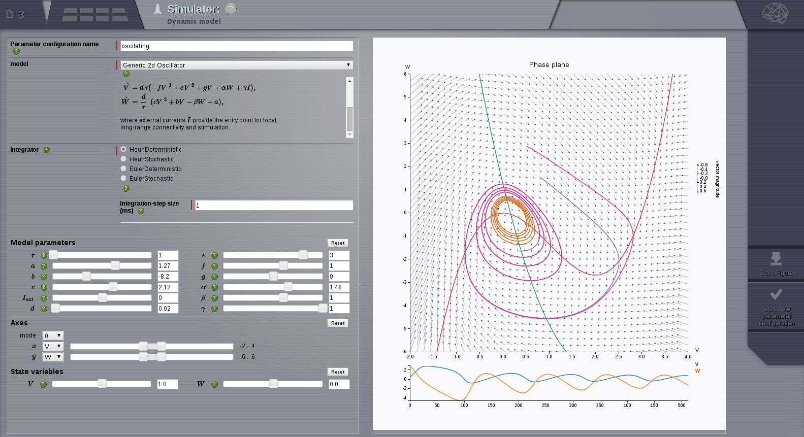

.. include:: /manuals/templates/pdf_constants.rst

GUI Demos
=========

The links in this section showcase TVB's web interface.

Simulation
----------

.. Sphinx limitations
      A :target: option on figure allows for links. But not for sphinx refs.
      So clicking the images does not follow the link.
      The images cannot be arranged in a flowing grid.
      To work around the grid issue we have added a css class and a rule for it in default.css
      To work around the target issue we have added direct html links. These are not robust and
      will be weird if this document will be rendered to pdf.

      :ref:`Get familiar with the behaviour of a model by exploring it's phase space. <phase_plane>`

.. figure:: screenshots/simulator.jpg
      :height: 200px
      :figclass: demo-figure
      :target: UserGuide-UI_Simulator.html#simulator-ui

      :ref:`Launch a simulation. <simulator_ui>`

Data Management
---------------

.. figure:: screenshots/data.jpg
      :width: 200px
      :figclass: demo-figure
      :target: UserGuide-UI_Project.html#tree-view-ui

      :ref:`View the data types in a project <tree_view_ui>`

.. figure:: screenshots/default_operations.jpg
      :width: 200px
      :figclass: demo-figure
      :target: UserGuide-UI_Project.html#operations-ui

      :ref:`The operations that were executed in the project <operations_ui>`

Visualizers
-----------

.. figure:: screenshots/visualizer_timeseries_svgd3.jpg
      :width: 200px
      :figclass: demo-figure
      :target: UserGuide-UI_Simulator-Visualizers.html#ts-svg-ui

      :ref:`Time series view <ts_svg_ui>`

.. figure:: screenshots/visualizer_brain.jpg
      :width: 200px
      :figclass: demo-figure
      :target: UserGuide-UI_Simulator-Visualizers.html#brain-activity-view

      :ref:`3D brain activity view <brain_activity_view>`

.. figure:: screenshots/visualizer_dual_head_eeg.jpg
      :width: 200px
      :figclass: demo-figure
      :target: UserGuide-UI_Simulator-Visualizers.html#brain-activity-view

      :ref:`brain_dual_view`

.. figure:: screenshots/visualizer_tsv.jpg
      :width: 200px
      :figclass: demo-figure
      :target: UserGuide-UI_Simulator-Visualizers.html#brain-volumetric

      :ref:`brain_volumetric`

.. figure:: screenshots/connectivity_editor.jpg
      :width: 200px
      :figclass: demo-figure
      :target: UserGuide-UI_Connectivity.html#connectivity-matrix-ui

      :ref:`connectivity_matrix_ui`

Scripting Tutorials
===================

These tutorials are written as IPython Notebooks and they use the scripting interface of TVB.
They can be run interactively if you have TVB’s scientific library and ipython installed.

The first set of "basic" tutorials are listed roughly in the order they should be read,
and cover the basic functionality of TVB's simulator package using very simple
examples.

.. _Anatomy Of A Region Simulation: http://nbviewer.ipython.org/github/the-virtual-brain/tvb-library/blob/trunk/tvb/simulator/doc/tutorials/Tutorial_Anatomy_Of_A_Region_Simulation/Tutorial_Anatomy_Of_A_Region_Simulation.ipynb
.. _Anatomy Of A Surface Simulation: http://nbviewer.ipython.org/github/the-virtual-brain/tvb-library/blob/trunk/tvb/simulator/doc/tutorials/Tutorial_Anatomy_Of_A_Surface_Simulation/Tutorial_Anatomy_Of_A_Surface_Simulation.ipynb
.. _Exploring A Model: http://nbviewer.ipython.org/github/the-virtual-brain/tvb-library/blob/trunk/tvb/simulator/doc/tutorials/Tutorial_Exploring_A_Model/Tutorial_Exploring_A_Model.ipynb
.. _Exploring A Model Reduced Wong Wang: http://nbviewer.ipython.org/github/the-virtual-brain/tvb-library/blob/trunk/tvb/simulator/doc/tutorials/Tutorial_Exploring_A_Model_ReducedWongWang/Tutorial_Exploring_A_Model_ReducedWongWang.ipynb
.. _Exploring The Bold Monitor: http://nbviewer.ipython.org/github/the-virtual-brain/tvb-library/blob/trunk/tvb/simulator/doc/tutorials/Tutorial_Exploring_The_Bold_Monitor/Tutorial_Exploring_The_Bold_Monitor.ipynb
.. _Looking At Longer TimeSeries: http://nbviewer.ipython.org/github/the-virtual-brain/tvb-library/blob/trunk/tvb/simulator/doc/tutorials/Tutorial_Looking_At_Longer_TimeSeries/Tutorial_Looking_At_Longer_TimeSeries.ipynb
.. _Region Stimuli: http://nbviewer.ipython.org/github/the-virtual-brain/tvb-library/blob/trunk/tvb/simulator/doc/tutorials/Tutorial_Region_Stimuli/Tutorial_Region_Stimuli.ipynb
.. _Surface Stimuli: http://nbviewer.ipython.org/github/the-virtual-brain/tvb-library/blob/trunk/tvb/simulator/doc/tutorials/Tutorial_Surface_Stimuli/Tutorial_Surface_Stimuli.ipynb
.. _Smooth Parameter Variations: http://nbviewer.ipython.org/github/the-virtual-brain/tvb-library/blob/trunk/tvb/simulator/doc/tutorials/Tutorial_Smooth_Parameter_Variation/Tutorial_Smooth_Parameter_Variation.ipynb
.. _Stochastic Simulations: http://nbviewer.ipython.org/github/the-virtual-brain/tvb-library/blob/trunk/tvb/simulator/doc/tutorials/Tutorial_Stochastic_Simulation/Tutorial_Stochastic_Simulation.ipynb
.. _Getting To Know Your Mesh Surface: http://nbviewer.ipython.org/github/the-virtual-brain/tvb-library/blob/trunk/tvb/simulator/doc/tutorials/Tutorial_Getting_To_Know_Your_Mesh_Surface/Tutorial_Getting_To_Know_Your_Surface_Mesh.ipynb
.. _Using Your Own Connectivity: http://nbviewer.ipython.org/github/the-virtual-brain/tvb-library/tree/trunk/tvb/simulator/doc/tutorials/Tutorial_Using_Your_Own_Connectivity/Tutorial_Using_Your_Own_Connectivity.ipynb

.. figure:: /manuals/styles/TVB_logo.svg
      :width: 200px
      :figclass: demo-figure
      :target: `Anatomy Of A Region Simulation`_

      `Anatomy Of A Region Simulation`_

.. figure:: /manuals/styles/TVB_logo.svg
      :width: 200px
      :figclass: demo-figure
      :target: `Anatomy Of A Surface Simulation`_

      `Anatomy Of A Surface Simulation`_

.. figure:: /manuals/styles/TVB_logo.svg
      :width: 200px
      :figclass: demo-figure
      :target: `Exploring A Model`_

      `Exploring A Model`_

.. figure:: /manuals/UserGuide/screenshots/demo_wong_wang.png
      :width: 200px
      :figclass: demo-figure
      :target: `Exploring A Model Reduced Wong Wang`_

      `Exploring A Model Reduced Wong Wang`_

.. figure:: /manuals/UserGuide/screenshots/demo_bold.png
      :width: 200px
      :figclass: demo-figure
      :target: `Exploring The Bold Monitor`_

      `Exploring The Bold Monitor`_

.. figure:: /manuals/styles/TVB_logo.svg
      :width: 200px
      :figclass: demo-figure
      :target: `Looking At Longer TimeSeries`_

      `Looking At Longer TimeSeries`_

.. figure:: /manuals/UserGuide/screenshots/demo_stimuli.png
      :width: 200px
      :figclass: demo-figure
      :target: `Region Stimuli`_

      `Region Stimuli`_

.. figure:: /manuals/UserGuide/screenshots/demo_surf_stimuli.png
      :width: 200px
      :figclass: demo-figure
      :target: `Surface Stimuli`_

      `Surface Stimuli`_

.. figure:: /manuals/UserGuide/screenshots/demo_smooth_param.png
      :width: 200px
      :figclass: demo-figure
      :target: `Smooth Parameter Variations`_

      `Smooth Parameter Variations`_

.. figure:: /manuals/UserGuide/screenshots/demo_stoch.png
      :width: 200px
      :figclass: demo-figure
      :target: `Stochastic Simulations`_

      `Stochastic Simulations`_

.. figure:: /manuals/UserGuide/screenshots/demo_mesh_stats.png
      :width: 200px
      :figclass: demo-figure
      :target: `Getting To Know Your Mesh Surface`_

      `Getting To Know Your Mesh Surface`_

.. figure:: /manuals/UserGuide/screenshots/demo_conn.png
      :width: 200px
      :figclass: demo-figure
      :target: `Using Your Own Connectivity`_

      `Using Your Own Connectivity`_

Use Cases
=========

This set of tutorials target specific, more realistic, simulations.
Simulations which either reproduce published modelling work or attempt to create a simulated
equivalent of a published experiment, modelling the experimental paradigm
and performing similar analysis on the simulated EEG/MEG/fMRI to that performed
on the experimental data.

.. _Evoked Responses: http://nbviewer.ipython.org/github/the-virtual-brain/tvb-library/blob/trunk/tvb/simulator/doc/tutorials/Tutorial_Evoked_Responses_In_The_Visual_Cortex/Tutorial_Evoked_Responses_In_The_Visual_Cortex.ipynb
.. _Modeling Lesions: http://nbviewer.ipython.org/github/the-virtual-brain/tvb-library/blob/trunk/tvb/simulator/doc/tutorials/Tutorial_Modeling_The_Impact_Of_Structural_Lesions/Tutorial_Modeling_The_Impact_Of_Structural_Lesions_Part_I.ipynb
.. _The Brain Network Model: http://nbviewer.ipython.org/github/the-virtual-brain/tvb-library/blob/trunk/tvb/simulator/doc/tutorials/Tutorial_Modeling_The_Impact_Of_Structural_Lesions/Tutorial_Modeling_The_Impact_Of_Structural_Lesions_Part_II.ipynb
.. _Offline Analysis: http://nbviewer.ipython.org/github/the-virtual-brain/tvb-library/blob/trunk/tvb/simulator/doc/tutorials/Tutorial_Modeling_The_Impact_Of_Structural_Lesions/Tutorial_Modeling_The_Impact_Of_Structural_Lesions_Part_III.ipynb

Evoked Responses
----------------

.. figure:: /manuals/UserGuide/screenshots/demo_evoked_visual.png
      :width: 200px
      :figclass: demo-figure
      :target: `Evoked Responses`_

      `Evoked Responses`_

Modeling The Impact Of Structural Lesions
-----------------------------------------

.. figure:: /manuals/UserGuide/screenshots/demo_lesions.png
      :width: 200px
      :figclass: demo-figure
      :target: `Modeling Lesions`_

      Part I `Modeling Lesions`_

.. figure:: /manuals/UserGuide/screenshots/demo_lesions2.png
      :width: 200px
      :figclass: demo-figure
      :target: `The Brain Network Model`_

      Part II `The Brain Network Model`_

.. figure:: /manuals/UserGuide/screenshots/demo_lesions3.png
      :width: 200px
      :figclass: demo-figure
      :target: `Offline Analysis`_

      Part III `Offline Analysis`_
