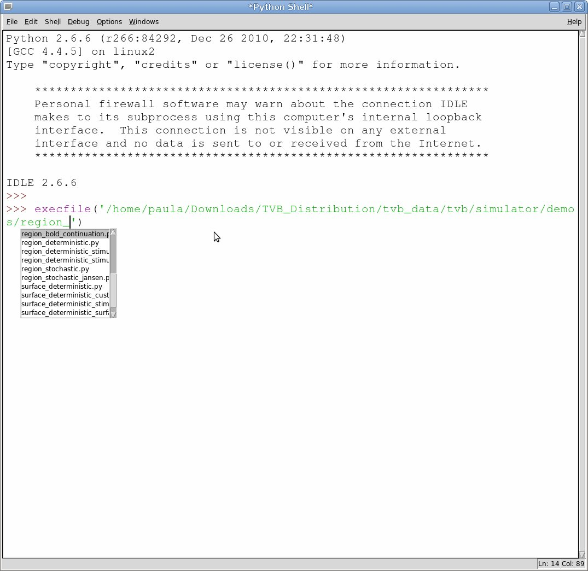
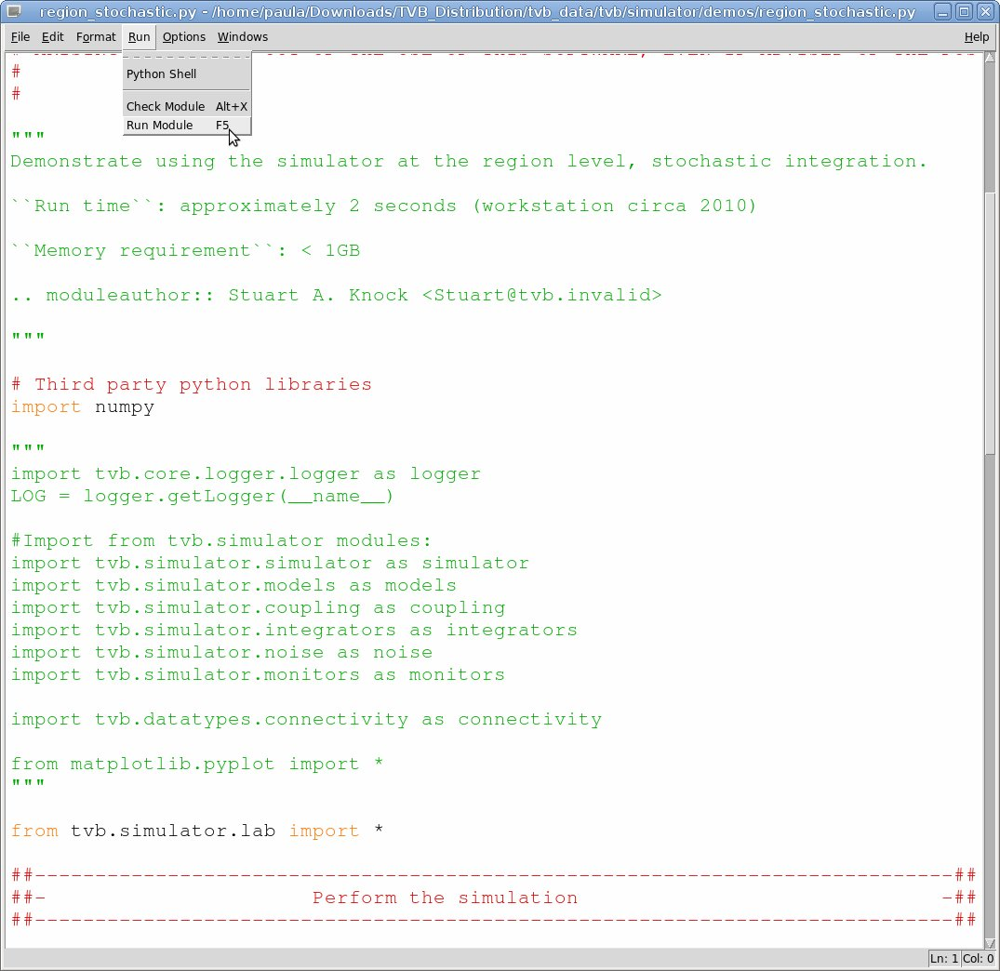

.. include:: ../templates/pdf_constants.rst

.. _shell_ui :

Console Interface of |TVB|
===========================

Getting started with Python IDLE 
--------------------------------

The console interface of |TVB| is an IDLE shell. All TVB services except GUI ones are available within this shell.

Within IDLE you can run a number of scripting demos to show how to build a network model and
run a simulation. 

To run any demo use the `execfile` command::

    execfile('/home/user/Downloads/TVB_Distribution/tvb_data/tvb/simulator/demos/region_deterministic.py')

The above command should work on Linux and Windows, as long as you replace '/home/user/Downloads/TVB_Distribution'
with your personal path towards the folder where TVB was being downloaded.
On Mac OS the path is just a little different::

    execfile('../Resources/lib/python2.7/tvb/simulator/demos/region_deterministic.py')
    execfile('/home/user/Downloads/TVB_Distribution/tvb.app/Contents/Resources/lib/python2.7/tvb/simulator/demos/region_deterministic.py')

Here is an illustration for the above.

   Run a |TVB| demo with execfile
   
   
Another way to run a script, that also allows to see and edit the code, is opening 
the file from the File menu. A new window will pop out. Then select Run Module 
from the Run menu. The script will be executed.

   Run a |TVB| demo from the Run Menu option

To work interactively in the Python shell you need a few tvb modules::

    from tvb.simulator.lab import *

This will import all the scientific simulator modules as well as some datatypes
that wrap important data as the `Connectivity` matrix and cortical `Surface`.

Headless Interface of |TVB|
---------------------------

If you are using |TVB| on a headless machine then Python IDLE is not an option.
In this scenario TVB's shell is a simple python console shell.
To launch a python terminal in the command profile use ::

   distribution start COMMAND_PROFILE -headless

And in the library profile ::

   distribution start LIBRARY_PROFILE -headless

The scripts are located in the `bin` folder and they have platform specific terminations.

The `distribution` script can be used to launch other profiles as well.
The `WEB_PROFILE` will start the web interface. The following has the same effect as `tvb_start` ::

    distribution start WEB_PROFILE

Using the distribution script allows you to give additional options.
The `-reset` option will clean the |TVB| folder before starting the web interface ::

    distribution start WEB_PROFILE -reset

.. _tvb_settings_headless:

Configuring a headless TVB
--------------------------

In order to configure TVB in a headless environment, create a file named `.tvb.configuration` in the home directory
of the current OS user which is launching |TVB|.
Copy the following content and edit it to suit your needs. ::

    MAXIMUM_NR_OF_OPS_IN_RANGE=2000
    URL_WEB=http://127.0.0.1:8080/
    ADMINISTRATOR_EMAIL=jira.tvb@gmail.com
    MATLAB_EXECUTABLE=/usr/bin/octave
    MAXIMUM_NR_OF_THREADS=4
    WEB_SERVER_PORT=8080
    URL_MPLH5=ws://127.0.0.1:9000/
    LAST_CHECKED_CODE_VERSION=6507
    USR_DISK_SPACE=5242880
    DEPLOY_CLUSTER=False
    ADMINISTRATOR_NAME=admin
    LAST_CHECKED_FILE_VERSION=2
    URL_VALUE=sqlite:////home/tvb_user/TVB/tvb-database.db
    ADMINISTRATOR_PASSWORD=[[md5 of password]]
    SELECTED_DB=sqlite
    MAXIMUM_NR_OF_VERTICES_ON_SURFACE=300000
    MPLH5_SERVER_PORT=9000
    TVB_STORAGE=/home/tvb_user/TVB

Usually one would change the web server port and domain.
|TVB| will create a folder with project data named TVB (at the path specified by line starting with `TVB_STORAGE`).
By default it is located in the users home directory.
You can change the `TVB_STORAGE` to point to a different location.

Finally run the appropriate script for your platform (as described in the previous chapter), to launch |TVB| with the new settings.

