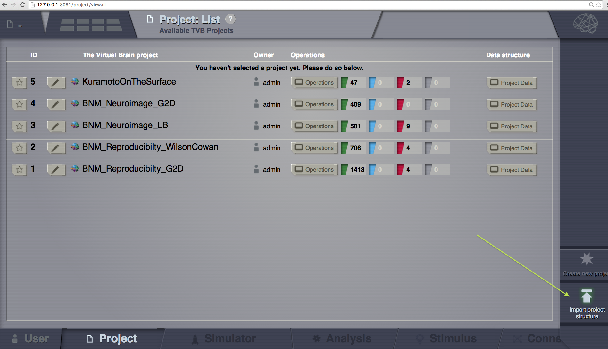
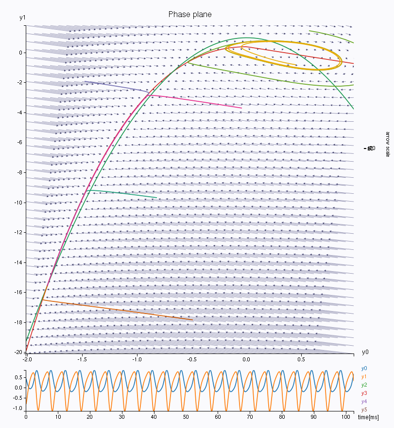
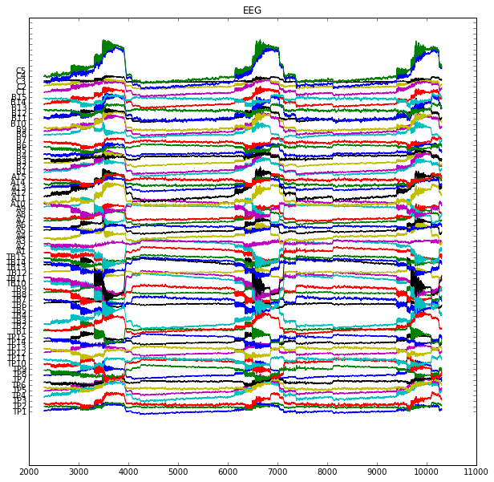

.. include:: /manuals/templates/pdf_constants.rst

.. toctree::
      :hidden:

      tutorial_0_GettingStarted
      tutorial_1_BuildingYourOwnBrainNetworkModel
      tutorial_3_ModelingEpilepsy

Tutorials
=========

GUI tutorials
-------------

.. _Modeling Epilepsy: http://nbviewer.ipython.org/url/docs.thevirtualbrain.org/tutorials/tutorial_2_ModelingEpilepsy.ipynb

      :ref:`tutorial_0_GettingStarted`

.. figure:: figures/BuildingYourOwnBrainNetworkModel_SimulatorArea.png
      :width: 200px
      :figclass: demo-figure
      :target: tutorial_1_BuildingYourOwnBrainNetworkModel.html

      :ref:`tutorial_1_BuildingYourOwnBrainNetworkModel`

      :ref:`tutorial_3_ModelingEpilepsy`

Scripting tutorials
-------------------

      `Modeling Epilepsy`_

