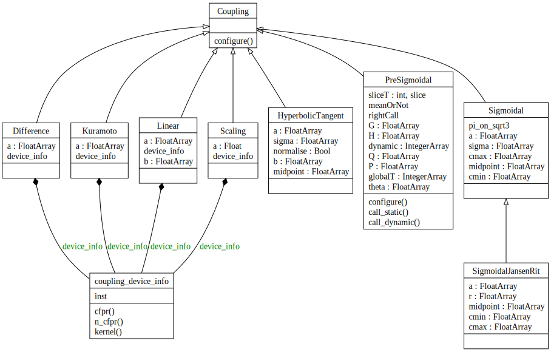

===============
:mod:`Coupling`
===============

.. _coupling: _images/classes_coupling.svg

.. #    :scale: 33%

.. automodule:: tvb.simulator.coupling
    :members:
    :undoc-members:
    :member-order: bysource

